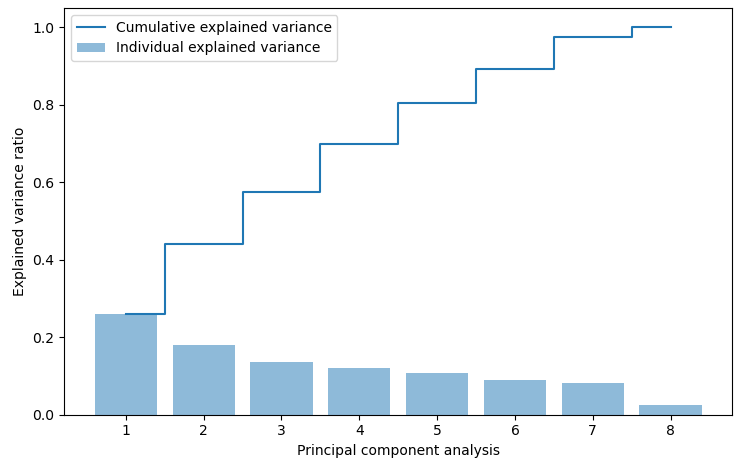
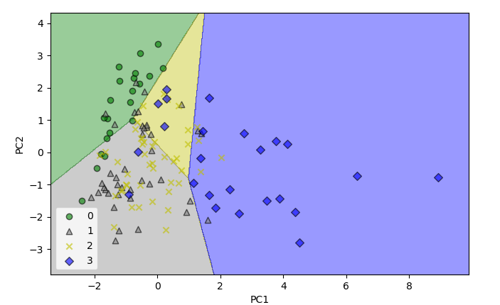
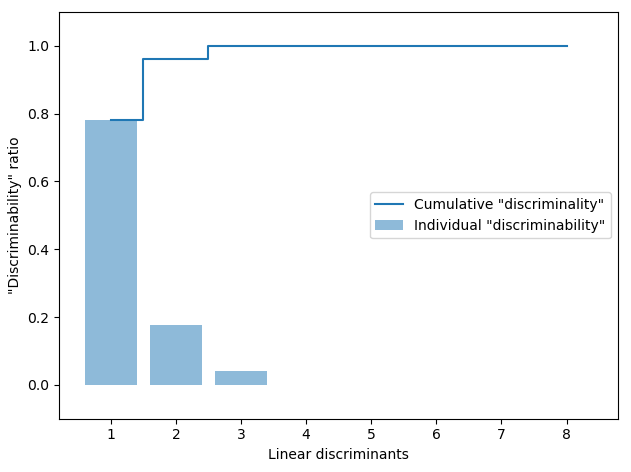
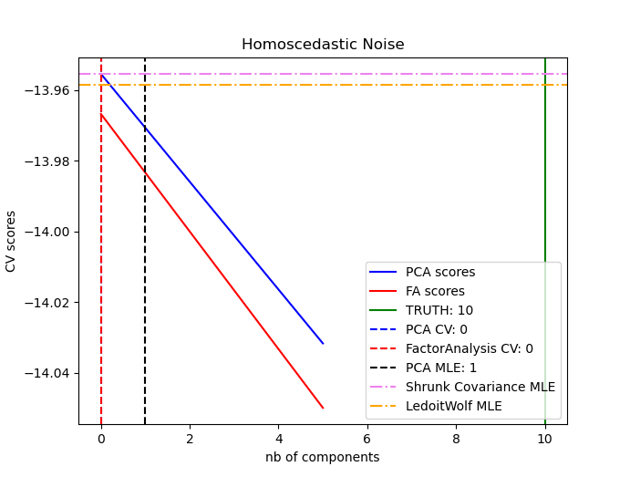
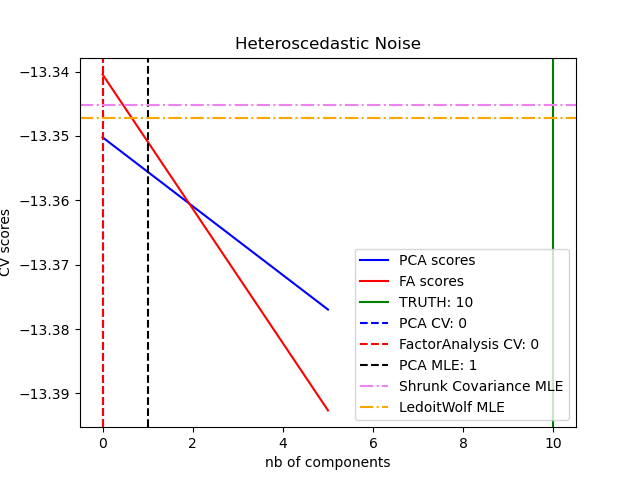

.. _analysis:

================
Analysis 
================

.. currentmodule:: watex.analysis

:mod:`~watex.analysis` gives some examples of matrices decomposition, feature extraction, selection, etc. 

.. note:: 
   Most of the analysis functions have a parameter `view` . Setting the `view` parameter to `True` 
   will give a basic visualization. 

Decomposition: :mod:`~watex.analysis.decomposition`
=====================================================

Steps behind the principal component analysis (PCA) and matrices decomposition 

Extract PCA: :func:`~watex.analysis.decomposition.extract_pca`
---------------------------------------------------------------

A naive approach to extract PCA from training set :math:`X`. Indeed, the PCA directions are highly 
sensitive to data scaling and we need to standardize the 
features before PCA if the features were measured on different scales and we assign equal 
importance to all features. Moreover, the NumPy function was designed to operate on 
both symmetric and non-symmetric squares matrices. However you may find it returns 
complex eigenvalues in certain cases related function, `numpy.linalg.eigh` has been implemented 
to decompose Hermitian matrices which is numerically more stable to work with matrices such as 
the covariance matrix. `numpy.linalg.eigh` always returns real eigh eigenvalues

.. code-block:: python 

	>>> from watex.exlib.sklearn import SimpleImputer 
	>>> from watex.utils import selectfeatures 
	>>> from watex.datasets import fetch_data 
	>>> from watex.analysis import extract_pca 
	>>> data= fetch_data("bagoue original").get('data=dfy1') # encoded flow categories 
	>>> y = data.flow ; X= data.drop(columns='flow') 
	>>> # select the numerical features 
	>>> X =selectfeatures(X, include ='number')
	>>> # imputed the missing data 
	>>> X = SimpleImputer().fit_transform(X)
	>>> eigval, eigvecs, _ = extract_pca(X)
	>>> eigval
	array([2.09220756, 1.43940464, 0.20251943, 1.08913226, 0.97512157,
		   0.85749283, 0.64907948, 0.71364687])

Total variance ratio: :func:`~watex.analysis.decomposition.total_variance_ratio`
----------------------------------------------------------------------------------

:func:`~watex.analysis.decomposition.total_variance_ratio` of eigenvalues :math:`\lambda_j`, is simply the 
fraction of an eigenvalue, :math:`\lambda_j` and the total sum of the eigenvalues as:

.. math:: 
    \text{explained_variance_ratio} = \frac{\lambda_j}{\sum{j=1}^{d}\lambda_j}
    
Using the numpy `cumsum` function, we can then calculate the cumulative sum of explained variance 
which can be plotted if `plot` is set to ``True`` via the matplotlib set function.    

.. code-block:: python 

	>>> from watex.analysis import total_variance_ratio 
	>>> # Use the X value in the example of `extract_pca` function   
	>>> cum_var = total_variance_ratio(X, view=True)
	>>> cum_var
	array([0.26091916, 0.44042728, 0.57625294, 0.69786032, 0.80479823,
		   0.89379712, 0.97474381, 1.        ])
		   

   
Feature transformation: :func:`~watex.analysis.decomposition.feature_transformation`
--------------------------------------------------------------------------------------

:func:`~watex.analysis.decomposition.feature_transformation` consists to transform  :math:`X` into new principal 
components after successfully decomposing to the covariances matrices. 

.. topic:: Examples: 

.. code-block:: python 

	>>> from watex.analysis import feature_transformation 
	>>> # Use the X, y value in the example of `extract_pca` function  
	>>> Xtransf = feature_transformation(X, y=y,  positive_class = 2 )
	>>> Xtransf[0] 
	array([-1.0168034 ,  2.56417088])
	
	
Decision region: :func:`~watex.analysis.decomposition.decision_region`
-----------------------------------------------------------------------

:func:`~watex.analysis.decomposition.decision_region` displays the decision region for the training data reduced 
to two principal component axes. 

.. code-block:: python 

	>>> from watex.datasets import fetch_data 
	>>> from watex.exlib.sklearn import SimpleImputer, LogisticRegression  
	>>> from watex.analysis.decomposition import decision_region 
	>>> data= fetch_data("bagoue original").get('data=dfy1') # encoded flow categories 
	>>> y = data.flow ; X= data.drop(columns='flow') 
	>>> # select the numerical features 
	>>> X =selectfeatures(X, include ='number')
	>>> # imputed the missing data 
	>>> X = SimpleImputer().fit_transform(X)
	>>> lr_clf = LogisticRegression(multi_class ='ovr', random_state =1, solver ='lbfgs') 
	>>> Xpca= decision_region(X, y, clf=lr_clf, split = True, view ='Xt') # test set view
	>>> Xpca[0] 
	array([-1.02925449,  1.42195127])
	

   
Linear Discriminant Analysis: :func:`~watex.analysis.decomposition.linear_discriminant_analysis`
-------------------------------------------------------------------------------------------------

Linear Discriminant Analysis (LDA) is used as a technique for feature extraction to increase the 
computational efficiency and reduce the degree of overfitting due to the curse of dimensionality in 
non-regularized models. The general concept behind LDA is very similar to the principal component 
analysis (PCA), but whereas PCA attempts to find the orthogonal component axes of minimum variance 
in a dataset, the goal in LDA is to find the features subspace that optimizes class separability.
 
**mathematical details** 

The main steps required to perform LDA are summarized below: 
    
* Standardize the d-dimensional datasets (:math:`d` is the number of features)
* For each class, compute the :math:`d-` dimensional mean vectors. Thus for  each mean feature 
  value, :math:`\mu_m` with respect to the examples of class :math:`i`: 
		
.. math:: m_i = \frac{1}{n_i} \sum{x\in D_i} x_m 
		
* Construct the between-clas scatter matrix, :math:`S_B` and the within class scatter matrix, :math:`S_W`. 
  Individual scatter matrices are scaled :math:`S_i` before we sum them up as scatter matrix :math:`S_W` as: 
		
.. math:: 
	
	\sum{i} = \frac{1}{n_i}S_i = \frac{1}{n_i} \sum{x\in D_i} (x-m_i)(x-m_i)^T
			
The within-class is also called the covariance matrix, thus we can compute the between-class 
scatter matrix :math:`S_B` as:

.. math:: S_B= \sum{i}^{n_i}(m_i-m) (m_i-m)^T 
	
where :math:`m` is the overall mean that is computed including examples from all classes. 

* Compute the eigenvectors and corresponding eigenvalues of the matrix :math:`S_W^{-1}S_B`. 
* Sort the eigenvalues by decreasing order to rank the corresponding eigenvectors 
* Choose the :math:`k` eigenvectors that correspond to the :math:`k` largest eigenvalues to construct :math:`dxk`-dimensional 
  transformation matrix, :math:`W`; the eigenvectors are the columns of this matrix. 
* Project the examples onto the new_features subspaces using the transformation matrix :math:`W`. 

.. code-block:: python 

	>>> from watex.datasets import fetch_data
	>>> from watex.utils import selectfeatures
	>>> from watex.exlib.sklearn import SimpleImputer, LogisticRegression  
	>>> from watex.analysis.decomposition import linear_discriminant_analysis 
	>>> data= fetch_data("bagoue original").get('data=dfy1') # encoded flow
	>>> y = data.flow ; X= data.drop(columns='flow') 
	>>> # select the numerical features 
	>>> X =selectfeatures(X, include ='number')
	>>> # imputed the missing data 
	>>> X = SimpleImputer().fit_transform(X)
	>>> Xtr= linear_discriminant_analysis (X, y , view =True)
	

   
   
Dimensionality: :mod:`~watex.analysis.dimensionality`
======================================================

Reduces the number of dimensions down to two (or to three) for instance, make it possible to plot 
high-dimension training set on the graph and often gain some important insights by visually detecting 
patterns, such as clusters.

Normal Principal Component Analysis (nPCA ): :func:`~watex.analysis.nPCA`
--------------------------------------------------------------------------

:func:`~watex.analysis.nPCA` is by far the most popular dimensional reduction algorithm. First, it identifies the hyperplane that 
lies closest to the data and projects it to the data onto it.

.. code-block:: python 

	>>> from watex.analysis.dimensionality import nPCA
	>>> from watex.datasets import fetch_data
	>>> X, _= fetch_data('Bagoue analysed data')
	>>> pca = nPCA(X, 0.95, n_axes =3, return_X=False) # returns PCA object 
	>>> pca.components_
	>>> pca.feature_importances_
	[('pc1',
	array(['magnitude', 'power', 'sfi', 'geol', 'lwi', 'shape', 'type',
         'ohmS'], dtype='<U9'),
	array([ 0.6442,  0.5645,  0.4192,  0.2028,  0.1517,  0.1433,  0.0551,
         -0.0536])),
	('pc2',
	array(['shape', 'ohmS', 'sfi', 'lwi', 'type', 'power', 'geol',
         'magnitude'], dtype='<U9'),
	array([-0.7317,  0.5239,  0.311 ,  0.2077, -0.1481, -0.1286,  0.0965,
          0.0501])),
	('pc3',
	array(['lwi', 'shape', 'ohmS', 'type', 'magnitude', 'power', 'sfi',
         'geol'], dtype='<U9'),
	array([-0.6098, -0.5725, -0.4287,  0.2619,  0.1763,  0.1004, -0.0819,
          0.0065]))]
		  
		  
Incremental PCA (iPCA): :func:`~watex.analysis.iPCA`
------------------------------------------------------
    
:func:`~watex.analysis.iPCA` allows splitting the training set into mini-batches and feeding the algorithm one 
mini-batch at a time. One problem with the preceding implementation of PCA is that requires 
the whole training set to fit in memory for the SVD algorithm to run. This is useful for large 
training sets, and also for applying PCA online(i.e, on the fly as a new instance arrives).

.. code-block:: python 

    >>> from watex.analysis.dimensionality import iPCA
    >>> from watex.datasets import fetch_data 
    >>> X, _=fetch_data('Bagoue analysed data')
    >>> Xtransf = iPCA(X,n_components=None,n_batches=100, view=True)

Kernel PCA (kPCA): :func:`~watex.analysis.kPCA`
-------------------------------------------------

:func:`~watex.analysis.kPCA` performs complex nonlinear projections for dimensionality reduction.
     
Commonly the kernel trick is a mathematical technique that implicitly
maps instances into a very high-dimensionality space(called the feature
space), enabling non-linear classification or regression with SVMs. 
Recall that a linear decision boundary in the high dimensional 
feature space corresponds to a complex non-linear decision boundary
in the original space.

.. code-block:: python 

	>>> from watex.analysis.dimensionality import kPCA
	>>> from watex.datasets import fetch_data 
	>>> X, _=fetch_data('Bagoue analysed data')
	>>> Xtransf=kPCA(X,n_components=None,kernel='rbf', gamma=0.04 )
    
Locally Linear Embedding(LLE): :func:`~watex.analysis.LLE`
--------------------------------------------------------------
    
:func:`~watex.analysis.LLE` is a nonlinear dimensionality reduction based on closest neighbors [1]_. It is another powerful 
non-linear dimensionality reduction(NLDR) technique. It is a Manifold Learning technique that does not 
rely on projections like `PCA`. In a nutshell, works by first measuring how each training instance 
library linearly relates to its closest neighbors(c.n.) and then looking for a low-dimensional 
representation of the training set where these local relationships are best preserved(more details shortly). 
Using LLE yields good results especially when makes it is particularly good at unrolling twisted manifolds, 
especially when there is too much noise [2]_.

.. code-block:: python 

	>>> from watex.analysis.dimensionality import LLE
	>>> from watex.datasets import fetch_data 
	>>> X, _=fetch_data('Bagoue analysed data')
	>>> lle_kws ={
	    'n_components': 4, 
	    "n_neighbors": 5}
	>>> Xtransf=LLE(X,**lle_kws)
	
Model selection with Probabilistic PCA and Factor Analysis (FA): :mod:`~watex.analysis.factor`
===============================================================================================

Probabilistic PCA and Factor Analysis are probabilistic models. The consequence is that the 
likelihood of new data can be used for model selection and covariance estimation. Here we compare 
PCA and FA with cross-validation on low-rank data corrupted with homoscedastic noise 
(noise variance is the same for each feature) or heteroscedastic noise (noise variance is different for each feature). 
In the second step, we compare the model likelihood to the likelihoods obtained from shrinkage 
covariance estimators. One can observe that with homoscedastic noise both FA and PCA succeed in 
recovering the size of the low-rank subspace. The likelihood of PCA is higher than FA in this case. 
However, PCA fails and overestimates the rank when heteroscedastic noise is present. Under appropriate 
circumstances, the low-rank models are more likely than the shrinkage models. The automatic estimation 
from Automatic Choice of Dimensionality for PCA. NIPS 2000: 598-604 by Thomas P. Minka is also compared.

Shrunk covariance scores: :func:`~watex.analysis.factor.shrunk_cov_score`
---------------------------------------------------------------------------

:func:`~watex.analysis.factor.shrunk_cov_score` shrunks  the covariance scores.

.. topic:: Examples: 

.. code-block:: python 

	>>> from watex.analysis import shrunk_cov_score 
	>>> from watex.datasets import fetch_data 
	>>> X, _=fetch_data('Bagoue analysed data')
	>>> shrunk_cov_score (X) 
	-11.234180833710871
	
Compare PCA and FA: :func:`~watex.analysis.factor.pcavsfa` 
------------------------------------------------------------

:func:`~watex.analysis.factor.pcavsfa` Compute PCA score and Factor Analysis scores from 
training :math:`X` and compare the probabilistic PCA and FA  models.

.. code-block:: python 

	>>> from watex.analysis import pcavsfa 
	>>> from watex.datasets import fetch_data 
	>>> X, _=fetch_data('Bagoue analysed data')
	>>> pcavsfa (X) 
	([-13.35021821995266, -13.376979159782895],
	[-13.340444115947667, -13.392643293410558])
	
The output PCA and FA score with homo vs hetero_scedatic noises:

	
* **Homo vs Hetero -scedatic data?** 

  ==================================== ====================================
  Homoscedatic noise data              Heteroscedatic noise data 
  ==================================== ====================================
  |homo_scedatic|                         |hetero_scedatic|
  ==================================== ====================================
  
Make Homo/Hetero scedatic noise data: :func:`~watex.analysis.factor.make_scedastic_data`
------------------------------------------------------------------------------------------

:func:`~watex.analysis.factor.make_scedastic_data` generates sampling data for probabilistic PCA 
and Factor Analysis model comparison. By default: 
 
* nsamples    = 1000 
* n_features  = 50  
* rank        =10 
        

.. code-block:: python 

	>>> from watex.analysis import make_scedastic_data  
	>>> X, X_homo, X_hetero , n_components = make_scedastic_data ()  
	

.. topic:: References 

	.. [1] Gokhan H. Bakir, Jason Wetson and Bernhard Scholkoft, 2004;
		"Learning to Find Pre-images";Tubingen, Germany:Max Planck Institute
		for Biological Cybernetics.

	.. [2] S. Roweis, L.Saul, 2000, Nonlinear Dimensionality Reduction by
		Loccally Linear Embedding.
