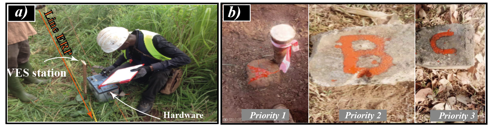

.. _five_min_ref: 

============================
Five minutes understanding
============================

This section explains the genesis of the project from :term:`CDWS` and gives an overview as well as the ease comprehension of 
the importance of :term:`DC-resistivity` methods during the :term:`campaign for drinking water supply` (CDWS).

What :term:`ERP` and :term:`VES` are ? 
----------------------------------------
The :term:`electrical resistivity profiling` (ERP)  and the :term:`vertical electrical sounding` (VES) are :term:`geophysical` 
subsurface imaging methods. They are most preferred to find :term:`groundwater` during the :term:`CDWS`, especially 
in developing countries due to their low cost and the assumption of being the most suitable method in the basement medium.
Commonly, the :term:`ERP` is first used to select the best conductive zone (anomaly) based on basic criteria such as 
the :term:`shape`, the :term:`type` of anomaly, and the :term:`geology` of the area [1]_; [2]_. 
Secondly, the :term:`VES` is carried out to speculate about the existence of a fracture zone and the layer thicknesses.  
Indeed, the goal of combining both methods is to find the best place to locate the :term:`drilling` expecting to give a FR above 
or equal to the project-required :term:`FR` (:term:`RFR`).  

Why :term:`RFR` is so much important in :term:`CDWS` ? 
------------------------------------------------------------
Typically, the RFR is tied to the type of hydraulic system which is based in turn 
on the number of inhabitants living in the exploration locality [3]_. For instance, the village hydraulic (VH) is 
the type of hydraulic system mostly suggested for the number of inhabitants less than 1000 (:math:`FR\geq 1 m^3/hr`). 
Likewise, the improved village hydraulic (IVH) (:math:`FR\geq 3 m^3/hr`) is proposed to the population size ranged 
between 1000 to 4000,  whereas the urban hydraulic (UH) (:math:`FR\geq 10 m^3/hr`) is offered to a population size greater 
than 4000 ([4]_; [5]_; [6]_). Thus, the FR obtained after the :term:`drilling` operations 
(observed FR) under the RFR, is considered unsuccessful :term:`drilling` and requires a new geophysical survey in that locality. 
This is expensive and the challenge of staying in the project schedule becomes a puzzle that many local companies 
try to work around. 

What traditional techniques/tips are used to solve the unsuccessful :term:`drilling` ? 
-----------------------------------------------------------------------------------------

Local companies propose at most three drilling locations with their order of priority after 
the survey to maximize their chance to get the RFR (See figure below). Unfortunately, the idea of proposing many drilling points is 
not always the best solution, and the problem to find the right drilling place expecting to give the RFR remains 
a real challenge. 

   
   :term:`DC-resistivity` methods. a) :term:`ERP` and :term:`VES` investigations. b) Priority for drilling operations based on the traditional methods. 
  
  
What's novelty using :term:`WATex` in :term:`GWE` ?
----------------------------------------------------
:code:`watex` provides "smart" algorithms ( pre-trained :term:`machine learning` models from :class:`watex.models.pModels` ) 
to predict the feasible :term:`FR` before any drilling operations. This is a new approach to solve the aforementioned problem, 
improve the traditional :term:`geophysical` methods, reduce the unsuccessful drillings, minimize the rate of unsustainable 
boreholes and losses. In addition, when constraints ( site restrictions) are passed to the :class:`watex.methods.electrical.ResistivityProfiling` class, 
:code:`watex` is capable to advise the user whether the auto-detected station is suitable for drilling or not. It also has the ability to 
warn the user about the selected station close to the restricted area. 

Indeed, the resolution of this :term:`GWE` problem during the :term:`CDWS` was the landmark of the :code:`watex` design project. 

.. topic:: References 

   .. [1] Nikiema, D.G.C., 2012. Essai d‘optimisation de l’implantation géophysique des forages en zone de socle : Cas de la province de Séno, Nord Est du Burkina Faso. IST / IRD Ile-de-France, Ouagadougou, Burkina Faso, West-africa.
   .. [2] Sombo, P.A., Williams, F., Loukou, K.N., Kouassi, E.G., 2011. Contribution de la Prospection Électrique à L’identification et à la Caractérisation des Aquifères de Socle du Département de Sikensi (Sud de la Côte d’Ivoire). Eur. J. Sci. Res. 64, 206–219.
   .. [3] CIEH, 1993. évaluation de l’aide publique française (1981-1990) / Ministère de la coopération et du développement, Secrétariat permanent des études, des évaluations et des statistiques, in: Evaluations / Ministère de La Coopération et Du Développement ; 10). Paris : Ministère de la coopération et du développement, Secrétariat permanent des études, des évaluations et des statistiques, cop. 1992, p. 139 p. : tabl., couv. ill. en coul.; 30 cm.
   .. [4] CIEH, 2001. L’utilisation des méthodes géophysiques pour la recherche d’eaux dans les aquifères discontinus. Série hydrogéologie 169.
   .. [5] MHCI, 2012. Lancement des travaux de renforcement de l’alimentation en eau potable de Boundiali. Minist. l’hydraulique 15.
   .. [6] Mobio, A.K., 2018. Exploitation des systèmes d’Hydraulique Villageoise Améliorée pour un accès durable à l’eau potable des populations rurales en Côte d’Ivoire : Quelle stratégie ? Institut International d’Ingenierie de l’Eau et de l’Environnement.

 
