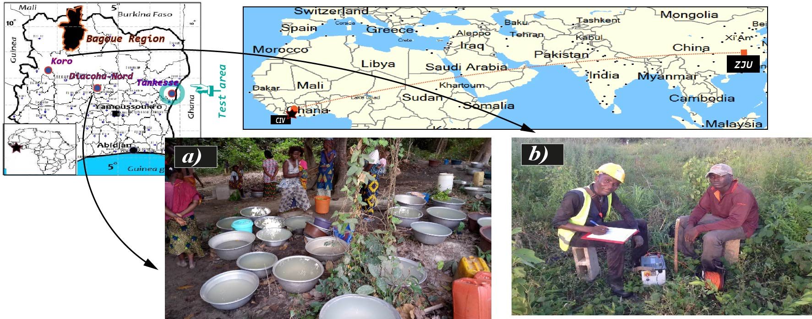
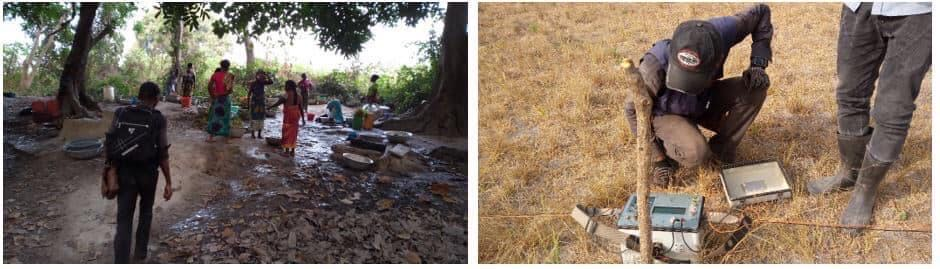
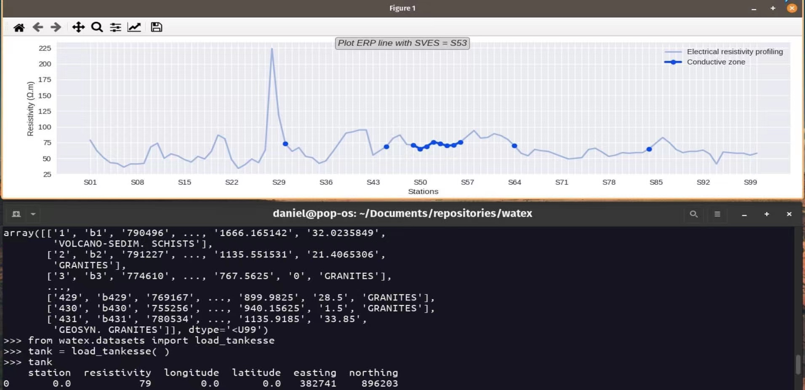

.. _story_ref:

================
Project story 
================

Here is a story that describes the :code:`watex` project design. 

Introductory notes
--------------------

:term:`Water` is a vital resource in the world, and the issues related to water of this present century remain crucial faced to 
the climate change challenges. :term:`Water`, in addition to being used in industries, electronics, services, and companies, remains a rare 
commodity, especially for developing countries. Indeed, :term:`water` treatment is very expensive and only developed countries have the 
means to afford the final treatment chain. 

The idea of the project was born in 2015 in the `geosciences and civil engineering operations company (IBS+) <https://www.facebook.com/ibsplus.ingenierie/?locale=fr_FR>`__. In  
this venture, I was selected as a geophysicist engineer where one of my missions consisted to bring potable water to many regions 
of :term:`Cote d'Ivoire` and beyond. An tangible example outside :term:`CIV` was  the :term:`CDWS` in some West African sub-regions such as  `Niger <https://fr.wikipedia.org/wiki/Niger>`__, `Guinea <https://en.wikipedia.org/wiki/Guinea>`__,
`Mali <https://fr.wikipedia.org/wiki/Mali>`__ and `Burkina <https://fr.wikipedia.org/wiki/Burkina_Faso>`__. These different projects 
were partly funded or bi-supported by international organizations (`World Bank <https://www.worldbank.org/en/home>`__, `UNICEF <https://www.unicef.org/>`__ ) and the host country governments (e.g., :term:`PNAEP` and 
:term:`PPU` programs in the case of  :term:`CIV`) with several cooperation initiatives. 

Trigger effect
---------------

Althrough, the desire to enhance the living conditions of the population remains one of my main concerns, the trigger factor 
that accelerates the design of :code:`watex` was the  Diacohou-Nord project in 2017 ( in the center part of :term:`Cote d’Ivoire`, see Figure 1).  
The project was specific which purpose was to find the best location for the :term:`drilling` operations expecting to obtain a 
:term:`flow` rate (:term:`FR`) of :math:`10m^3/hr` (= :term:`RFR`). However, this peculiar area strongly faced with a drinking water shortage 
especially during the dry season. The condition such as the topographic/terrain and other constraints were not optimals to get such :term:`FR` thereby worsening the 
conditions of the living populations. In addition, during our trip to that locality,  from 6 P.M. to 6 A.M. every day, women in the village rush away 
into the forest for seeking potable water for the households, their husbands, and their children ( Figure 1.a). The water flowing from 
the lowlands, mash areas and rocks located far in the forest entailed the second alternative source of water when all the wells/boreholes
in the locality and surrondings had dried up notwithstanding the dangers with the wild animals. 

   
   :term:`DC-resistivity` survey investigations. a) An illustration of the critical issue of water shortage in Diacohu-Nord. Women are 
   waiting for water in the forest from night until the morning. b) DC survey investigations in the "Koro" locality, north area of the :term:`Cote d'Ivoire`
   
Unfortunately, the consequences of that :term:`water` quest at night in the forest were numerous and terrible such as the 
snakebites that I witnessed on May 17, 2017. The lady was immediately transported to the nearest city for treatment. I was upset to hear that 
this phenomenon seems common experienced and frequently happened in their daily life. 

On my return from the mission, I, therefore, thought to solve this problem so that such a story does no longer happen again. Thus, two
months later, I resigned from the company and looking for a scholarship opportunity to study in programming and 
:term:`artificial intelligence`. The first idea that came to mind was to design a machine  to detect an 
:term:`underground water` reservoir capable  to estimate the :term:`FR` according to the population needs even in dry seasons. 

   
   Women are seeking for :term:`drinking` water: left-panel) The place where the lady was bitten by the snake. Early in the morning, 
   my team and I went to the site for inspection to propose an alternative solution ; right-panel) survey investigation in 
   Diacohu-Nord locality. The color of grasses shows the drastic consequences of the dry season in this locality.   
   
Fortunately, three months later, I got a scholarship from the `China Scholarship Council (CSC) <https://www.chinesescholarshipcouncil.com/>`__ 
of the Chinese government in collaboration with the government of :term:`Côte d'Ivoire` for a Ph.D candidate. Thus, I was registered 
to `Zhejiang University <https://www.zju.edu.cn/english/>`__ (ZJU) in 2018 where I my research interest was computational geophysics. 
My research work entailed to design new :term:`ML` approaches capable to detect the fracture zones and predict :term:`FR` efficiently
from :term:`DC-resistivity` and electromagnetic (especially the :term:`CSAMT`) data. Thus,  the first trial version of :code:`watex` 
was born. It was focused on a case study problem in the :term:`Bagoue region` ( see Figure 1.). The results were satisfactory with a 
prediction score of 77% of correct :term:`FR` with a reasonnable amount of data.  

Efficiency test 
-----------------

To test the efficiency of the software in other locality (out of :term:`Bagoue region`), we, therefore collected data from a local company 
`GEOTRAP SARL <https://www.piaafrica.com/fr/cote-divoire/mines-exploitations/79486-geotrap-sarl-geophysique-et-travaux-publics>`__ 
in the region of Indenié Djuablin, named Tankesse (East of the :term:`CIV`, see Figure 1.).
The data were processed and fed to the software algorithms (:class:`watex.methods.electrical`) to auto-detect the favorable stations 
(in blue) and select the best one by adding the environmental constraints as shown in the figure below. The goal was 
to predict the :term:`RFR` estimated to :math:`5m^3/hr`. As a result, :code:`watex` proposed, as the final drilling point( the best),  
the station ``S53``. 

   
   Tankesse data processing. Data collected from GEOTRAP SARL. 
   
Fortunately, two months later, the drilling was successfully  carried out yielding a :term:`FR` of :math:`9.7 m^3/hr` whereas 
:code:`watex` predicted :math:`7.3 m^3/hr` (see `video <https://youtube.com/shorts/NDci9g_v01Q>`__ ). Indeed, this seems 
truthy because the "smart" algorithms implemented in :code:`watex` do the essential to not overestimate the 
:term:`groundwater` :term:`FR` prediction. The aim is  to minimize unsucessful drillings and therefore reduce expenses. 
Here is a `youtube video <https://youtube.com/shorts/NDci9g_v01Q>`__ that shows the efficiency of the use of software for future 
:term:`CDWS`. 

.. raw:: html

   

   <iframe width="320" height="560" src="https://www.youtube.com/embed/NDci9g_v01Q" title="Geosciences computing: watex efficient test performed in Tankesse area" frameborder="0" allow="accelerometer; autoplay; clipboard-write; encrypted-media; gyroscope; picture-in-picture; web-share" allowfullscreen></iframe>
   

It was a great chance for the popualtion living in this area since the Tankesse  area (get data from :func:`watex.datasets.load_tankesse`)
has significant thick layers conposed of granitic arenas which often give a wrong rate of :term:`FR` during/after the :term:`drilling` operations 
based on our traditional methods thereby causing the numerous unsucessful drillings and unsustainable boreholes. 
:term:`Artificial intelligence` (:term:`AI`) via :code:`watex` could  just taken up its first challenge for the population 
welfare in this region. 

Conclusions
--------------
:code:`watex` is less expensive tool because it uses cheap geophysical methods (:term:`ERP` and :term:`VES`) to predict the 
expected the :term:`FR` which is related to the number of people living in a given locality for a long-term water exploitation. 
For example, suppose that a population of a given locality of 2,000 inhabitants increases in 10 years to reach 50,000 inhabitants, 
the :term:`RFR` of :math:`3m^3/hr` today (with 2,000 inhabitants) will no longer be valid within 10 years due to the population 
growth and the effects of climate change. From now on, :code:`watex` seems an alternative solution to reduce the 
rate of unsucessful and non-sustainable drillings.

Beyond this aforementioned problem purely related to hydrogeological exploration, :code:`watex` offers other exploitable assets 
and hopes in the next five years to become an important library in the :term:`GWE` field with with the participation of diverse of 
constributors of to this project hopefully.  

.. seealso::

   :doc:`five-minutes <five_min_understanding>` to understand the project genesis.  
   

*Credit to the author*. 

