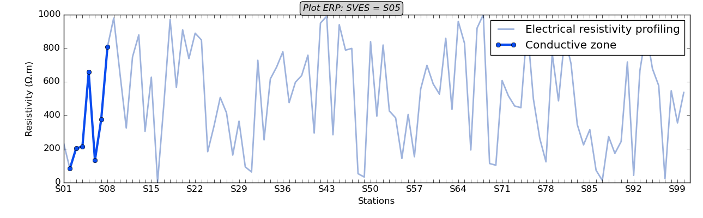
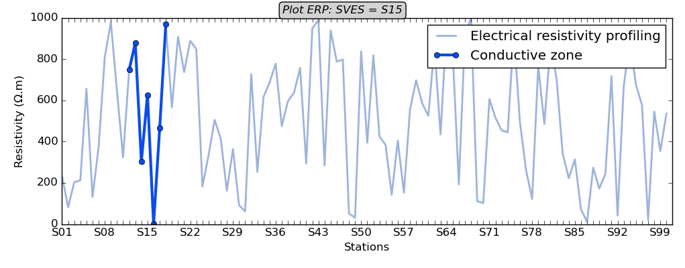
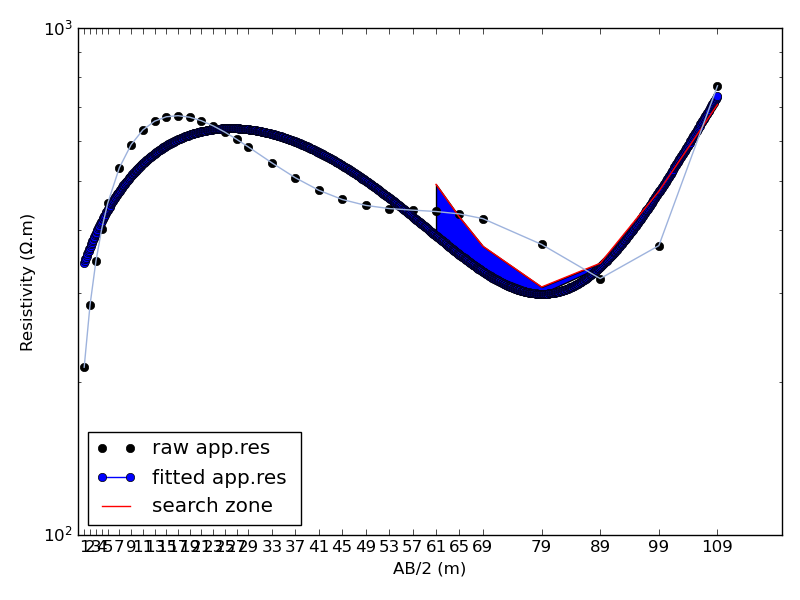
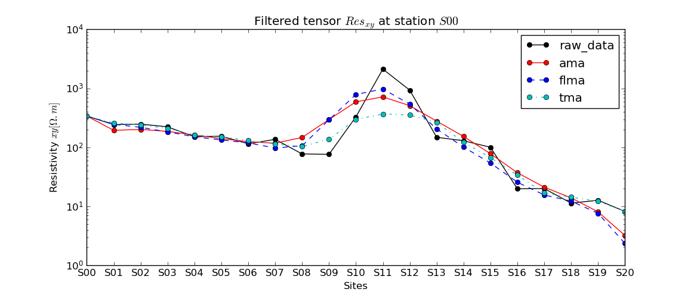
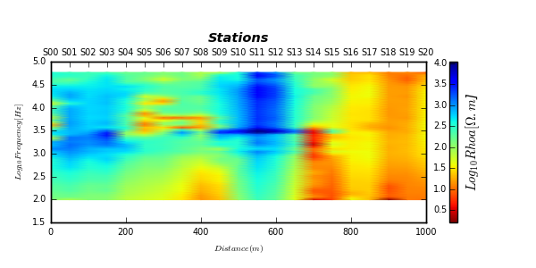
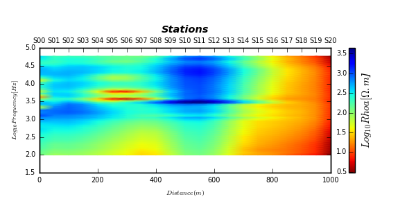
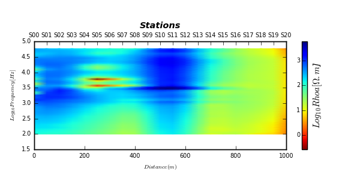
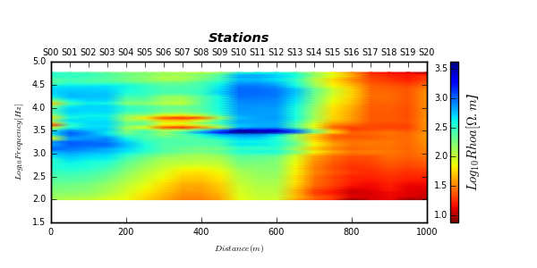
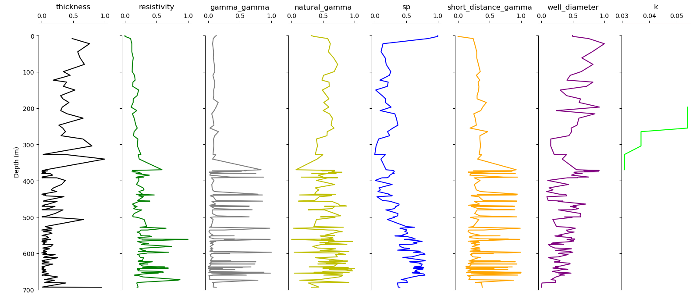
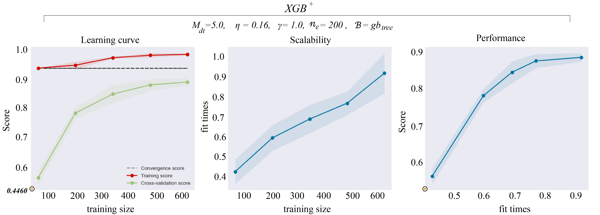

.. _methods:

================
Methods  
================

.. currentmodule:: watex.methods

:mod:`~watex.methods` implements function and modules DC-resistivity, EM, and Hydrogeological parameters calculations. 
For the first release three main methods are implemented: 

* `DC-Resistivity method` 
	DC-resistivity methods are cheaper and fast, especially the ERP and VES, the DC methods are the most used in developing countries for GWE. They are the most preferred methods to stay on the project schedule. Furthermore, from the DC-Profiling method implemented in watex from module electrical, the relevant appropriate features are extracted such as the conductive zone and the best position point for drilling [3]_. 
	
* `EM method` 
	The method implemented in watex mainly focused on short periods, especially the Natural Source Audio-frequency Magnetotellurics (NSAMT) data. 
	Indeed, the NSAMT is one of the EM methods occasionally found in GWE because it has some advantages compared to other geophysical short-period methods ([1]_, [4]_, [7]_, [11]_). Unfortunately, NSAMT data suffers from frequency ranges with little or no signal in the "attenuation band" also known as the "dead band" [2]_. :code:`watex` works around this issue by recovering the loss or weak signal due to man-made noise (human activities, existence of factories near the survey sites, power lines, etc) and updating new tensors. It also provides efficient filters to correct the tensors influenced by these noises, especially at a frequency in the range above 1 kHz. 
	
* `Hydrogeology method` 
	it focuses on computing hydrogeology parameters such as permeability coefficient k, finding the aquifer group similarities, and managing the logging data indispensable in hydrogeological exploration ([6]_,[8]_). Genuinely, logging technology distinguishes the properties of rock and fluid by measuring the physical property of heat, sound, and electricity in the borehole compared to other geophysical methods ([5]_, 10]_). Thanks to the mixture learning strategy (MXS) implemented by watex, the combination of both methods infers the relationship between the logging data and the hydrogeological parameters thereby minimizing the numerous pumping test failures and reducing the useless boreholes.

.. _dc_resistivity: 

DC-Resistivity: :mod:`~watex.methods.electrical`
==================================================

For non-specialized users about the :term:`DC-resistivity`  methods especially the :term:`ERP` and :term:`VES` methods, it is suggested to take 
:doc:`five-minutes <history/five_min_understanding>` reading to undertand the DC-methods before getting started with. 

The :mod:`~watex.methods.electrical` is composed of multiples DC readings prefixed par the `DC` as the names of the methods (:class:`~watex.methods.electrical.DCProfiling`,
:class:`~watex.methods.electrical.DCSounding` and single DC reading classes (:class:`~watex.methods.electrical.ResistivityProfiling` and :class:`~watex.methods.electrical.VerticalSounding`). 
The latter offers supplemental plot functions whereas the former does not. 

Resistivity Profiling (ERP): :class:`~watex.methods.electrical.ResistivityProfiling` 
-------------------------------------------------------------------------------------

:class:`~watex.methods.electrical.ResistivityProfiling` deals with single Electrical Resistivity Profiling (ERP).
The method is composed of `station`, `resistivity` data, and/or coordinates of measurements. Refer to :ref:`datasets` for further details.
As an example, we will make samples of 100 measurements using the function :func:`~watex.datasets.gdata.make_erp` and compute the DC -electrical parameters for flow rate prediction [3]_.
The :meth:`~watex.methods.electrical.ResistivityProfiling.summary` recaps all the prediction parameters. 

.. note:: 
	For demonstration, I assume that the drilling is performed at station 5(S05) on the survey line, 
	i.e the DC parameters are computed at that station. However, if the station is not specified, the algorithm will find the best conductive zone based on the resistivity values and will store the value in attribute `sves_` (position to make a drill). The auto-detection can be used when users need to propose a place to make a drill.  Note that for a real case study, it is recommended to specify the station where the drilling operation was performed through the parameter station. For instance, automatic drilling location detection can predict a station located in a marsh area that is not a suitable place for making a drill. Therefore, to avoid any misinterpretation due to the complexity of the geological area, it is useful to provide the station position. The following examples illustrate the aforementioned details:  

* Compute the DC parameters and plot the conductive zone at stations `S5` 

.. code-block:: python 

	>>> from watex.datasets import make_erp 
	>>> erp_data = make_erp ( n_stations =100 ).frame 
	>>> erp_data.head(3) 
	   station  longitude  latitude        easting    northing  resistivity
	0      0.0 -13.488511  0.000997  668210.580864  110.183287   233.090909
	1     20.0 -13.488511  0.000997  668210.581026  110.183416    81.727273
	2     40.0 -13.488511  0.000997  668210.581188  110.183544   202.818182
	>>> from watex.methods import ResistivityProfiling 
	>>> erpo = ResistivityProfiling (station ='S05').fit(erp_data ) 
	>>> erpo.power_ 
	60 
	>>> erpo.sfi_
	array([1.048])
	>>> erpo.conductive_zone_
	array([202.8182, 212.9091, 656.9091, 132.1818, 374.3636, 808.2727, 979.8182])
	>>> erpo.summary (return_table=True ) 
		dipole  longitude  latitude  ...  shape  type       sfi
	station                               ...                       
	S005         10  -13.48851  0.000997  ...      C    PC  1.047981
	>>> erpo.plotAnomaly(style ='classic') # outputs the following figure 
	

   

* Compute the DC parameters and plot the conductive zone using the automatic-detection 

.. code-block:: python 

	>>> from watex.methods import ResistivityProfiling 
	>>> erpo = ResistivityProfiling (auto=True).fit(erp_data ).summary(keep_params=True)  
	>>> # Note that if `auto` is not set to True when the station is not given, 
	>>> # it will be triggered by force and raising a warning message
	>>> erpo.table_ 
	   power   magnitude shape type       sfi
	0     60  968.727273     V   PC  1.331279
	>>> erpo.plotAnomaly (style ='classic') 
	
	

   
Here, the automatic detection specifies the best point for making a drill to `S15` with its prediction 
parameters summarized in the :attr:`~watex.methods.electrical.ResistivityProfiling.table_`. 

 
Vertical Sounding (VES): :class:`~watex.methods.electrical.VerticalSounding`
------------------------------------------------------------------------------

:class:`~watex.methods.electrical.VerticalSounding`  is carried out to speculate about the 
existence of a fracture zone and the layer thicknesses. Commonly, it comes as a supplement 
method to ERP after selecting the best conductive zone. The main data that compose the VES 
are `AB` and `resistivity`. The `MN` is not compulsory. Note that by convention `AB` is `AB/2` in meters 
and the resistivity is preferably expressed in :math:`\Omega.m`.  In the following example, we will generate 
samples of 31 measurements in deeper using the function :func:`~watex.datasets.gdata.make_ves`. 
Furthermore, :class:`~watex.methods.electrical.VerticalSounding` has a `search` parameter which is very useful. Indeed, 
the parameter passed to the above class is implemented to find water outside of the pollution. Usually, when exploring 
deeper using the VES, we are looking for groundwater in the fractured rock that is outside the anthropic 
pollution [12]_. Thus the search parameter indicates where the search for the fracture zone in 
deeper must start. For instance, `search=45` tells the algorithm to search or start detecting the 
fracture zone from 45m to deeper. 
	
* Compute the ohmic-area `OhmS` prediction parameters and plot the searching fracture zone

.. code-block:: python 

	>>> from watex.datasets import make_ves 
	>>> ves_data = make_ves ( seed=42, iorder =5 ).frame 
	>>> ves_data.tail (7) 
		   AB    MN  resistivity
	24   61.0   5.0   434.728606
	25   65.0   5.0   429.921368
	26   69.0  10.0   420.808772
	27   79.0  10.0   374.251687
	28   89.0  10.0   320.386412
	29   99.0  10.0   372.161240
	30  109.0  10.0   770.101644
	>>> from watex.methods import VerticalSounding 
	>>> veso = VerticalSounding (search = 60 ).fit(ves_data ) 
	>>> veso.ohmic_area_
	867.2945999304986
	>>> veso.fractured_zone_ 
	array([ 61.,  65.,  69.,  79.,  89.,  99., 109.])
	>>> veso.fractured_zone_resistivity_ 
	array([491.7705, 423.5979, 371.0891, 308.3456, 343.5002, 476.5529,
		   707.5036])
	>>> veso.plotOhmicArea (fbtw=True , style ='classic') 
	

   
Here the `ohmic-area` zone is hatched (fill_between) with a value equal to :math:`867.3 \Omega.m^2`. The 
summarized parameters can be collected using: 

.. code-block:: python 

	>>> veso.summary(return_table=True ) 
			 AB    MN   arrangememt utm_zone  ... search max_depth  ohmic_area  nareas
	area                                      ...                                     
	None  200.0  20.0  schlumberger     None  ...     60     109.0    867.2946       1
	
.. topic:: Example: 

	* :ref:`sphx_glr_glr_examples_utils_plot_ohmic_area.py` 
	
	
DC-Profiling: :class:`~watex.methods.electrical.DCProfiling`
-------------------------------------------------------------

:class:`~watex.methods.electrical.DCProfiling` reads a collection of DC-resistivity profiling data. 
It computes electrical profiling parameters and store data in a line object where each line 
is :class:`~watex.methods.electrical.ResistivityProfiling` object. For instance, the expected drilling 
location point  and its resistivity value for two survey lines ( line1 and line2) can be fetched as:: 
        
        >>> <object>.line1.sves_ ; <object>.line1.sves_resistivity_ 
        >>> <object>.line2.sves_ ; <object>.line2.sves_resistivity_ 
		
For further details about the parameters explanations, click 
on :class:`~watex.methods.electrical.DCProfiling` . The following examples give a real 
example of data collected and stored in the software *data/erp* directory. 

* Get DC -resistivity profiling from the individual ERP data  

.. code-block:: python 

    >>> from watex.datasets import make_erp 
    >>> from watex.methods import DCProfiling  
    >>> dcpo= DCProfiling(auto=True) # auto detection 
    >>> data1 = make_erp ( n_stations =100 ).frame  
    >>> data2 = make_erp ( n_stations =70 , max_rho = 1e4).frame 
    >>> data3 = make_erp (n_stations = 150, min_rho=1e2, max_rho=1e5 ).frame  
    >>> dcpo.fit(data1, data3, data3 ) 
    >>> dcpo.nlines_ # number of lines read 
	dc-erp: 100%|##################################| 3/3 [00:00<00:00, 190.98B/s]
	3
    >>> dcpo.sves_ # the best automatic conductive zone 
    Out[417]: array(['S036', 'S097', 'S097'], dtype=object)
    >>> dcpo.line1.sves_ # line 1 best drilling point 
	'S036'
	>>> dcpo.line2.sfi_ # pseudo-fracturing index at the best drilling point
	1.3068009325282002
	>>> dcpo.line3.conductive_zone_ # the conductize zone of position of the line3  
	array([37646.3087, 61112.7517, 97318.1208,   100.    , 54408.0537,
		   98659.0604, 26248.3221])
	>>> dcpo.summary() # summarized the computed parameters 
		   dipole  longitude  latitude  ...  shape  type       sfi
	line1      10  -13.48851  0.000997  ...      C    PC  1.265274
	line2      10  -13.48851  0.000997  ...      M    PC  1.306801
	line3      10  -13.48851  0.000997  ...      M    PC  1.306801
	
	
* Read a collection of ERP data  in excel sheets
		
.. code-block:: python 

    >>> datapath = 'data/erp'
	>>> dcpo= DCProfiling(auto=True) # 
    >>> dcpo.read_sheets=True 
    >>> dcpo.fit(datapath, force =True) # force the reading i.e transform the raw data to a selector ERP.  
	dc-erp: 100%|##################################| 4/4 [00:00<00:00, 257.36B/s]
	DCProfiling(AB= 200.0, MN= 20.0, arrangememt= schlumberger, ... , auto= True, keep_params= False, read_sheets= True)
    >>> dcpo.nlines_  # getting the number of survey lines to read successfully 
    4
	>>> dcpo.line2.sves_resistivity_ 
	93
    >>> dcpo.sves_ # stations of the best conductive zone 
    array(['S017', 'S001', 'S000', 'S036'], dtype=object)
    >>> dcpo.sves_resistivities_ # the lower conductive resistivities 
    array([  80.,   93., 1101.,  500.])
    >>> dcpo.powers_ 
    array([ 50.,  40.,  30., 180.])
	>>> dcpo.survey_names_  # name of the four lines read 
	['sheet1', 'l11_gbalo', 'sheet2', 'sheet3']

	
DC-Sounding: :class:`~watex.methods.electrical.DCSounding` 
-----------------------------------------------------------

:class:`~watex.methods.electrical.DCSounding` reads a  collection of VES data and stores 
the computed predictor in a :class:`~watex.methods.electrical.VerticalSounding` object. 
Contrary to :class:`~watex.methods.electrical.DCProfiling` , data is stored in `site` object 
not in `line`. Retrieving data from each DC-sounding site follow the naming below::
        
    >>> <object>.site<number>.<:attr:`~.VerticalSounding.<attr>_`
        
For instance to fetch the DC-sounding data position and the resistivity in depth of the fractured zone for the first site, it should be:: 
        
	>>> <object>.site1.fractured_zone_
	>>> <object>.site1.fractured_zone_resistivity_   
		
For parameters explanation, refer to :class:`~watex.methods.electrical.DCSounding` instead. The 
following examples will illustrate the literature above: 

* Read a single DC Electrical Sounding file 
    
.. code-block:: python 

    >>> from watex.methods.electrical import DCSounding
    >>> dcvo= DCSounding ()  
    >>> dcvo.search = 30. # start detecting the fracture zone from 30m depth.
    >>> dcvo.fit('data/ves/ves_gbalo.xlsx')
	dc-ves: 100%|###################################| 1/1 [00:00<00:00, 49.00B/s]
    >>> dcvo.ohmic_areas_
    array([523.25458506])
    >>> dcvo.site1.fractured_zone_ # show the positions of the fracture zone 
    array([ 28.,  32.,  36.,  40.,  45.,  50.,  55.,  60.,  70.,  80.,  90.,
           100.])
    >>> dcvo.site1.fractured_zone_resistivity_
    array([ 66.1963,  67.5732,  69.2663,  71.2754,  74.2315,  77.6814,
        81.6254,  86.0633,  96.4209, 108.7543, 123.0635, 139.3486])
    

* Read Multiple Sounding files from sheets 
	
.. code-block:: 

	>>> dcvo= DCSounding ()   
	>>> dcvo.fit('data/ves') 	# read the ves data in directory
	>>> dcvo.survey_names_  	# survey names successfully read 
	['ves_gbalo', 'ves_gbalo', 'ves_gbalo', 'ves_gbalo_unique']
    >>> dcvo.ohmic_areas_ 
	array([ 268.0877,  268.0877, 1183.3641])
	>>> dcvo.nareas_ 
	array([2., 2., 2.])
    >>> dcvo.summary() 
			  AB    MN   arrangememt  ... max_depth   ohmic_area nareas
	site1  200.0  20.0  schlumberger  ...       100   268.087715      2
	site2  200.0  20.0  schlumberger  ...       100   268.087715      2
	site3  200.0  20.0  schlumberger  ...       100  1183.364102      2

	
.. _em: 

EM: :mod:`~watex.methods.em`  
=============================

:mod:`~watex.methods.em` module is related to a few meter exploration in the case of groundwater 
exploration(GWE). The module provides some basic processing steps for EMAP data filtering
and removing noises. Commonly the method mostly used in groundwater exploration is the audio-magnetotelluric because of 
the shortest frequency and rapid executions. Furthermore, we can also list some other advantages 
such as: 

* is useful for imaging both deep geologic structure and near-surface 
  geology and can provide significant details. 
* includes a backpack portable system that allows for use in difficult terrain. 
* the technique requires no high-voltage electrodes, and logistics 
  are relatively easy to support in the field. Stations can be acquired 
  almost anywhere and can be placed any distance apart. This allows for
  large-scale regional reconnaissance exploration or detailed surveys of 
  local geology and has no environmental impact 
  
.. note::
   
   Note that for deep implementation especially for long-period data, or exploring a large scale of EM/AMT data 
   processing, it is recommended to visit other the package `pycsamt`_ , `MTpy`_, `razorback`_ or `MTnet`_ website.  
   :code:`watex` can also read EDI objects created from the first both packages. 
  

.. _pycsamt: https://github.com/WEgeophysics/pycsamt
.. _MTpy: https://github.com/MTgeophysics/mtpy
.. _razorback: https://github.com/BRGM/razorback
.. _MTnet: https://www.mtnet.info/main/

Note that the :class:`~watex.methods.em.Processing` inherits from :class:`~watex.methods.em.EM` class. When EDI data is passed 
to EM :meth:`~watex.methods.em.EM.fit` method, each Edi-file is considered as an `EM` object, and attributes 
are wrapped and recomputed such the `coordinates`, `ids` sites, `frequency` and `reference frequency`.  EDI files can also rewrite accordingly 
using the EM :meth:`~watex.methods.em.EM.rewrite` method. The latter gives many options for EDI outputs. Refer to 
:meth:`~watex.methods.em.EM.rewrite` for further details about parameters. 

For the whole examples, let's fetch 21 examples of EDI files stored in :func:`~watex.datasets.dload.load_edis`.  

.. code-block:: python 

	>>> from watex.datasets import load_edis 
	>>> from watex.methods import EM 
	>>> edi= load_edis (samples =21 ) 
	>>> edi.frame.site[:7].values 
	array(['e.E00', 'e.E01', 'e.E02', 'e.E03', 'e.E04', 'e.E05', 'e.E06'],dtype=object)
	>>> edi.frame.edi [:7].values 
	array([Edi( verbose=0 ), Edi( verbose=0 ), Edi( verbose=0 ),
		   Edi( verbose=0 ), Edi( verbose=0 ), Edi( verbose=0 ),
		   Edi( verbose=0 )], dtype=object)  
	>>> edi.frame.columns 
	Index(['name', 'longitude', 'edi', 'site', 'latitude', 'id'], dtype='object')
	>>> edi_data = edi.frame.edi.values 
	>>> e= EM().fit(edi_data ) 
	>>> e.freqs_ # from higher to lower frequency 
	array([58800.  , 52128.64, 46214.21, 40970.82, 36322.34, 32201.26,
		   28547.76, 25308.77, 22437.28, 19891.58, 17634.71, 15633.91,
		   13860.11, 12287.56, 10893.43,  9657.48,  8561.76,  7590.36,
			6729.17,  5965.69,  5288.83,  4688.77,  4156.79,  3685.16,
			3267.05,  2896.38,  2567.76,  2276.42,  2018.14,  1789.17,
			1586.17,  1406.21,  1246.66,  1105.22,   979.82,   868.65,
			 770.1 ,   682.72,   605.26,   536.59,   475.71,   421.74,
			 373.89,   331.47,   293.86,   260.52,   230.96,   204.76,
			 181.52,   160.93,   142.67,   126.48,   112.13,    99.41])
	>>> e.refreq_ # reference frequency 
	58800.0
	
Note that the tensor components `z` (impedances), `resistivity`, and `phases` are stored in a three-dimensional array of (n_frequency, 2, 2 ) for `xx`, `xy` , `yx` and `yy`. It is possible to get the corresponding tensor component in the two-dimensional array from the method :meth:`~watex.methods.em.Processing.make2d`. By default :meth:`~watex.methods.em.Processing.make2d` outputs `resistivity` components `xy`. Rather than deleting the missing tensors, they are kept in the tensor as  NaN signal and should be used for corrections. As mentioned above, most short-period EM specially NSAMT suffers from the lower and missing signal. Deleting many tensors will yield poor data processing. As a result, a misinterpretation should be done for the location of the drilling operations. Refer to the method (:meth:`~watex.methods.em.Processing.make2d`) documentation for more details. 

.. code-block:: python 

	>>> zxy = e.make2d (out = 'zxy') # out complex 
	>>> zxy.shape 
	(54, 21)

The code snippets below show a concrete example of data composed of weak signal and missing tensor located directory 

.. code-block:: python 

	>>> from watex.methods.em import EM 
	>>> edipath ='data/edis'
	>>> emObjs= EM().fit(edipath)
	>>> phyx = EM().make2d ('phaseyx')
	>>> phyx  # missing tensor a refered as NaN values. 
	array([[ 26.42546593,  32.71066454,  30.9222746 ],
		   [ 44.25990541,  40.77911136,  41.0339148 ],
		   ...
		   [ 37.66594686,  33.03375863,  35.75420802],
		   [         nan,          nan,  44.04498791]])
	>>> phyx.shape 
	(55, 3)
	>>> # get the real number of the yy components of tensor z 
	>>> zyy_r = make2d (ediObjs, 'zyx', kind ='real')
	array([[ 4165.6   ,  8665.64  ,  5285.47  ],
		   [ 7072.81  , 11663.1   ,  6900.33  ],
		   ...
		   [   90.7099,   119.505 ,   122.343 ],
		   [       nan,        nan,    88.0624]])
	>>> # get the resistivity error of component 'xy'
	>>> resxy_err = EM.make2d ('resxy_err')
	>>> resxy_err 
	array([[0.01329037, 0.02942557, 0.0176034 ],
		   [0.0335909 , 0.05238863, 0.03111475],
		   ...
		   [3.33359942, 4.14684926, 4.38562271],
		   [       nan,        nan, 4.35605603]])
	>>> phyx.shape ,zyy_r.shape, resxy_err.shape  
	((55, 3), (55, 3), (55, 3))

Restoring tensors: :meth:`~watex.methods.em.Processing.zrestore`  
----------------------------------------------------------------

In the following, we will show some examples for restoring signal and processing EDI data using the EM :class:`~watex.methods.em.Processing` 
class. The signal recovery is ensured by the :meth:`~watex.methods.em.Processing.zrestore`. Before, the EDI quality data 
can be analyzed using the :meth:`~watex.methods.em.Processing.qc` method. For instance: 

.. code-block:: python 

	>>> from watex.methods.em import Processing
	>>> pobj = Processing().fit('data/edis')
	>>> f = pobj.getfullfrequency ()
	>>> # len(f)
	>>> # 55 frequencies 
	>>> c,_ = pobj.qc ( tol = .6 ) # mean 60% to consider the data as representatives 
	>>> c  # the representative rate in the whole EDI- collection
	0.95 # the whole data at all stations is safe to 95%. 
	>>> # now check the interpolated frequency 
	>>> c, freq_new  = pobj.qc ( tol=.6 , return_freq =True) # returns the interpolated frequency 

If the quality is so poor, there is a possibility to remove the bad data using 
the :meth:`~watex.methods.em.Processing.getValidTensors` method. Indeed the :meth:`~watex.methods.em.Processing.getValidTensors` method 
analyzes the data and keeps the good ones. The goodness of the data depends on the  `threshold` rate.  For instance ``50%`` means to c
onsider an impedance tensor 'z'  valid if the quality control shows at least that score at each frequency of all stations. For example: 
 
.. code-block:: python 

	>>> from watex.methods import Processing 
	>>> pObj = Processing ().fit('data/edis')
	>>> f= pObj.freqs_
	>>> len(f) 
	55
	>>> zObjs_soft = pObj.getValidTensors (tol= 0.3, option='None' ) # None doesn't export EDI-file
	>>> len(zObjs_soft[0]._freq) # suppress 3 tensor data 
	52 
	>>> zObjs_hard  = pObj.getValidTensors( tol = 0.6 )
	>>> len(zObjs_hard[0]._freq)  # suppress only two 
	53

.. note:: 

	The sample of EDI data stored in :func:`~watex.datasets.dload.load_edis` is already preprocessed data so it is not useful for a 
	software demonstration. Rather, we use the concrete *data/edis/* . However, the data is not available in the software repository *data/edis* 
	and can be collected upon request. 

The tensors recovering can be operated as :

.. code-block:: python 

	>>> from watex.methods.em import Processing
	>>> path2edi = 'data/edis'
	>>> pObjs= Processing().fit(path2edi)
	>>> # One can specify the frequency buffer like the example below, however 
	>>> # it is not necessary at least there is a specific reason to fix the frequencies beforehand.
	>>> buffer = [1.45000e+04,1.11500e+01]
	>>> zobjs_b =  pObjs.zrestore(
		# buffer = buffer
	)  
		
:code:`zobjs_b` is a new tensor recovered in (`n_frequency, 2,2 )` dimensions. The following output gives a real example of recovery tensors of the raw data ( containing missing tensors) of stations E12 and E27 collected at all frequencies. The blue dot markers are the tensor data recovered at the missing frequency signals. Note that the recovery tensor is used to (re)compute the apparent resistivity. 

.. figure:: ../examples/auto_examples/methods_em_tensor_recovered.png
   :target: ../examples/auto_examples/methods_em_tensor_recovered.html
   :align: center
   :scale: 50%
	
	
Filtering tensors: :meth:`~watex.methods.em.Processing.ama`, :meth:`~watex.methods.em.Processing.flma`  & :meth:`~watex.methods.em.Processing.tma` 
-----------------------------------------------------------------------------------------------------------------------------------------------------

After recovering the signal, the latter exhibits a field strength amplitude for the next processing step like filtering. :code:`watex` implements three filterings linked to the :class:`~watex.methods.em.Processing` class such as the adaptative moving average (AMA), the fixed-dipole length moving average (FLMA), and the trimming-moving average (TMA). Note that when using the AMA filter,  the `c` parameter is a window-width expansion factor that must be input to the filter adaptation process to control the roll-off characteristics of the applied Hanning window [13]_. Here is an illustration: 

.. code-block:: python 

	>>> import numpy as np 
	>>> import matplotlib.pyplot as plt 
	>>> from watex.methods import Processing 
	>>> from watex.datasets import fetch_data  # load_edis 
	>>> e= fetch_data ('edis', samples =21, key='*' )  #"*" to fetch all columns of edi data 
	>>> # the above code is the same as 
	>>> # e= load_edis (samples =21 , key='*') 
	>>> edi_data = e.frame.edi.values 
	>>> pobj= Processing(window_size =5, component='yx', c= 2, out='srho').fit( edi_data ) # 'srho' for static resistivity correction'
	>>> resyx = pobj.make2d ('resyx') 
	>>> res_ama = pobj.ama() 
	>>> res_flma = pobj.flma () 
	>>> res_tma = pobj.tma () 
	>>> x_stations = np.arange (len(e.frame.site )) 
	>>> plt.xticks (x_stations , list (e.frame.id)) 
	>>> # corrected Edi at station S00
	>>> plt.semilogy (x_stations, resyx[0, :]  , 'ok-', label ='raw_data' ) 
	>>> plt.semilogy(x_stations, res_ama[0, :] ,'or-',  label ='ama') 
	>>> plt.semilogy(x_stations, res_flma [0, :], 'ob--',  label ='flma') 
	>>> plt.semilogy(x_stations, res_tma[0, :] , 'oc-.', label ='tma') 
	>>> plt.title ("Filtered tensor $Res_{xy}$ at station $S00$") 
	>>> plt.legend ()
	>>> plt.xlabel ("Sites") ; plt.ylabel ("Resistivity ${xy}[\Omega.m]$")
	>>> plt.style.use ('classic')
	
The following picture shows the different filters applied on the first station S00. 
 

	

The next figures show the filtered data in a two-dimensional layout. The plot is handled using the :class:`~watex.view.plot.TPlot` class. 
The code snippets are given below: 

.. code-block:: python 

	>>> from watex.view.plot import TPlot 
	>>> from watex.datasets import load_edis 
	>>> # get some 3 samples of EDI for demo 
	>>> # customize plot by adding plot_kws 
	>>> plot_kws = dict( ylabel = '$Log_{10}Frequency [Hz]$', 
						xlabel = '$Distance(m)$', 
						cb_label = '$Log_{10}Rhoa[\Omega.m$]', 
						fig_size =(6, 3), 
						font_size =7. 
						) 
	>>> t= TPlot(component='yx', **plot_kws ).fit(edi_data)
	>>> # plot recovery2d using the log10 resistivity 
	>>> t.plot_tensor2d (to_log10=True) # for raw tensor 
	>>> t.plot_ctensor2d (to_log10=True) 
	>>> t.plot_ctensor2d (to_log10=True, ffilter='flma') 
	>>> t.plot_ctensor2d (to_log10=True, ffilter='ama')

	

   

   
* **Noise data vs filtered data (AMA, FLMA and TMA) ?** 

  ====================== ====================== ====================== ======================
  Noise data                AMA 			 	FLMA	   				TMA
  ====================== ====================== ====================== ======================
  |raw_data|                |ama|            		|flma| 				 |tma|
  ====================== ====================== ====================== ======================
	
	
Note, there are many other functions in :mod:`~watex.em` that can be implemented. One of them is 
the method :meth:`~watex.methods.em.Processing.exportedis` that exports the new tensor (new_Z) for modeling 
after updating tensor using the decorator :class:`~watex.methods.em._zupdate` by triggering 
the `option` parameter to ``write``. 

.. _hydrogeology: 

Hydrogeology: :mod:`~watex.methods.hydro`
==========================================

:mod:`~watex.methods.hydro` deals with the hydrogeological parameters calculations of aquifers. 
These parameters are essential and crucial in the designing and construction progress of geotechnical 
engineering and groundwater dewatering, which are directly related to the reliability of these parameters. 
In the following, it is useful to remember the hydrogeological attribute definition below: 

* `aqname`
    Name of aquifer group column. `aqname` allows retrieving the aquifer group `arr_aq` value in a specific data frame. Commonly`aqname` needs to be supplied when a data frame is passed as a positional or keyword argument. Note that it is not mandatory to have a group of the aquifer in the log data. It is needed only if the label similarity needs to be calculated.  
* `sname`
    Name of the column in the data frame that contains the strata values. Don't confuse `sname` with `stratum` which is the name of the valid layer/rock in the array/Series of strata. 
* `z` 
    An array of depth or a pandas series that contains the depth values. A two-dimensional array or more is not allowed. However when `z` is given as  a dataframe and `zname` is not supplied, an error raises since `zname` is used to fetch and overwrite `z` from the data frame. 
* `zname`
    Name of depth columns. `zname` allows retrieving the depth column in a data frame. If an integer is passed, it assumes the index of the data frame fits the depth column. Integer value must not be out of the data frame size along axis 1. Commonly `zname` needs to be supplied when a data frame is passed to a function argument. 
* `kname` 
	Name of permeability coefficient columns. `kname` allows retrieving the permeability coefficient 'k' 
	in a specific data frame. If an integer is passed, it assumes the index of the data frame fits the 
	`k` columns. Note that the integer value must not be out of the data frame size along axis 1. Commonly 
	`kname` needs to be supplied when a data frame is passed as a positional or keyword argument.  
* `k`
    An array of permeability coefficient `k` or a pandas series that contains the `k` values. A two-dimensional array or more is not allowed. However, when `k` passes as a data frame and `kname` is not supplied, an error raises since `kname` is used to retrieve `k` values from the data frame and overwritten it.
	
Here is data that composes the hydro-geophysical dataset (HGDS): 

.. code-block:: python 
	
	>>> from watex.datasets import load_hlogs 
	>>> load_hlogs ().frame.columns 
	Index(['hole_id', 'depth_top', 'depth_bottom', 'strata_name', 'rock_name',
		   'layer_thickness', 'resistivity', 'gamma_gamma', 'natural_gamma', 'sp',
		   'short_distance_gamma', 'well_diameter', 'aquifer_group',
		   'pumping_level', 'aquifer_thickness', 'hole_depth_before_pumping',
		   'hole_depth_after_pumping', 'hole_depth_loss', 'depth_starting_pumping',
		   'pumping_depth_at_the_end', 'pumping_depth', 'section_aperture', 'k',
		   'kp', 'r', 'rp', 'remark'],
		  dtype='object')

Aquifer section: :class:`~watex.methods.hydro.AqSection` 
---------------------------------------------------------

:class:`~watex.methods.hydro.AqSection` get the section of each aquifer from the HGDS. For further details about the 
hydro-dataframe, read the documentation of the :func:`~watex.datasets.dload.load_hlogs`. Indeed, the unique 
section 'upper' and 'lower' is the valid range of the whole data to consider as valid data. Indeed, the aquifer 
section computing is necessary to shrink the data of the whole boreholes. Mostly the data from the section is 
considered valid data as the predictor:math:`X_r`. Out of the range of the aquifers section, data can be discarded 
or compressed to the top :math:`X_r`. Refer to :mod:`~watex.utils.hydroutils` for additional details. 

Here is an example of computing a section from a single borehole data `H502` (default): 

.. code-block:: python 

	>>> from watex.datasets import load_hlogs 
	>>> from watex.methods import AqSection 
	>>> h =load_hlogs (key='h502') 
	>>> ao = AqSection (aqname ='aquifer_group', kname = 'k', zname ='depth_top').fit(h.frame) 
	>>> ao.findSection () 
	[197.12, 340.35]
	
In the above example, the valid section of the aquifer is found between 197.12 and 340.35 meters deep. 

Logging: :class:`~watex.methods.hydro.Logging` 
-------------------------------------------------

:class:`~watex.methods.hydro.Logging`  class deals with the numerical values of HGDS that compose the 
predictor :math:`X`. If categorical values are found in the logging dataset, they should be discarded. 

Here is an example of plotting the logging data. 

.. code-block:: 

    >>> from watex.datasets import load_hlogs 
    >>> from watex.methods.hydro import Logging 
    >>> # get the logging data 
    >>> h = load_hlogs ()
    >>> h.feature_names
    ['hole_id',
     'depth_top',
     'depth_bottom',
     'strata_name',
     'rock_name',
     'layer_thickness',
     'resistivity',
     'gamma_gamma',
     'natural_gamma',
     'sp',
     'short_distance_gamma',
     'well_diameter']
    >>> # we can fit to collect the valid logging data
    >>> log= Logging(kname ='k', zname='depth_top' ).fit(h.frame[h.feature_names])
    >>> log.feature_names_in_ # categorical features should be discarded.
    ... ['depth_top',
		 'depth_bottom',
		 'layer_thickness',
		 'resistivity',
		 'gamma_gamma',
		 'natural_gamma',
		 'sp',
		 'short_distance_gamma',
		 'well_diameter']
    >>> log.plot ()
    ... Logging(zname= depth_top, kname= k, verbose= 0)
    >>> # plot log including the target y 
    >>> log.plot (y = h.frame.k, draw_spines =(0, 7)) #first position 
    ... Logging(zname= depth_top, kname= k, verbose= 0)
	
The figure below shows the following outputs. Note that the logging plot has many parameters to customize the plot. Refer to 
:func:`~watex.utils.plotutils.plot_logging` for further details. 

	
Mixture Learning Strategy (MXS): :class:`~watex.methods.hydro.MXS` 
-----------------------------------------------------------------------

:class:`~watex.methods.hydro.MXS` entails predicting the permeability coefficient `k` from the HGDS data. Note 
that the dataset for predicting `k` comes with a lot of missing data in the target :math:`y`.  This is obvious 
since the `k` is strongly tied to the productive aquifer and is collected after the pumping test. Commonly the 
pumping is performed if and only if the layer is an aquifer. To work around this issue and to predict k with an 
optimal score, watex implements a new ML approach called MXS. The approach first predicts upstream the naïve group 
of aquifers (NGA) s using the clustering algorithms such as K-Means and Hierarchical Agglomerative Clustering (HAC).  
The HAC dendrogram is used to validate the number of clusters that fit the NGA as well as the silhouette and elbow 
metrics using the K-Means. NGA assumes to be the main aquifer group in the area. Once the NGA is predicted, an MXS 
target:math:`y*` is created by merging the NGA labels with the true label (valid `k`) in the target :math:`y` following 
criteria of label similarity computation using Bayesian evidential learning. The NGA labels are used to compensate 
for the missing `k` in the target `y`. The new MXS target  :math:`y*`  represents a full-strength target ready for 
predicting k using the supervised learning algorithms. The case history implemented in the Hongliu coal mine with 11 
boreholes has successfully given more than 80% of correct prediction of k using the SVM radial basis kernel ([3]_, [14]_) and XGB. 

Here are the following code snippets to achieve the results using a single borehole 'h2601'. First, I fetch the logging 
data stored in the software for visualization to see what a sample of logging data looks likes: 

.. code-block:: python 

	>>> from watex.datasets import load_hlogs 
	>>> from watex.methods import Logging, MXS 
	>>> ho= load_hlogs ( key = 'h2601')

For the following, I drop the observation 'remark' in the test sample since there is no valid data:: 

	>>> hdata = ho.frame.drop (columns ='remark') 

Since we are both dealing with unsupervised learning and supervised learning, the problem is turned into a classification task by categorizing k using into three classes ( :math:`k1: 0 < k≤0.01 m/d`) encoded to {1} , (:math:`k2: 0.01<k≤0.07 m/d`)   encoded to {2} and ( :math:`k3:k>0.07 m/d`) encoded to {3} . This default classification can efficiently be performed by turning the `default_func`  parameter to ``True``, then the NGA labels can be predicted using:

.. code-block:: python  

	>>> mo= MXS(n_groups= 3, kname ='k', aqname='aquifer_group').fit(hdata) 
	>>> yNGA = mo.predictNGA(return_label=True )  
	>>> ymxs = mo. makeyMXS(yNGA , categorize_k=True, default_func=True) 
	>>> # or ymxs = mo.predictNGA().makeyMXS(categorize_k=True, default_func=True)

Once the :math:`y*`  ( `ymxs`) is created, it can be encoded and use the modeling step enumerated in the first example for the supervising learning. The model training phase can be handled by the :mod:`~watex.models` via the module :class:`~watex.models.validation.GridSearch` or :class:`~watex.models.validation.GrdiSearchMultiples` for single-model training and multiple models training respectively. A real-world example of model training results using the XGB is given in the figure below. The plot can be ensured with the function 
:func:`~watex.utils.plotutils.plot_learning_curves` from :mod:`~watex.utils`. The machine performance inspection can also be handled with the :func:`~watex.view.mlplot.plotLearningInspection` function in :mod:`~watex.view` . For multiple inspections, use :func:`~watex.view.mlplot.plotLearningInspections` instead. Note the <`s`> at the end of <“Inspection”>.  Moreover, the sign (+) 
is the optimal model with a tradeoff found between the bias and the variance, and below are the hyperparameters values of 
selected models.  For reproducing the model results, send the request for collecting the case history data. 

The left panel of the figure above is for the learning curve. The center panel is for the model scalability and the right panel is for the model performance. :math:`XGB^{+}`  paradigm finds out a good tradeoff between computation time and performance since it reaches its optimal performance with a relatively faster time. :math:`M_{dt}`: Maximum depth of trees. :math:`\eta`: Learning rate for boosting trees (between 0 and 1). :math:`\beta` is the booster. It could be linear (`Lin`), tree (`Tree`), or Dropouts with multiple Additive Regression Trees (`DART`). :math:`\eta_e`: the number of the rounds/estimators of boosted trees. :math:`\gamma` controls the pruning. Minimum loss reduction is needed to further split a leaf. Higher :math:`\gamma`  is more conservative [15]_. 

Aquifer Group:  :class:`~watex.methods.hydro.AqGroup`
-------------------------------------------------------

:class:`~watex.methods.hydro.AqGroup` find the existing group between the permeability coefficient `k`  and the group of the aquifer. 
It computes the occurrence between the true labels and the group of aquifer as a function of occurrence and representativity via the method :meth:`~watex.methods.hydro.AqGroup.findGroups`. Refer to :class:`~watex.methods.hydro.AqGroup` for further explanation. Many possibilities of group manipulations can be handled using the raw function :func:`~watex.utils.hydroutils.find_aquifer_groups`. 
Here is an example of computing label representativity :

.. code-block:: python 

	>>> from watex.methods.hydro import AqGroup 
	>>> from watex.datasets import load_hlogs 
	>>> hdata= load_hlogs (as_frame =True) 
	>>> # drop the 'remark' columns since there is no valid data 
	>>> hdata.drop (columns ='remark', inplace =True)
	>>> hg = AqGroup (kname ='k', aqname='aquifer_group').fit(hdata ) 
	>>> hg.findGroups () 
	_Group(Label=[' 0 ', 
			   Preponderance( rate = ' 100.0  %', 
							[('Groups', {{'II': 1.0}}),
							 ('Representativity', ( 'II', 1.0)),
							 ('Similarity', 'II')])],
				 )   

In the above example the similarities between predicted k-label equals to `0` and the group `II` is obvious ``100%``. This evident since the k-data collected at this single borehole refer to a single categorization k. 

.. topic:: References 

	.. [1] Bastani, M., Savvaidis, A., Pedersen, L.B., Kalscheuer, T., 2011. CSRMT measurements in the frequency range of 1-250kHz to map a normal fault in the Volvi basin, Greece. J. Appl. Geophys. 75, 180–195. https://doi.org/10.1016/j.jappgeo.2011.07.001
	.. [2] Carlson, N.R., Feast, C.F., Bushner, G.L., 2011. The use of CSAMT and NSAMT in siting groundwater production wells: Two case histories, in: International Workshop on Gravity, Electrical and Magnetic Methods and Their Applications. pp. 23–23. https://doi.org/10.1190/1.3659064
	.. [3] Kouadio, K.L., Loukou, N.K., Coulibaly, D., Mi, B., Kouamelan, S.K., Gnoleba, S.P.D., Zhang, H., XIA, J., 2022. Groundwater Flow Rate Prediction from Geo‐Electrical Features using Support Vector Machines. Water Resour. Res. 1–33. https://doi.org/10.1029/2021wr031623
	.. [4] Kouadio, K.L., Xu, Y., Liu, C., Boukhalfa, Z., 2020. Two-dimensional inversion of CSAMT data and three-dimensional geological mapping for groundwater exploration in Tongkeng Area, Hunan Province, China. J. Appl. Geophys. 183, 104204. https://doi.org/10.1016/j.jappgeo.2020.104204
	.. [5] Liu, D., Yu, Z.B., Lü, H.S., 2010. Data assimilation using support vector machines and ensemble Kalman filter for multi-layer soil moisture prediction. Water Sci. Eng. 3, 361–377. https://doi.org/10.3882/j.issn.1674-2370.2010.04.001
	.. [6] Meng, T., Lifeng, M., Fengbiao, W., Gan, F., Yongbin, X., 2021. Experimental study on permeability evolution and nonlinear seepage characteristics of fractured rock in coupled thermo-hydraulic-mechanical environment:a case study of the sedimentary rock in Xishan area. Eng. Geol. 294, 106339. https://doi.org/10.1016/j.enggeo.2021.106339
	.. [7] Sandberg, S.K., Hohmann, G.W., 1982. Controlled-source audiomagnetotellurics in geothermal exploration. Geophysics 47, 100–116. https://doi.org/10.1190/1.1441272
	.. [8] ScienceDirect, 2022. Permeability coefficient [WWW Document]. Elsevier Sci. Publ. Co. Inc. URL https://www.sciencedirect.com/topics/engineering/permeability-coefficient (accessed 10.8.22).
	.. [9] Zheng, G., 2010. Introduction to NSAMT, Zonge International.
	.. [10] Zhong, R., Johnson, R., Chen, Z., 2020. International Journal of Coal Geology Generating pseudo density log from drilling and logging-while-drilling data using extreme gradient boosting ( XGBoost ). Int. J. Coal Geol. 220, 103416. https://doi.org/10.1016/j.coal.2020.103416
	.. [11] Zonge, L., Hughes, L.J., 1991. Controlled Source Audio-Frequency Magnetotellurics. Soc. Explor. Geophys. 2, 713–809.
	.. [12] Biemi, J. (1992). Contribution à l’étude géologique, hydrogéologique et par télédétection de bassins versants subsaheliens du socle précambrien d’Afrique de l’Ouest: hydrostructurale hydrodynamique, hydrochimie et isotopie des aquifères discontinus de sillons et aires gran. In Thèse de Doctorat (IOS journa, p. 493). Abidjan, Cote d'Ivoire
	.. [13] Torres-verdìn, C., Bostick, F.X., 1992. Principles of spatial surface electric field filtering in magnetotellurics : Electromagnetic array profiling ( EMAP ). Geophysics 57, 25–34. https://doi.org/10.1190/1.2400625
	.. [14] Chang, C.C., Lin, C.J., 2011. LIBSVM: A Library for support vector machines. ACM Trans. Intell. Syst. Technol. 2, 1–39. https://doi.org/10.1145/1961189.1961199
	.. [15] Friedman, J.H., 2001. Greedy function approximation: a gradient boosting machine. Ann. Stat. 1189–1232.
