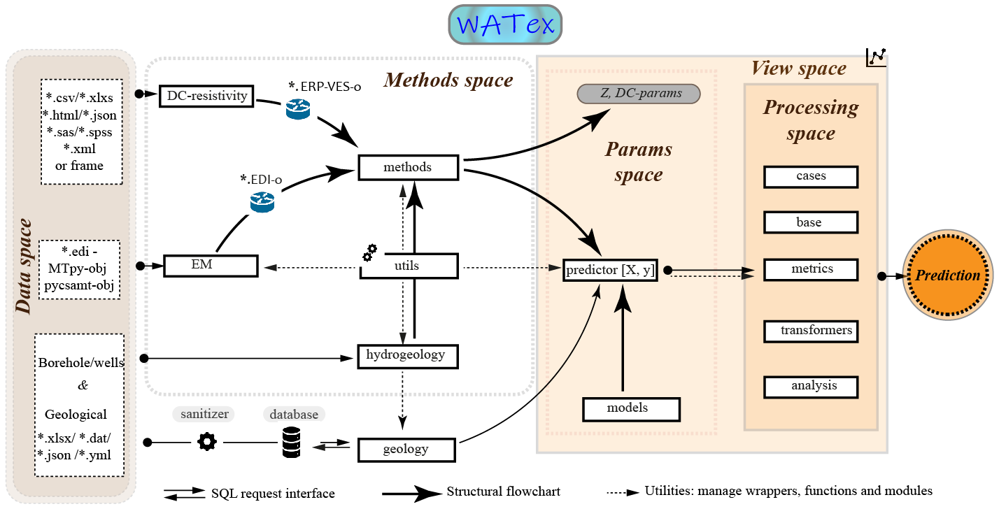

.. _structure: 

===============================
:code:`watex` Structure 
===============================

The page explains the choice of selecting Python programming language for designing :code:`watex` and gives a synopsis of 
the :code:`watex` package organization.  

Why Python ?
===============

The classes, modules, and functions of watex are written using Python language.  The choice of Python as a programming language is 
derived from two advantages. The first is its easy accessibility, clear syntax, interactive shell environment., and ease of 
interaction between modules and packages. Secondly, Python is freely distributed and due to the powerful numerical libraries 
(`NumPy`_ , `SciPy`_ , `Pandas`_ , `SQLite`_ , `scikit-learn`_ , etc.), allows the handling of large data sets. 

.. _NumPy: https://numpy.org/
.. _Scipy: https://scipy.org/ 
.. _Pandas: https://pandas.pydata.org/ 
.. _SQLite: https://sqlite.org/index.html 
.. _scikit-learn: https://scikit-learn.org/

Sub-packages organization 
==========================

The package follows the modular approach of `scikit-learn`_ and uses it as a top-level module for the predictions. 
some modules and classes like :mod:`~watex.methods.erp` or :class:`~watex.cases.modeling.BaseModel` follows the approach of `GMT`_ [1]_. It should probably deprecated for 
the next release to implement the `fit` and `transform` methods. To basically understand the package organization, It is structured  into tree domains called spaces. 

**Data space**
	The data space is composed of four different data types referring to the implemented methods such as:
	`ERP data type`: It can be arranged into several formats such as `*.csv`, `*. xlsx`, `*.xml`, `*.html`, or simple in `Pandas`_  data frame. The columns of ERP must be composed of station positions, the resistivity data, and the coordinates such as longitude/latitude or easting/ northing. 
	`VES data type`: It expects the same format as ERP. However, the columns of DC- sounding must be the AB/2 depth measurements at each time the current electrodes are moved apart and the resistivity values collected at each sounding depth. The MN/2 values of the potential electrodes are not compulsory. 
	`EM data type`: watex deals only with the SEG-Electrical Data Interchange format(*.edi). However, the EDI - object created from external software like `pycsamt`_ and `MTpy`_ can also be read. Indeed, the watex EDI module API is designed to work with both. In addition, attributes and methods from EDI objects are constructed following both software structures.
	Boreholes and geology data type: Both can be collected in `*. yaml`, `*.json` or `*csv formats`. An example of data arrangement can be found in the data/borehole’s directory of the package. 

**Methods space** 
	The domain :ref:`methods` (:mod:`~watex.methods`) mainly focused on geophysical and hydrogeological methods implementation. 
	**User guide:** See the :ref:`methods` section for further details.
	
**Params space**
	The domain of parameters is a set of tricks for features manipulating for prediction purposes. The parameter space builds 
	the predictor :math:`[X,y ]` where :math:`X` is data composed of features only and :math:`y` is the target for supervised learning. For instance, 
	the DC profiling and sounding parameters are combined with the geological data (the geology of the survey area) to compose a 
	unique predictor :math:`X`. If the main goal is the FR prediction before any drilling operations, :math:`y(FR)` must previously be collected 
	from existing boreholes in the survey area as FR samples for model training. However, if the objective is predicting k, mostly :math:`X` 
	is composed of the strata, the logging data, and the borehole depth while :math:`y(k)` is obtained at a certain depth of a productive aquifer. 
	Thus, :math:`[X,y]` are aggregated to compose a unique dataset ready for the processing space. 
	Furthermore, the ‘models’ in the params space is a set of pre-trained models already used to achieve concrete results 
	in published papers. The pre-trained models expect the same number of parameters as the predictor :math:`[X,y]` and will throw 
	an error otherwise. However, if the predictor :math:`[X,y]` is correctly created, the pre-trained models can easily be fetched and utilized 
	to fast predict FR or k. At the time the paper is written, only the pre-trained models for FR and k predicting, are available. 
	There is also an alternative way to boost the prediction score by re-training the model via the :mod:`~watex.models` sub-package. 

**Processing space**
	The domain for processing mainly focused on machine learning applications such as data exploratory, preparation, data munging, 
	model training, and testing. It also includes several tools for data analysis such as factor and linear discriminant analysis 
	and, normal, kernel, and incremental PCA. In addition, some tools are not implemented in scikit-learn yet at the time the paper 
	is written. For instance, the sequential backward selection algorithm proposed by [2]_ is useful to control the 
	feature importance and get the rate of contribution of each feature in the dataset. It can also improve the predicting power of 
	the model if the model suffers from overfitting. The adaptative linear neuron classifier , greedy perceptron 
	, and the naïve majority vote classifier are also additional algorithms implemented in watex. Overall, the modules of the 
	processing space follow the `scikit-learn`_ API and mostly inherit from the base-estimator class for ease of cross-validating. 
	Individually, the cases module in the processing space is for reproducing workflow already published. The only task for users of 
	this module is to arrange data safely. If data is correctly arranged, it does not make sense to worry after calling the fit method. 
	Data is automatically transformed using the base transformers and the default pipeline used to achieve the results of published 
	papers. :code:`watex` simplifies the work reproducibility for ML newbies. However, for ML practitioners, modules can be modified and adjusted 
	accordingly. Besides the cases module, there is the transformers module for feature transformation and the metric module for the 
	model performance evaluation. 
	
**View space**
	This domain is constructed for visualization purposes. It deals with the parameters and processing spaces and yields several 
	plots for data exploration, features analysis, features discussion, tensor recovery, model inspection, and evaluation. 
	Mostly the params space plots are managed by the modules :class:`~watex.view.ExPlot`, :class:`~watex.view.QuickPlot`, and 
	:class:`~watex.view.TPlot` plots while the processing space plot is handled by :class:`~watex.view.EvalPlot` plot and many other 
	functions in plot utilities :mod:`~watex.utils.plotutils`. 

The figure below recaps all the litterature above: 

 
.. _MTpy: https://github.com/MTgeophysics/mtpy
.. _pycsamt: https://github.com/WEgeophysics/pycsamt
.. _GMT: https://www.generic-mapping-tools.org/
 
.. topic:: References 

	.. [1] Wessel, D.E., Smith, W.., 1998. New, improved version of generic mapping tools realeased. Eos Trans. Am. Geophys. 
		Union 79, 579.
	.. [2] Ferri, F.J., Pudil, P., Hatef, M., Kittler, J., 1994. Comparative study of techniques for large-scale feature 
		selection.This work was suported by a SERC grant GR/E 97549. The first author was also supported by a FPI grant from the 
		Spanish MEC, PF92 73546684, in: GELSEMA, E.S., KANAL, L.S. (Eds.), Pattern Recognition in Practice IV, Machine Intelligence 
		and Pattern Recognition. North-Holland, pp. 403–413. https://doi.org/https://doi.org/10.1016/B978-0-444-81892-8.50040-7