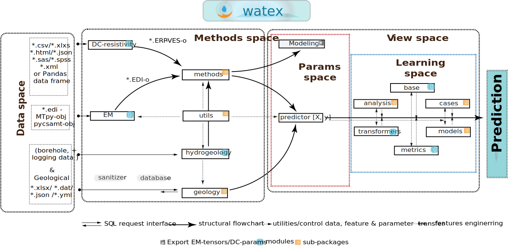

.. _structure:

===========================
Structure
===========================

This page gives an overview of the :code:`watex` architecture and functionnalities. The figure below gives an overview 
of the architecture of :code:`watex` explained below: 

Data Structures and Methods 
==============================
:code:`watex` is structured into five domains also called spaces ( *Data space*, *Method space*, *Params space*, *Learning space* and *View space*)

Data  space
------------

The data space domain of :code:`watex` is composed of four different data types referring to the implemented methods such as:

ERP data type
^^^^^^^^^^^^^

It can be arranged into several formats such as `*.csv`, `*.xlsx`, `*.xml`, `*.html`, or simple in `Pandas <https://pandas.pydata.org/>`_  data frame. 
The columns of ERP must be composed of station positions, resistivity data, and the coordinates 
such as longitude/latitude or easting/ northing. 

.. seealso:: :ref: `ERP dataset <erp_dataset>`
	

VES data type
^^^^^^^^^^^^^^^^^

It expects the same format as ERP. However, the columns of DC- sounding must be the AB/2 depth measurements at each 
time the current electrodes are moved apart and the resistivity values collected at each sounding depth. The MN/2 values 
of the potential electrodes are not compulsory. 

.. seealso:: :ref:`VES dataset <ves_dataset>`
   

EM data type
^^^^^^^^^^^^^^

`watex` deals only with the SEG-Electrical Data Interchange format(.edi). However, the EDI - object 
created from external software like `pycsamt <https://github.com/WEgeophysics/pycsamt>`_ and `MTpy <https://github.com/MTgeophysics/mtpy>`_ 
can also be read. Indeed, the watex EDI module API is designed to work with both. In addition, attributes and methods 
from EDI objects are constructed following both software structures. Boreholes and geology data type: Both can be collected 
in `. yaml`, `.json` or `.csv formats`. An example of data arrangement can be found in the `data/boreholes` directory of the package. 

.. seealso:: :ref:`EM dataset <em_dataset>`

Boreholes and geology data type 
^^^^^^^^^^^^^^^^^^^^^^^^^^^^^^^^

Both can be collected in *. yaml, *.json or *.csv formats. An example of data arrangement can be found in the 
data/borehole’s directory of the package. 

Methods space 
----------------

This domain mainly focused on geophysical and hydrogeological methods implementation. 

DC-Resistivity methods
^^^^^^^^^^^^^^^^^^^^^^^
Because they are cheaper and fast, especially the ERP and VES, the DC methods are the most used in developing countries for groundwater 
exploration (GWE). They are the most preferred methods to stay on the project schedule. Furthermore, from the DC-Profiling method implemented 
in watex from module electrical, the relevant appropriate features are extracted such as the conductive zone and the best position point 
for drilling.  For the prediction purpose, the profiling parameters such as the type, shape, magnitude, power of anomaly, and, pseudo-fracturing 
index (sfi) are also computed. Likewise, from the DC-Sounding, some features such as the fractured zones are extracted in deeper and the ohmic-area 
(ohmS) feature derived from the fracture location is also computed.

.. seealso:: :ref:`DC-resistivity method <dc_resistivity>`
   

EM method 
^^^^^^^^^^^

EM method focused on short periods of EM where the groundwater target is for the first 500 meters to 1km depth at most. 
Indeed, the EM method is rarely used during the DWSC except for commercial purposes such as mineral water exploration. 
Here, the methods provided efficient tools for the fast processing of short-period data like complex Natural Source Audio-frequency Magnetotelluric (NSAMT) 
data. Indeed, the NSAMT is one of the EM methods occasionally found in GWE because it has some advantages compared to other geophysical 
short-period methods like CSAMT, and CSRAMT (`Bastani et al., 2011 <https://doi.org/10.1016/j.jappgeo.2011.07.001>`_; 
`Kouadio et al., 2020 <https://doi.org/10.1016/j.jappgeo.2020.104204>`_; `Sandberg and Hohmann, 1982 <https://doi.org/10.1190/1.1441272>`_; 
`Zonge and Hughes, 1991 <https://doi.org/10.1190/1.9781560802686>`_). For instance, NSAMT is useful: 

* for imaging deep and near-surface geology structures and can provide relevant details as it requires no high-voltage electrodes.
*  It has no environmental impact and its infrastructures are relatively easy to support in the field, especially in 
   difficult terrain (Zheng, 2010 [1]_). 
   
Unfortunately, this advantage also requires careful processing because the natural signals are uncontrollable 
and suffer from frequency ranges with weak or sometimes no signal. This is one of the main problems of using NSAMT data especially the signal 
level in the "attenuation band" also known as the "dead band"(Carlson et al., 2011 [2]_). 

watex works around this issue by recovering the loss or weak signal due to man-made noise (human activities, existence of factories near the survey sites, power lines, etc) and updating new tensors. 
It also provides efficient filters to correct the tensors influenced by these noises, especially at a frequency range above 1 kHz. 

Hydrogeology method
^^^^^^^^^^^^^^^^^^^^
It focuses on computing hydrogeology parameters such as permeability coefficient :math:`k`, finding the aquifer group similarities, 
and managing the logging data indispensable in hydrogeological exploration( `Meng et al., 2021 <https://doi.org/10.1016/j.enggeo.2021.106339>`_; 
`ScienceDirect, 2022 <https://www.sciencedirect.com/topics/engineering/permeability-coefficient>`_ ). 

Indeed, geophysical logging mostly comes to support hydrogeological exploration. Genuinely, the method distinguishes the properties of 
rock and fluid by measuring the physical property of heat, sound, and electricity in the borehole compared to other geophysical 
engineering methods `Liu et al., 2010 <https://doi.org/10.3882/j.issn.1674-2370.2010.04.001]>`_; `Zhong et al., 2020 <https://doi.org/10.1016/j.coal.2020.103416>`_). 
Thanks to the mixture learning strategy (MXS) implemented by watex, the combination of both methods infers the relationship between the 
logging data and the hydrogeological parameters thereby minimizing the numerous pumping test failures and reducing the useless boreholes.

.. seealso:: :ref:`Hydrogeology method <hydrogeology>` 

Params space 
----------------

The domain of parameters is a set of tricks for features manipulating for prediction purposes. The parameter space builds the predictor :math:`[X,y ]` 
where :math:`X` is data composed of features only and :math:`y` is the target for supervised learning. For instance, the DC profiling and sounding parameters 
are combined with the geological data (the geology of the survey area) to compose a unique predictor :math:`X`. If the main goal is the FR prediction before any drilling operations, y(FR) must previously 
be collected from existing boreholes in the survey area as FR samples for model training. 

However, if the objective is predicting k, mostly X is composed of the strata, the logging data, 
and the borehole depth while y (k) is obtained at a certain depth of a productive aquifer. Thus, [X,y] are aggregated to compose a unique 
dataset ready for the processing space (explained in the next section). 

Furthermore, the ‘models’ in the params space is a set of pre-trained models already used to achieve concrete results in published papers. The 
pre-trained models expect the same number of parameters as the predictor :math:`[X,y]` and will throw an error otherwise. However, if the 
predictor :math:`[X,y]` is correctly created, the pre-trained models can easily be fetched and utilized to fast predict FR or k. At the time the paper is written, only 
the pre-trained models for FR and k predicting, are available. There is also an alternative way to boost the prediction score by re-training 
the model via the :mod:`~watex.models.premodels` module. 

Learning space 
---------------

The domain for learning mainly focused on machine learning applications such as data exploratory, preparation, data munging, model 
training, and testing. It also includes several tools for data analysis such as factor and linear discriminant analysis and, normal, 
kernel, and incremental PCA. 

In addition, it also includes some other learning algorithms such as the sequential backward selection algorithm (:class:`~watex.base.SequentialBackwardSelection`),  
proposed by `Ferri et al., (1994) <https://doi.org/https://doi.org/10.1016/B978-0-444-81892-8.50040-7>`_. The latter is useful to control the feature importance and get the rate of contribution of each feature in the dataset. 
It can also improve the predicting power of the model if the model suffers from overfitting. Moreover, the adaptative linear neuron classifier (:class:`~watex.base.AdalineGradientDescent`)
(Widrow, 1960; Wlodarczak, 2019), greedy perceptron (:class:`~watex.base.GreedyPerceptron`)( `McCulloch and Pitts, 2014 <https://doi.org/10.2307/2268029>`_) , 
and the naïve majority vote classifier (:class:`~watex.base.MajorityVoteClassifier`) are also additional algorithms. 

Overall, the modules of the learning space follow the scikit-learn API and mostly inherit from the base-estimator class for ease of cross-validating. Individually, the **cases** sub-package in the 
learning space is for reproducing workflow already published. The only task for users of this module is to arrange data safely. If data is 
correctly arranged, it does not make sense to worry after calling the fit method.Data is automatically transformed using the base transformers and the 
default pipeline to achieve the results of published papers. However, for ML practitioners, modules can be modified and adjusted accordingly. 

Besides the **cases** module, there is the transformers (:mod:`~watex.transformers` ) module for feature transformation and the metric module (:mod:`~watex.metrics` ) for the model performance evaluation. 

View space 
------------
This domain is constructed for visualization purposes. It deals with the *parameters* and *learning spaces* and yields several plots for 
data exploration, features analysis, features discussion, tensor recovery, model inspection, and evaluation. Mostly the **params space** plots are 
managed by the modules :class:`~watex.view.ExPlot`, :class:`~watex.view.QuickPlot`, and :class:`~watex.view.TPlot` plots while the 
**learning space** plots are handled by :class:`~watex.view.EvalPlot` and many other functions in plot utilities (see :mod:`~watex.utils.plotutils`).

.. seealso:: :ref:`Visualization page <view>` 

Functionnalities 
=================

The section is divided into two parts: 
* core packages 
* learning from scikit-learn

Core functionnalities 
----------------------

:code:`watex` is making its way, so the enumerated modules are not exhaustive. The table below shows the public API modules. The 
public API is determined based on the documentation and are the class, functions, and modules that are presumed to be the most used 
for solving an immediate specific task.  

The public API modules can be called using the `shorthand import strategy` like:: 

	>>> import watex as wx 
	
The list of the Public API displayed here concerned only the inner-learning, methods and geology  sub-packages: 

.. table::
   :widths: auto
   :class: longtable
   
   ========================== ============================= ===========================
    **Methods**                   **Modules**                **Some functionnalities** 
   -------------------------- ----------------------------- ---------------------------
    Reducers                   :mod:`watex.analysis`        Randomized-kernel-incremenental and Normal PCA (rPCA, `kPCA`, `iPCA`, `nPCA)`, ...
    Innner-learners            :mod:`watex.base`            `SequentialBackwardSelection` ; `GreedyPerceptron`, `MajorityVoteClassifier` , `AdalineGradientDescent; `AdalineStochasticGradientDescent`, ...
    Geophysical                :mod:`watex.methods`         DC- Electrical Resistivity Profiling, Short-period Electromagnetic methods such as NSAMT,  `Logging`, ...
    Hydrogeology               :mod:`watex.methods.hydro`   Hydro-parameters calculation, Mixture learning strategy (`MXS`), ...                                                         
    Geology                    :mod:`watex.geology`         `Borehole`, `Structural` , `Structural` , `Stratigraphic`, ...                                                   
   ========================== ============================= ===========================

Each class or function in the public API can be implemented via the following syntax:: 

	>>> import watex as wx 
	>>> data = wx.make_erp (n_stations =30 , max_rho = 1e4 , min_rho=1 ).frame # generate an Electrical Resistivity Profiling 
	>>> robj = wx.ResistivityProfiling ().fit(data ) 
	>>> robj.sfi_ 
	1.2771108364026975
	
Additional to being a geosiences library, :code:`watex` implements some machine learning algorithms  
and stored in the module Base :mod:`watex.base` nammed  `inner -learners` in the table above. 

Synopis for calling :code:`watex` 
---------------------------------
`Scikit-learn <https://scikit-learn.org/stable/index.html>`_ is built on the top of :code:`watex` modules  for prediction purpose i.e, we can 
call directly called scikit-learn algorithms from :code:`watex`. For instance:

.. code-block:: python 

	>>> import watex as wx 
	>>> X_train, X_test, y_train, y_test = wx.sklearn.train_test_split (...) 
	>>> sgd = wx.sklearn.SGDClassifier (...) 
	>>> # or 
	>>> from watex.exlib import train_test_split , SGDClassifier
	>>> X_train, X_test, y_train, y_test = train_test_split (...) 
	>>> sgd_cf = SGDClassifier (...) 
	
`Scikit-learn <https://scikit-learn.org/stable/index.html>`_  a machine learning library with many sub-packages. If an error occurs when importing ``sklearn`` objects 
from :code:`watex`, import that modules from ``scikit-module`` sub-packages instead. Indeed, :code:`watex` tries to simplify 
scikit import strategy by elimating the  level of the modules sub-package name. For instance import :class:`~watex.exlib.RandomForestClassifier` 
from  scikit-learn ``ensemble`` sub-package using  :code:`watex`, henceforth it can be: 
 
.. code-block:: python 
 
	>>> import watex as wx 
	>>> wx.sklearn.RandomForestClassifier (...) 
	>>> # rather than 
	>>> from sklearn.ensemble import RandomForestClassifier 
	
Here, the user does not need to worry about the name of sub-package that contains the main class. Here is ``ensemble`` sub-package. The scikit-learn
sub-package most implemented in :code:`watex` are: 

.. table::
   :widths: auto
   :class: longtable
   
   ================= =====================================
   **Sub-package**       **Algorithm names**
   ----------------- -------------------------------------
   Kernels 	         Support vector Machines 
   Neighbors         KNeighbors (NN) 
   Ensemble          RandomForest, Bagging and Pasting, Boosting and Stacking
   clusters          KMeans and Hierarchical Agglomerative Trees` 
   decomposition     PCA, Incremental PCA, Kernel PCA, and Factor Analysis
   ...               ... 
   ================= =====================================

The list of algorithms is not exhaustive. Browse the whole :mod:`watex.exlib.sklearn` to discover other implemented 
algorithms. 

.. seealso: Refer  to :ref:`API references <api_references>`.

.. _scikit-learn: http://scikit-learn.org/stable/
   
   
.. topic:: References 

   .. [1] Zheng, G., 2010. Introduction to NSAMT, Zonge International.
   .. [2] Carlson, N.R., Feast, C.F., Bushner, G.L., 2011. The use of CSAMT and NSAMT in siting groundwater production wells: Two case histories, in: International Workshop on Gravity, Electrical and Magnetic Methods and Their Applications. pp. 23–23. 
   

