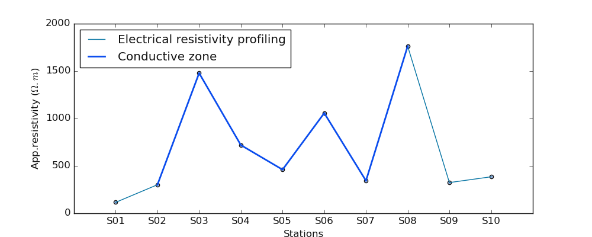
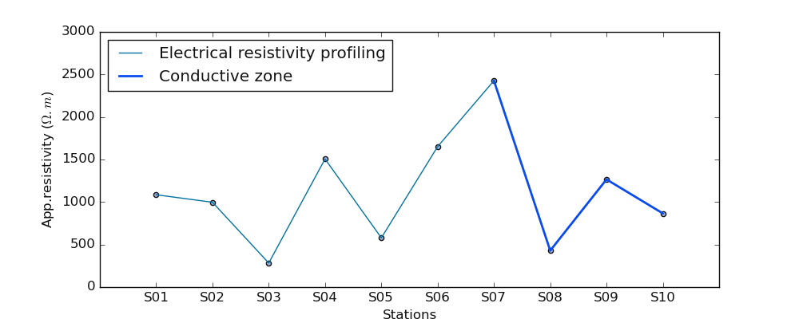
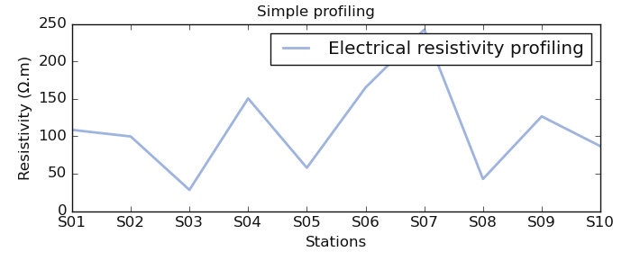
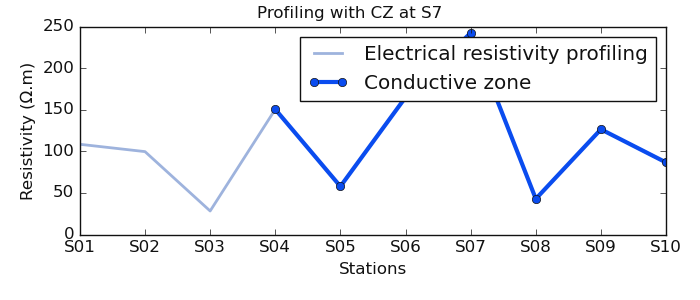
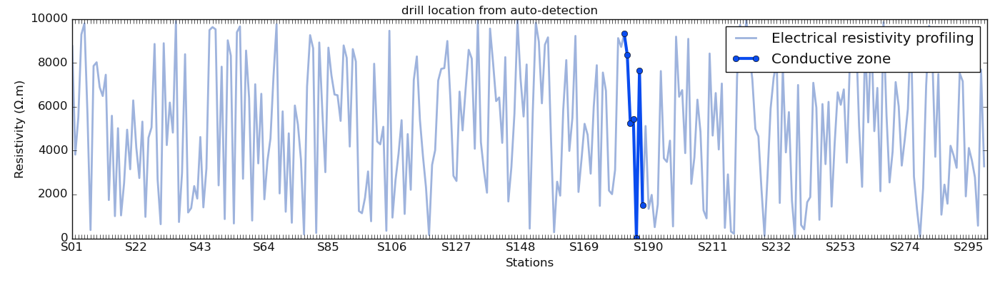
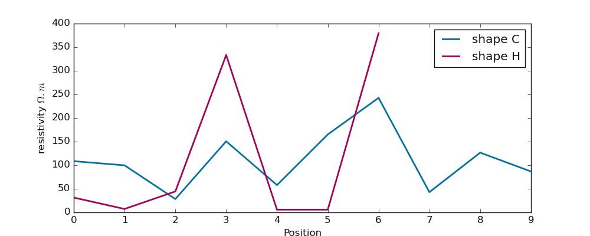
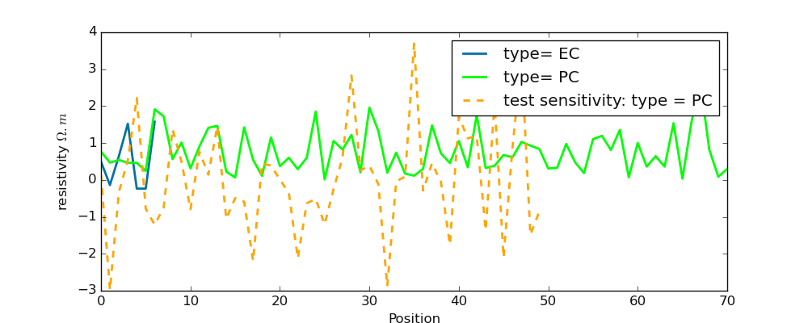
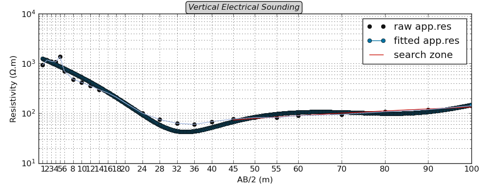

.. _utilities:

===============
Utilities
===============

.. currentmodule:: watex.utils

:mod:`~watex.utils` is a module composed of set of tricks, hints to quick performs operations and 
get systematically results. The tools are composed of functions to handle specifics task. The functions 
can be used in a third party software. For clarity, we will group utilities into three categories: 

* core utilities: :mod:`~watex.utils.coreutils` 
  Is a set of tools to deal with the software acceptable formats. It reads, controls, validates and parses the data 
  and distribute to the different modules that composed the package. It is also able to transform the data to a 
  recommended data-type if there is a minimum informations in the data that is recognized by the software. 
* mathematical extension utilities: :mod:`~watex.utils.exmath` 
  Is a set of tools mainly dedicated for mathematical algebras and geometry calculus. It is the core maths 
  tricks implemented throughout the software. 
* plot utilities: :mod:`~watex.utils.plotutils` 
  Is a set of plot tricks to quick visualize the data. It composed the additional utilities to support the 
  :mod:`~watex.view` module. 
* functions utilities: :mod:`~watex.utils.funcutils` 
  Is a set of pieces of components that is used by other functions to handle a specific task. It also contains many 
  functions that can be used by third-party software  to built its own packages. 
* geology utilities: :mod:`~watex.utils.geotools` 
  Is a set of functions maily focused on managing the layer properties, stratigraphic plots, everything related to the 
  geology and stratigraphic. 
* hydrogeology utilities: :mod:`~watex.utils.hydroutils`
  Is a set of tools for hydrogeology parameters computation, aquifer layer management, the boreholes depth section computing. 
  It is also composed of math concepts that is related to hydrogeology and logging. 
* GIS utilities: :mod:`~watex.utils.gistools` 
  Is a set of tools for managing the coordinates, everything refering to the geographic information system. It is used in 
  the package to assert the coordinates, transform or recomputed the  given values based of the referential system. 
  
In addition to the tools listed above, there are other modules that can help the user to construct its own Python Package. 

.. note::
   In this guide, we could not list all the module of these utilities. We will give some tools that expect to be useful for 
   the user to fast achieve some expected task. However for more-in depth, we recommend the user to clone the repository
   in `github <https://github.com/WEgeophysics/watex>`_ to discover other function tasks. 

.. _coreutils: 

Core Utilities: :mod:`~watex.utils.coreutils` 
================================================= 
:mod:`~watex.utils.coreutils` is composed of utilities that represent the core of the software. It manages the data, controls the data, and 
implements basic tasks like parsing and transforming data to be recognized by other modules of the package. We will list some below: 

Read and parse the data: :func:`~watex.utils.read_data`
---------------------------------------------------------

:func:`~watex.utils.read_data` is used for reading and parsing data before feeding to the methods and params spaces (c.f. :ref:`structures`). 
It reads and parses `csv, xlm, html , spss, etc.`, every data that can be read by `pandas read package <htpps://pandas.pydata.org>`_ function.
For instance:: 
	
	>>> from watex.utils import read_data 
	>>> # read csv file 
	>>> data = read_data ('data/erp/testsafedata.csv') 
	>>> data.head(2) 
		pk       x          y   rho
	0   0  790752  1092750.0  1101
	1  10  790747  1092758.0  1147
	>>> # read xls data 
	>>> datau = read_data ('data/erp/testunsafedata.xlsx') 
	>>> datau.head(2) 
			x  stations  resapprho      NORTH
	0  790752        40       1101  1092750.0
	1  790747        70       1147  1092758.0
	
	
The :func:`~watex.utils.read_data` outputs a data frame from the reading file. It does not accept an array. However, to systematically convert 
an array to a frame, it is recommended to use :func:`watex.utils.coreutils._is_readable` function. Indeed,  :func:`~watex.utils.coreutils._is_readable`
does the same task as :func:`~watex.utils.read_data` but converts the array to the data frame with column names starting with 
the prefix `f`. To have full control of the column names, ones can be changing the parameter `input_names`  to another name or supply the columns
via the parameter `columns`. Here are some basic examples:: 

	>>> from watex.utils.coreutils import _is_readable 
	>>> import numpy as np 
	>>> np.random.seed (42) 
	>>> data1 = _is_readable ( np.random.randn (2, 7 ) ) 
	>>> data1.columns 
	Index(['f0', 'f1', 'f2', 'f3', 'f4', 'f5', 'f6'], dtype='object')
	>>> # will change the input name 'f' with 'sample'
	>>> data1 = _is_readable ( np.random.randn (2, 7 ), input_name='sample' ) 
	>>> data1.columns 
	Index(['sample0', 'sample1', 'sample2', 'sample3', 'sample4', 'sample5',
       'sample6'],dtype='object')
	>>> # change each columns 
	>>> data1 = _is_readable ( np.random.randn (2, 7 ), columns = ['a', 'b', 'c', 'd', 'e', 'f', 'g']) 
	>>> data1.head (2) 
			  a         b         c         d         e         f         g
	0 -0.115648 -0.301104 -1.478522 -0.719844 -0.460639  1.057122  0.343618
	1 -1.763040  0.324084 -0.385082 -0.676922  0.611676  1.031000  0.931280
	
	
Recompute coordinate values: :func:`~watex.utils.coreutils.fill_coordinates`
--------------------------------------------------------------------------------
:func:`~watex.utils.coreutils.fill_coordinates` recomputes the coordinates values (latitude/longitude) or easting/northing and filled the remaining 
coordinates if does not exist. For instance, if 'easting/northing' composes the columns of the data frame, if the UTMZONE  is specified, two other 
columns should be created as outputs 'latitude/longitude' after recomputing the former coordinates data. This is useful for managing 
plots according to one specific coordinate type. Here are two basic examples: 

* from easting/northing to latitude/longitude 

.. code-block:: python 

	>>> from watex.utils.coreutils import fill_coordinates 
	>>> from watex.utils import read_data 
	>>> data = read_data ('data/erp/l2_gbalo.xlsx') 
	>>> # rename columns 'x' and 'y' to 'easting' and 'northing'  inplace 
	>>> data.rename (columns ={"x":'easting', "y":'northing'} , inplace =True ) 
	>>> # transform the data by computing latitude/longitude  by specifying the UTM zone 
	>>> data_include,_ = fill_coordinates (data , utm_zone ='49N' ) 
	>>> data.head(2)  
		pk  easting   northing   rho  longitude  latitude
	0   0   790752  1092750.0  1101        113         9
	1  10   790747  1092758.0  1147        113         9

* from latitude/longitude to easting/northing 

Now let doing the revert process by removing the easting/northing and recomputing using the latitude/longitude coordinates:
	
.. code-block:: python 

	>>> datalalon = data_include[['pk', 'longitude', 'latitude']] 
	>>> data_east_north, _ = fill_coordinates (datalalon ) 
	>>> data_east_north.head(2) 
		pk  longitude  latitude  easting  northing
	0   0        113         9   719870    995452
	1  10        113         9   719870    995452
		

.. note:: 

	The recomputing data from longitude/latitude to easting/northing if not specified the datum like 'WGS84' will use the latter instead. 
	And the value could be a bit approximated like the demonstration below. However, if more data are given, the accuracy should be improved. 

Generate coordinates: :func:`~watex.utils.makeCoords`
------------------------------------------------------
:func:`~watex.utils.makeCoords` is used to generate multiple station coordinates (longitudes, latitudes) from a reference station/site. This 
is useful in the case the stations and site coordinates are missing while the dipole spacing or the step between stations/sites is known. The 
computed coordinates can be outputs in DD:MM:SS or degree decimals. Here are examples: 

* Passed the reference coordinates in DD:MM:SS 

.. code-block:: python 

	>>> from watex.utils import makeCoords 
	>>> rlons, rlats = makeCoords('110:29:09.00', '26:03:05.00', nsites = 7, todms=True)
	>>> rlons 
	array(['110:29:09.00', '110:29:35.77', '110:30:02.54', '110:30:29.30',
       '110:30:56.07', '110:31:22.84', '110:31:49.61'], dtype='<U12')
	>>> rlats 
	array(['26:03:05.00', '26:03:38.81', '26:04:12.62', '26:04:46.43',
       '26:05:20.23', '26:05:54.04', '26:06:27.85'], dtype='<U11')

* Passed the reference coordinates as a list of [start, stop]

The [start, stop] list is the first and last stations/sites coordinates. If known, the number of sites can provide and the 
equidistant coordinates will be created. In the following examples, the list of reference coordinates [start, stop] is passed 
in degree decimals.  However, they also accept the DD:MM:SS. The following example split coordinates into 238 sites and the 
rotation angle compared to four cardinal points  is 125 degrees:: 
  
  >>> rlons, rlats = makeCoords ((116.7, 119.90) , (44.2 , 40.95),nsites = 238, step =20. , order = '-', r= 125)
  >>> rlons [:7] # get the first seven points 
  array([119.9       , 119.88649789, 119.87299578, 119.85949367, 119.84599156, 
         119.83248945, 119.81898734])
  >>> rlats [:7] 
  array([40.95      , 40.96371308, 40.97742616, 40.99113924, 41.00485232,
       41.0185654 , 41.03227848])
								 
If `todms` is set to ``True``, the `rlons` and `rlats` should be in DD:MM:SS. 

Control the ERP data type: :func:`~watex.utils.erpSelector` 
-------------------------------------------------------------
								  
:func:`~watex.utils.erpSelector` asserts the validation of Electrical Resistivity Profiling (ERP) data types. If the data is not 
arranged according to the ERP data type, there is a config parser to check whether there is any possibility to change the column names into 
appropriate ERP column names. For instance, by throughout the package `x` and `y` are considered as `easting`  and `northing`. Thus, if the 
data contains `x` and `y` as frame columns, it should be renamed as `easting` and `northing` instead. Here is an example:: 

	>>> from watex.utils import read_data, erpSelector 
	>>> raw_data = read_data ('data/erp/l10_gbalo.xlsx') 
	>>> raw_data.head(2) 
	   PK       X        Y  Rho
	0   0  790284  1093124  126
	1  10  790281  1093118  120
	>>> erp_data = erpSelector ('data/erp/l10_gbalo' , force =True ) 
	>>> erp_data.head(2) 
		station  resistivity  longitude  latitude  easting  northing
	0      0.0          126        0.0       0.0   790284   1093124
	1     10.0          120        0.0       0.0   790281   1093118

In the above example, :func:`~watex.utils.erpSelector` has changed the `pk` , `x` and `y` columns to `station`, `easting`, and 
`northing` respectively. Note also the additional longitude and latitude. If not given in the raw data, both should be set to None and vice-versa. 
To compute the longitude/latitude from easting/northing, use the :func:`~watex.utils.coreutils.fill_coordinates` instead. 

.. note:: 
   
   The argument ``True`` passed to the parameter `force` is important to force read the data from a file or frame whose arrangement does not follow 
   the ERP data arrangement ( see :ref:`datasets <datasets>`) to rename the columns from the config parser 
   :class:`~watex.property.Config`. By default `force` is ``False``, thus, the minimum column recognition is performed. In the above example if 
   `force` was not set, an :class:`~watex.exceptions.ERPError`  should raise indicating the way to safely arrange the ERP data. 
   

.. seealso: 

	See also the documentation of :func:`~watex.utils.coreutils.is_erp_dataframe` to check whether the data frame contains the electrical resistivity 
    profiling (ERP) index properties.
	

Control the VES data type: :func:`~watex.utils.vesSelector` 
-------------------------------------------------------------

:func:`~watex.utils.vesSelector` asserts the validation of Vertical Electrical Sounding (VES) data types. If the data is not 
arranged according to the VES data type, there is a parser to rename the column to fit the appropriate VES columns.  For instance, the 
prefix `SE` throughout the package is considered as the resistivity measurement in deeper at each AB/2 ( current electrodes). Thus, 
the `SE` is systematically renamed to `resistivity`. Here is an example:: 

	>>> from watex.utils import read_data, vesSelector 
	>>> raw_data = read_data ('data/ves/ves_gbalo.csv') 
	>>> raw_data.head(2) 
		AB/2  MN/2   SE1  SE2   SE3  SE4
	0     1   0.4   943  294  1125  457
	1     2   0.4  1179  502  1345  582
	>>> ves_data = vesSelector ('data/ves/ves_gbalo.csv') 
	>>> ves_data.head(2) 
	   AB   MN  resistivity
	0   1  0.4          943
	1   2  0.4         1179
	
In the aforementioned example, `AB/2` and `MN/2` are changed to `AB` and `MN`. By convention, the measurement in deeper is known as `AB/2` thus, 
when keeping the `AB`  and `MN` in the validation VES, the user must understand that it is half of AB and MN instead. Rather than using 
`0.5AB` or `0.5MN`, `AB`, and `MN` are simply used. Keep in mind that it is `AB/2` and `MN/2`. 
Furthermore, we noticed that the resistivity in the validation VES is the first resistivity (`SE1`). Note that :func:`~watex.utils.vesSelector` does 
not output all the resistivity values if there are many sounding sites like the example above (4 sounding sites). However, to retrieve the 
resistivity from a specific sounding site, the user must pass the parameter `index_rhoa` to the index of the resistivity to fetch. Here is an 
example to fetch the `SE3` i.e the index 2. 

.. code-block:: python 
	
	>>> ves_data = vesSelector ('data/ves/ves_gbalo.csv', index_rhoa = 2)  
	>>> ves_data.head(2) 
	   AB   MN  resistivity
	0   1  0.4         1125
	1   2  0.4         1345
	
.. note:: The parameter `index_rhoa` starts from `0` as Python Indexing. 

Select the conductive zone from ERP: :func:`~watex.utils.defineConductiveZone` 
--------------------------------------------------------------------------------

:func:`~watex.utils.defineConductiveZone` selects the conductive zone as a subset of the ERP line.  Indeed the conductive zone is a specific zone 
expected to hold the drilling location `station`. If the drilling location is not provided, it would be by default the very low resistivity values 
found in the ERP line. If the station position/number is passed to the function i.e the manual selection is triggered instead. The following 
example gives a visual depiction::

	>>> import numpy as np 
	>>> from watex.utils.coreutils import defineConductiveZone
	>>> from watex.utils.plotutils import plot_profiling 
	>>> np.random.seed (123) 
	>>> test_array = np.abs (np.random.randn (10)) *1e3 
	>>> selected_cz ,*_ = defineConductiveZone(test_array, 's5') # plot the station S5 
	>>> selected_cz 
	array([1490.73202815,  935.8338684 , 1175.82904478, 1253.88066775,
        637.75150245,  907.1051958 , 1428.68070023])
	>>> plot_profiling(test_array, selected_cz )

   
If the station is out of the resistivity data range ( for instance station 's20' while we expect max station equal to `10` ), the auto-detection is 
triggered instead. For example:: 

	>>> selected_cz ,*_ = defineConductiveZone(test_array, auto=True)  
	>>> # selected_cz ,*_ = defineConductiveZone(test_array, 's20' )# plot the station S20 out of the range 
	>>> selected_cz 
	array([1253.88066775,  637.75150245,  907.1051958 , 1428.68070023,
			140.06872019,  861.75489586])
	>>> plot_profiling(test_array, selected_cz )
	

   
.. note:: 
   
   To automatically detect/define the conductive zone if the station is not supplied, it is recommended to 
   use :func:`~watex.utils.plotAnomaly` instead. The latter is more consistent. 
   
	
Plot the anomaly from ERP: :func:`watex.utils.plotAnomaly` 
------------------------------------------------------------
:func:`~watex.utils.plotAnomaly` is the most consistent plot for plotting at the same time the ERP and the selected conductive zone either the 
position to make a drill is given or the auto selection is triggered. Let’s go ahead for  a sample of random data for the first example to propose the 
ERP without computing the conductive zone and the selected conductive zone:: 

* Visualize a simple resistivity profiling 

	>>> from watex.utils import plotAnomaly, defineConductiveZone 
	>>> import numpy as np 
	>>> np.random.seed (123)
	>>> test_array = np.abs (np.random.randn (10)) *1e2
	>>> # conductive zone not selected 
	>>> plotAnomaly (test_array, fig_size =(7, 3),  fig_title_kws=dict (t= 'Simple profiling')) 
	

   
* Visualize ERP with the selected conductive zone at station S7 

.. code-block:: python 

	>>> # now select the conductive at station 7 
    >>> selected_cz ,*_ = defineConductiveZone(test_array, 7) 
    >>> plotAnomaly(test_array, selected_cz, fig_title_kws=dict (t= 'Profiling with CZ at S7') , fig_size = (7, 3))
	

   
In the next demonstration, we use a long line of 300 stations generated from the function :func:`~watex.datasets.make_erp`. We use auto-demarcation 
to automatically detect the station to make a drill. 

.. code-block:: python  

	>>> from watex.datasets import make_erp 
	>>> from watex.utils import plotAnomaly 
	>>> d = make_erp (n_stations =300 , min_rho =10 , max_rho =1e4 , seed =123 ) # for data reproducibility  
	>>> plotAnomaly (d.frame , station= 'auto', fig_size = (14, 5), fig_title_kws=dict (t= 'drill location from auto-detection'), style ='classic', )
	

	

.. note:: 

	The auto-detection must be taken with carefulness. Indeed, the geological information of the area can bias the interpretation. For instance, 
	based on the resistivity the auto-detection can select a station where the latter is located in a marshes area or close to a waste site. 
	If that case, the selected zone can be systematically rejected. 
	
.. seealso:: 
	
	See also the :class:`~watex.methods.ResistivityProfiling` for further details or :mod:`watex.methods.ERP` 
	

.. _exmathutils: 

Math Extension Utilities: :mod:`~watex.utils.exmath` 
====================================================== 

:mod:`~watex.utils.exmath`  is the core of the mathematical operations of the packages.  We will list some of the useful operations for handling some 
specific tasks. 

Filtered data with Savitzky Golay 1d: :func:`~watex.utils.exmath.savitzky_golay1d`
-----------------------------------------------------------------------------------

:func:`~watex.utils.exmath.savitzky_golay1d` filter removes high-frequency noise from data [1]_. 
It has the advantage of preserving the original shape and features of the signal better than other types of filtering approaches, 
such as moving average techniques.

.. code-block:: python 

	>>> import numpy as np 
	>>> import matplotlib.pyplot as plt 
	>>> from watex.utils.exmath import savitzky_golay1d 
	>>> t = np.linspace(-4, 4, 500)
	>>> y = np.exp( -t**2 ) + np.random.normal(0, 0.05, t.shape)
	>>> ysg = savitzky_golay1d(y, window_size=31, order=4, mode ='valid')

.. topic:: Example:

   * :ref:`sphx_glr_glr_examples_utils_plot_savitzky_golay1d.py`
 

Multiple mode Savitzky Golay filters: :func:`~watex.utils.exmath.savgol_filter`
-----------------------------------------------------------------------------------
:func:`~watex.utils.exmath.savgol_filter` gives multiple mode for applying filters such as ``'mirror'``, ``'constant'``, 
``'nearest'``, ``'wrap'`` or ``'interp'``. Here is an example: 

.. code-block:: python  

	>>> from watex.utils.exmath import savgol_filter
	>>> np.set_printoptions(precision=2)  # For compact display.
	>>> t= np.array([2, 2, 5, 2, 1, 0, 1, 4, 9])
	>>> x = np.exp (-t**2) + + np.random.normal(0, 0.05, t.shape)
	>>> #Filter with a window length of 5 and a degree 2 polynomial.  Use
	>>> #the defaults for all other parameters.
	>>> y_interp = savgol_filter(x, 5, 2)
	>>> # Note that the last five values in x are samples of a parabola, so
	>>> # when mode='interp' (the default) is used with polyorder=2, the last
	>>> # three values are unchanged. Compare that to, for example,
	>>> # `mode='nearest'`:
	>>> fig=plt.figure (figsize = (10, 4) ) 
	>>> y_neareast = savgol_filter(x, 5, 2, mode='nearest')
	>>> y_mirror = savgol_filter(x, 5, 2, mode='mirror')
	>>> y_constant = savgol_filter(x, 5, 2, mode='constant')
	>>> y_wrap = savgol_filter(x, 5, 2, mode='wrap')
	>>> plt.plot (np.arange(len(x)), y_interp, label ='interp') 
	>>> plt.plot (np.arange(len(x)), y_mirror, label = 'mirror') 
	>>> plt.plot(np.arange(len(x)), y_constant, label='constant') 
	>>> plt.plot (np.arange(len(x)), y_neareast,label='nearest')
	>>> plt.plot (np.arange(len(x)), x, label ='True signal') 
	>>> plt.ylabel ('signal value'); plt.xlabel ('band-range') 
	>>> plt.legend()

Compute the  DC-profiling parameters 
--------------------------------------

DC profiling parameters are got from the ERP line. They are five parameters:

* `shape` 
* `type`
* `power` 
* `magnitude`
* `sfi` 

Two of them are nominals ( `shape` and `type` ) and the remaining are numerical. 
For further details, refer to ([2]_,[3]_) to better understand the concept of DC -profiling parameters 

Shape: :func:`~watex.utils.shape`
^^^^^^^^^^^^^^^^^^^^^^^^^^^^^^^^^^^

:func:`~watex.utils.shape`  is mostly used in the basement medium to depict the better conductive zone 
for the drilling location. According to Sombo et al. (2011; 2012)([3]_,[4]_), various shapes of anomalies can be 
described such as:

* **"V"**, **"U"**, **"W"**, **"M"**, **"K"**, **"C"**, and **"H"**

The `shape` parameter does not depend on the resistivity values. As the name indicates, it is related to the disposal of the 
profiling curve at a specific conductive zone. The selected conductive zone is presumed to be the location for making the drilling operations. 
For instance:: 

	>>> import numpy as np 
	>>> rang = np.random.RandomState(42)
	>>> from watex.utils.exmath import shape 
	>>> test_array1 = np.arange(10)
	>>> shape (test_array1)
	'C'
	>>> test_array2 = rang.randn (7)
	>>> shape(test_array2)
	'H'
	>>> test_array3 = np.power(10, test_array2 , dtype =np.float32) # powered the resistivity 
	>>> shape (test_array3) 
	'H'
	
As we can notice, **'H'** shape does not change although the resistivity values are powered. We can visualize both shapes on a simple 
graph:: 

	>>> import matplotlib.pyplot as plt 
	>>> plt.figure (figsize = (10, 4 )) 
	>>> plt.plot (np.arange (len(test_array)), test_array, label ='shape C', lw =2) 
	>>> plt.plot ( np.arange (len(test_array3)), test_array3*10, label ='shape H', lw=2, c='m') 
	>>> plt.legend () 
	>>> plt.xlabel ("Position") ; plt.ylabel ("resistivity $\Omega.m$") 
	>>> plt.show ()
	
	

   
Type: :func:`~watex.utils.type_`
^^^^^^^^^^^^^^^^^^^^^^^^^^^^^^^^^^
 
:func:`~watex.utils.type_` is also computed from ERP. Opposite to the `shape`, the type is not focused on the selected conductive zone and is sensitive to 
the resistivity distribution along the ERP line [4]_. Moreover,  it refers to the 
whole ERP line and how the resistivity values are distributed. Originally, the :func:`~watex.utils.type_` parameter  is defined by the African Hydraulic Study 
Committee report (CIEH, 2001)[5]_. Later it was implemented by authors such as (Adam et al., 2020; Michel et al., 2013; Nikiema, 2012)([6]_, [7]_ , [8]_ ). `Type` comes to 
help the differentiation of two or several anomalies with the same `shape`. For instance, two anomalies with the same shape ``W`` will differ 
in the order of priority of their types. The `type` depends on the lateral resistivity distribution of underground (resulting from the pace of the apparent resistivity curve) 
along with the whole ERP survey line. Indeed, four types of anomalies were emphasized:

* **"EC"**, **"CB2P"**, **"NC"** and **"CP"**. 
	
For a deep description, refer to the paper of Kouadio et al, (2022)[2]_ or the authors cited above if the user knows the French language. 
For the following, we will give a simple example to describe the anomaly ``type``:: 

	>>> import numpy as np 
	>>> from watex.utils.exmath import type_
	>>> rang = np.random.RandomState(42)
	>>> test_array2 = rang.randn (7)
	>>> type_(np.abs(test_array2))
	'EC'
	>>> long_array = np.abs (rang.randn(71))
	>>> type_(long_array) 
	'PC'
	>>> # test Type sensitivity by lengthening  the `test_array2` resistivity values times 1.5 
	>>> test_array_2= rang.randn (50) *1.5 
	>>> type_(np.abs(test_array_2)) 
	'PC'
	>>> plt.figure (figsize = (10, 4 )) 
	>>> plt.plot (np.arange (len(test_array2)), test_array2, label ='type= EC', lw =2)
	>>> plt.plot ( np.arange (len(long_array)), long_array, label ='type= PC', lw=2, c='lime') 
	>>> plt.plot ( np.arange (len(test_array_2)), test_array_2, label ='test sensitivity: type = PC', lw=2, c='orange', ls='--')  
	>>> plt.legend () 
	>>> plt.xlabel ("Position") ; plt.ylabel ("resistivity $\Omega.m$") 

The example above demonstrate how the anomaly `type` is sensitive to the resistivity values opposite to the `shape` (:func:`~watex.utils.shape`)  

.. note:: When computing the anomaly type: :func:`~watex.utils.type_`, don't forget the ``_`` of type to not confuse it with the Python type object. 
	
Power: :func:`~watex.utils.power`
^^^^^^^^^^^^^^^^^^^^^^^^^^^^^^^^^^
:func:`~watex.utils.power` is one of the most easier DC-profiling parameters to get. Anomaly `power` closely refers to the width of 
the conductive zone. The `power` parameter implicitly defines the width of the conductive zone and is evaluated from the 
difference between the beginning of the conductive zone (lower bound abscissa :math:`S_{LB}`)  and the end  of the conductive zone (
upper bound: :math:`S_{UB}`)as: 

.. math:: power=|S_{LB} - S_{UB} |

where :math:`S` is the abscissa position referring to the station position.

.. note:: 

	The `power` accepts the positions of the conductive zone, not the whole ERP resistivity data or the station positions. It units 
	is expressed according to the station position units either 'meter' or 'km' or any other distance metric. By default station 
	position is recorded in meters. 
	
In the following example, the conductive zone is determined from station 20 to 80 m. The step is obviously equal to 10m. For example: 

.. code-block:: python
 
	>>> import numpy as np 
	>>> from watex.utils import power 
	>>> conductive_zone_position = np.array ([20, 30, 40, 50, 60, 70, 80]) # electrode step =10 m 
	>>> power(conductive_zone_position ) 
	60
	
Magnitude: :func:`~watex.utils.magnitude`
^^^^^^^^^^^^^^^^^^^^^^^^^^^^^^^^^^^^^^^^^^
:func:`~watex.utils.magnitude` is the second most easier to compute get from the selected conductive zone. Mathematically, it is the absolute 
resistivity value (:math:`\rho_a`) between the minimum :math:`\min \rho_a` and maximum :math:`\max \rho_a` value of selected anomaly: 

.. math::  magnitude=|\min\rho_a -\max\rho_a|

Let's go ahead by computing the magnitude from generated resistivity values:: 
 
	>>> import numpy as np 
	>>> from watex.utils import magnitude 
	>>> np.random.seed (2000)
	>>> conductive_zone= np.abs (np.random.randn(7 ))*1e2  
	>>> magnitude(conductive_zone) 
	>>> 212.19934911847056

.. note:: The `magnitude` expects resistivity values from the conductive zone only, not the whole resistivity values from the ERP line.

Pseudo-fracturing-index (sfi) :func:`~watex.utils.sfi`
^^^^^^^^^^^^^^^^^^^^^^^^^^^^^^^^^^^^^^^^^^^^^^^^^^^^^^^^
:func:`~watex.utils.sfi` is a bit complicated compared to the aforementioned numerical parameters.  Indeed, it uses a similar approach to the IF parameter 
proposed by Dieng et al [9]_ (2004).  Furthermore, its threshold is set to :math:`\sqrt{2}` for symmetrical anomaly characterized by a perfect 
distribution of resistivity in a homogenous medium. Note that it does not indicate the rock fracturing degree in the underground but it is 
used to speculate about the apparent resistivity dispersion ratio around the cumulated sum of the resistivity values of the selected anomaly. 
The formula is given by:

.. math:: sfi=\sqrt{(P_a^{*}/P_a )^2+(M_a^{*}/M_a )^2}

where :math:`P_a` and :math:`M_a` are the anomaly power and the magnitude respectively. 
:math:`P_a^{*}`  is and :math:`M_a^{*}` are the projected power and magnitude of the lower point of 
the selected anomaly:: 

.. code-block:: python 

	>>> import numpy as np 
	>>> from watex.utils.exmath import plot_sfi 
	>>> rang = np.random.RandomState (123) 
	>>> condzone = np.abs(rang.randn (7))*1e3
	>>> plotkws  = dict (rlabel = 'Selected conductive zone (cz)', 
						 )
	>>> plot_sfi (condzone,  fig_size = (10, 4), style ='classic', **plotkws)

.. figure:: ../examples/auto_examples/utils_exmath_plot_sfi.png
   :target: ../examples/auto_examples/utils_exmath_plot_sfi.html
   :align: center
   :scale: 60%	

.. topic:: Examples:

   * :ref:`sphx_glr_glr_examples_utils_plot_sfi.py`
   
   
ANR: :func:`~watex.utils.exmath.get_anomaly_ratio`
^^^^^^^^^^^^^^^^^^^^^^^^^^^^^^^^^^^^^^^^^^^^^^^^^^^
ANR (:func:`~watex.utils.exmath.get_anomaly_ratio`) corresponds to the select anomaly ratio (**ANR**). It is computed along with the whole profile 
from the pseudo-fracturing index (SFI) ( see. :func:`~watex.utils.sfi`). Indeed, the standardized resistivity values`rhoa`  of is 
averaged from :math:`S_{begin}` to :math:`S_{end}` (:math:`S` is the station position ). The ANR is a positive value and the equation is given as:
        
.. math:: ANR= sfi * \frac{1}{N} * | \sum_{i=1}^{N} \frac{\rho_{a_i} - \bar \rho_a}{\sigma_{\rho_a}} | 

where :math:`\sigma_{rho_a}`  and :math:`\bar \rho_a` are the standard deviation  and the mean of the resistivity values composing the selected
anomaly.

ANR is not used as DC- parameters for prediction purposes. The ratio does not have a meaningful influence on flow rate prediction since it is 
proportional to `sfi`. `sfi` is most reliable to feature the pseudo-index area compared to the ANR [9]_. 

To compute the ANR, the following steps are needed: 

* selected the conductive zone where the drilling is expected to be performed or already performed. 
* detect the station position of this selected zone and passed to the parameter `cz_posix`. 
* provide the `sfi` if possible. This is optional but is a fast way to get the value immediately. 

ANR can also be computed straight by providing the electrode spacing passed to parameter `e_spacing` , the station position passed to the 
parameter `p` and the selected conductive zone (`cz`) demonstrates the example below:

.. code-block:: python 

    >>> from watex.datasets import make_erp 
    >>> from watex.utils.exmath import get_anomaly_ratio
    >>>  # for data reproducibility seed to 123
    >>> d = make_erp (n_stations =70, min_rho =10 , max_rho =1e4 , seed =123 )
    >>> selected_cz,* _= defineConductiveZone (d.resistivity , auto=True) 
    >>> ANR = get_anomaly_ratio (d.resistivity, cz= selected_cz , e_spacing =10)
    >>> print(ANR)
    ... 0.06 #6% 

In the above example, the selected conductive zone represents only a 6% ratio of probable anomaly existing in the survey area with 70 stations. 
This indicates that another location can be an expected area to make a drill especially if the selected conductive zone is close to undesirable areas 
like waste or close to a polluted site. 

Smart operation on VES data: :func:`~watex.utils.exmath.vesDataOperator` 
-------------------------------------------------------------------------

:func:`~watex.utils.exmath.vesDataOperator` checks the AB/2 data in the sounding measurement and set the suitable
operations for the duplicated spacing distance of current electrodes `AB`. 
    
Indeed, sometimes at the potential electrodes (`MN`), the measurement of `AB` are collected twice after modifying the distance of `MN` a bit. At this point, 
two or many resistivity values are targetted to the same distance `AB` (`AB` remains unchangeable while `MN` is changed). So 
the VES operation  from :func:`~watex.utils.exmath.vesDataOperator` consists of whether to average (``mean``) the resistivity values or to 
take the ``median`` values or to ``leaveOneOut`` (i.e. keep one value of resistivity among the different values collected at the same point`AB`) 
at the same spacing `AB`. Note that for the `LeaveOneOut`` (default) the selected resistivity value is randomly chosen. 

Here is an example:: 

	>>> from watex.utils.exmath import vesDataOperator
    >>> from watex.utils.coreutils import vesSelector 
    >>> data = vesSelector (f= 'data/ves/ves_gbalo.xlsx')
    >>> len(data)
    ... (32, 3) # include the potentiel electrode values `MN`
    >>> data_op= vesDataOperator(data.AB, data.resistivity, typeofop='leaveOneOut', outdf =True)
    >>> data_op.shape 
    ... (26, 2) # exclude `MN` values and reduce(-6) the duplicated values. 
	>>> data_oplm= vesDataOperator(data.AB, data.resistivity, typeofop='mean', outdf =True)
	>>> data_oplm.shape
	... (26, 2)
	>>> data_opld= vesDataOperator(data.AB, data.resistivity, typeofop='median', outdf =True)
	>>> data_opld.shape
	... (26, 2)

Let's plot the different strategies for the operated VES curves for clarity:: 

	>>> import matplotlib.pyplot as plt 
	>>> plt.figure (figsize =(9, 5))
	>>> plt.loglog (data.AB, data.resistivity ,'-ok',  label ='raw VES data') 
	>>> plt.loglog ( data_oplv.AB, data_oplv.resistivity , marker ='*', color = f'{P().frcolortags.get("fr3")}', label='VES data > leaveoneout') 
	>>> plt.loglog ( data_oplm.AB, data_oplm.resistivity , marker ='D', color = 'orange', ls='--', label='VES data > mean')
	>>> plt.loglog ( data_opld.AB, data_opld.resistivity , marker ='^', color = 'lime', ls=':', label='VES data > median')
	>>> plt.xlabel ('AB/2 (m)') 
	>>> plt.ylabel ('Resistivity ($\Omega.m$)') 
	>>> plt.grid (True, which='both') ; plt.minorticks_on ()
	>>> plt.legend ()
	
.. figure:: ../examples/auto_examples/utils_exmath_ves_data_operator.png
   :target: ../examples/auto_examples/utils_exmath_ves_data_operator.html
   :align: center
   :scale: 60%	 
   
Compute Ohmic-area: :func:`~watex.utils.ohmicArea`
----------------------------------------------------
  
:func:`~watex.utils.ohmicArea` is the only DC-parameters (**ohmS**) computed from Vertical Electrical Sounding (VES). 

**Mathematical details** 

Indeed, the `ohmS` value calculated from `pseudo-area` is a fully data-driven parameter and is used to evaluate a pseudo-area of the fracture zone  
from the depth where the basement rock is supposed to start. Usually, when exploring deeper using the VES, we are looking for groundwater
in the fractured rock that is outside the anthropic pollution [10]_ .  Since the VES is an indirect method, we cannot ascertain whether the 
presumed fractured rock contains water inside. However, we assume that the fracture zone could exist and should contain groundwater. Mathematically,
based on the VES1D model proposed by Koefoed [11]_ (1976), we consider a function:math:`\rho_T(l)`, a set of reducing resistivity transform 
functions to lower the boundary plane at half the current electrode spacing :math:`(l)`. From the sounding curve :math:`\rho_T(l)`,  
curve an imaginary basement rock :math:`b_r (l)` of slope equal to ``45°`` with the horizontal :math:`h(l)` was created. A pseudo-area :math:`S(l)`
should be defined by extending from :math:`h(l)` the :math:`b_r (l)` curve when the sounding curve :math:`\rho_T(l)`  is below :math:`b_r(l)`,
otherwise :math:`S(l)` is equal to null. The computed area is called the ohmic-area :math:`ohmS` expressed in :math:`\Omega .m^2` and constitutes
the expected *fractured zone*. Thus :math:`ohmS` ≠ :math:`0` confirms the existence of the fracture zone while of :math:`Ohms=0` raises doubts. 
The equation to determine the parameter is given:

.. math::
    
	ohmS = \int_{ l_i}^{l_{i+1}} S(l)dl \quad {s.t.} 
	
	S(l) =  b_r (l)  - \rho_T (l) \quad \text{if} \quad  b_r (l)  > \rho_T (l) \\
	S(l) =  0.  \quad \text{if}  \quad b_r (l)  \leq \rho_T (l) 
	
	b_r(l)= l + h(l)  \quad ; \quad h(l) = \beta  
	
	\rho_T(l) = l^2 \int_{0}^{\infty} T_i( \lambda ) h_1( \lambda l) \lambda d\lambda 
       
where :math:`l_i \quad \text{and} \quad l_{i+1}` solve the equation :math:`S(l=0)`; :math:`l` is half the current electrode spacing :math:`AB/2`,
and :math:`h_1` denotes the first-order of the Bessel function of the first kind, :math:`\beta` is the coordinate value on y-axis direction of the
intercept term of the :math:`b_r(l)` and :math:`h(l)`, :math:`T_i(\lambda )` resistivity transform function,  :math:`lamda` denotes the integral variable,
where n denotes the number of layers, :math:`rho_i` and :math:`h_i` are the resistivity and thickness of the :math:`i-th` layer, respectively.
Get more explanations and clearance of the formula in the paper of Kouadio et al 2022 [2]_. 

Here is  an example of computing the `ohmS`::

	>>> from watex.utils.exmath import ohmicArea 
	>>> from watex.utils.coreutils import vesSelector 
	>>> data = vesSelector ('data/ves/ves_gbalo.xlsx') 
	>>> (ohmS, err, roots), *_ = ohmicArea(data = data, search =45, sum =True ) 
	>>> (ohmS, err, roots)
	... (13.46012197818152, array([5.8131967e-12]), array([45.        , 98.07307307]))
	
From the example above, the pseudo-area is equal to ``13.46`` :math:`\Omega.m^2` is computed between the spacing point AB =[45, 98] depth. To 
visualize the `ohmS` area, the function :func:`~watex.utils.plotOhmicArea` can be used instead. For example:: 

    >>> from watex.utils.exmath import plotOhmicArea 
    >>> plotOhmicArea (data, style ='classic', show_grid =True, fig_size = (7, 3) )

	
.. note::
	
	Full Utility Guide will be available soon.

	

.. topic:: References 

   .. [1] A. Savitzky, M. J. E. Golay, Smoothing and Differentiation of Data by Simplified Least Squares Procedures. Analytical Chemistry, 1964, 36 (8), pp 1627-1639.
   .. [2] Kouadio, K.L., Loukou, N.K., Coulibaly, D., Mi, B., Kouamelan, S.K., Gnoleba, S.P.D., Zhang, H., XIA, J., 2022. Groundwater Flow Rate Prediction from Geo‐Electrical Features using Support Vector Machines. Water Resour. Res. 1–33. https://doi.org/10.1029/2021wr031623
   .. [3] Sombo, P. A., Williams, F., Loukou, K. N., & Kouassi, E. G. (2011). Contribution de la Prospection Électrique à L’identification et à la Caractérisation des Aquifères de Socle du Département de Sikensi (Sud de la Côte d’Ivoire). European Journal of Scientific Research,64(2), 206–219.
   .. [4] Sombo, P. A. (2012). Application des methodes de resistivites electriques dans la determination et la caracterisation des aquiferes de socleen Cote d’Ivoire. Cas des departements de Sikensi et de Tiassale (Sud de la Cote d’Ivoire). Universite Felix Houphouet Boigny.
   .. [6] Adam, B. M., Abubakar, A. H., Dalibi, J. H., Khalil Mustapha,M., & Abubakar, A. H. (2020). Assessment of Gaseous Emissions and Socio-Economic ImpactsFrom Diesel Generators used in GSM BTS in Kano Metropolis. African Journal of Earth and Environmental Sciences, 2(1),517–523. https://doi.org/10.11113/ajees.v3.n1.104  
   .. [7] Michel, K. A., Drissa, C., Blaise, K. Y., & Jean, B. (2013)*. Application  de méthodes géophysiques à l ’ étude de la productivité des foragesd ’eau en milieu cristallin : cas de la région de Toumodi ( Centre de la Côte d ’Ivoire). International Journal of Innovation and Applied Studies, 2(3), 324–334.
   .. [8] Nikiema, D. G. C. (2012). Essai d‘optimisation de l’implantation géophysique des forages en zone de socle : Cas de la province de Séno, Nord Est du Burkina Faso (IRD). (I. / I. Ile-de-France, Ed.). IST / IRD  Ile-de-France, Ouagadougou, Burkina Faso, West-africa. Retrieved  from http://documentation.2ie-edu.org/cdi2ie/opac_css/doc_num.php?explnum_id=148
   .. [9] Dieng, (2014). http://documents.irevues.inist.fr/bitstream/handle/2042/36362/2IE_2004_12_21.pdf?sequence=1
   .. [10] Biemi, J. (1992). Contribution à l’étude géologique, hydrogéologique et par télédétection de bassins versants subsaheliens du socle précambrien d’Afrique de l’Ouest:hydrostructurale hydrodynamique, hydrochimie et isotopie des aquifères discontinus de sillons et aires gran. In Thèse de Doctorat (IOS journa, p. 493). Abidjan, Cote d'Ivoire	
   .. [11] Koefoed, O. (1976). Progress in the Direct Interpretation of Resistivity Soundings: an Algorithm. Geophysical Prospecting, 24(2), 233–240. https://doi.org/10.1111/j.1365-2478.1976.tb00921.x
