.. _view:

================
View 
================

.. currentmodule:: watex.view

:mod:`~watex.view` is dedicated to visualization purposes. The module deals with the parameters and 
processing spaces and yields multiple plots for data exploration, features analysis, features discussion, 
tensor recovery, model inspection, and evaluation.  :mod:`~watex.view`  is divided into two sub-modules: 

* :mod:`~watex.view.plot` for handling the params space plots via  :class:`~watex.view.ExPlot`, :class:`~watex.view.QuickPlot`, 
  and :class:`~watex.view.TPlot`. 
* :mod:`~watex.view.mlplot` for handling the learning space plot through the :class:`~watex.view.EvalPlot` as well 
  as many other functions. 

All the classes implemented in :mod:`~watex.view` module from  :class:`~watex.property.Baseplot` ABC (Abstract Base Class) 
objects. All arguments from this class can be used for customizing the plots. Refer to :class:`~watex.property.Baseplot` 
to know the explanation of the attributes for plot customizing. 

Furthermore, note the existence of the `tname` and `pkg` parameters passed mostly to the :mod:`~watex.view`  module classes:

* `tname`: always str, 
  Is  the target name or label. In supervised learning the target name is considered as the reference name of :math:`y` or label variable:  
* `pkg`: always str, Optional by default,
  Is the kind or library to use for visualization. can be ['yb'|'msn'|'sns'|'pd']  for 'yellowbrick'[1]_ , 'missingno', 'seaborn' or 'pandas' respectively. Mosyly the default value for `pkg` is 
  ``pd`` or ``sns``.  To install these packages, use ``pip`` or ``conda``. Note that the `pkg` parameter  is specific for each plotting methods, not a class initialization parameters. Refer to each plot class documentation.   

Params space plots: :mod:`~watex.view.plot`
===========================================
The `params space` plots is ensured by the modules :class:`~watex.view.ExPlot`, :class:`~watex.view.QuickPlot`, for 
data exploratory, data analysis and quick visualization,  and tensor plots for EM recovery signals. 

Exploratory plots: :class:`~watex.view.plot.ExPlot`
-----------------------------------------------------

`ExPlot` ( :class:`~watex.view.plot.ExPlot` ) is a shadow class and explores data to create a model since 
it gives a feel for the data and also at great excuses to meet and discuss issues with business units 
that control the data. Moreover, all `ExPlot` methods return an instanced object that inherits from 
class:`~watex.property.Baseplots` for visualization. Simply, `ExPlot` can be called:: 

	>>> from watex.view import ExPlot # for short calling 
	>>> from watex.view.plot import ExPlot 
	
The customizing attributes can be passed as keywords arguments before the `fit` method (:meth:`~watex.view.ExPlot.fit` as:: 

	>>> plot_kws =dict (fig_size=(12, 7), xlabel="Label for X", ylabel= "something for Y", ... ) 
	>>> ExPlot (**plot_kws) 

Here, are some examples of plots that can be inferred from the :class:`~watex.view.plot.ExPlot`. 
Refer to :class:`~watex.view.plot.ExPlot` for additional parameters explanation. 

Plot parallel coordinates: :meth:`~watex.view.ExPlot.plotparallelcoords` 
^^^^^^^^^^^^^^^^^^^^^^^^^^^^^^^^^^^^^^^^^^^^^^^^^^^^^^^^^^^^^^^^^^^^^^^^
:meth:`~watex.view.ExPlot.plotparallelcoords` uses parallel coordinates in multivariates for 
clustering visualization. For examples:

.. code-block:: python 

	>>> from watex.datasets import fetch_data 
	>>> from watex.view import ExPlot 
	>>> data =fetch_data('original data').get('data=dfy1')
	>>> p = ExPlot (tname ='flow', fig_size =(7, 5)).fit(data)
	>>> p.plotparallelcoords(pkg='yb')

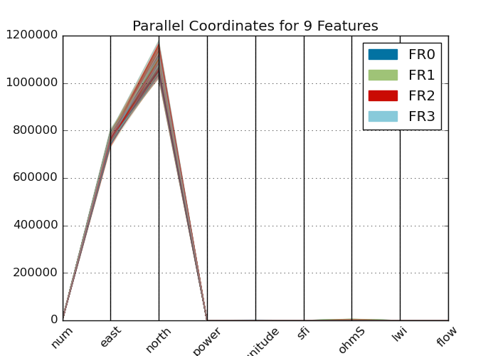
   
Plot Radial: :meth:`~watex.view.ExPlot.radviz` 
^^^^^^^^^^^^^^^^^^^^^^^^^^^^^^^^^^^^^^^^^^^^^^^^^^^^^^^^^^^^^^^^^^^^^^^^

:meth:`~watex.view.ExPlot.radviz`  shows each sample on a circle or square, with features on 
the circumference to visualize separately between targets. Values are normalized and each figure 
has a spring that pulls samples based on the value. Here is an example: 

.. code-block:: python 
	
	>>> from watex.datasets import fetch_data 
	>>> from watex.view import ExPlot 
	>>> # visualization using the yellowbrick package 
	>>> data0 = fetch_data('bagoue original').get('data=dfy1')
	>>> p = ExPlot(tname ='flow').fit(data0)
	>>> p.plotradviz(classes= [0, 1, 2, 3] ) # can set to None 
	>>> # visualization using the pandas 
	>>> p.plotradviz(classes= [0, 1, 2, 3], pkg='yb' )
	
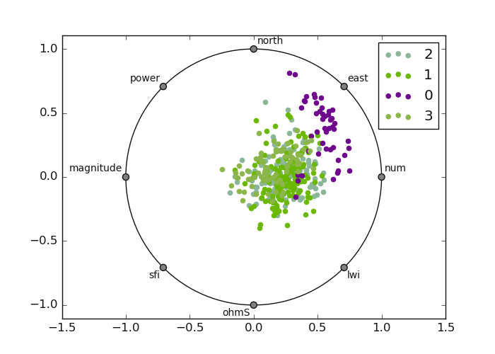

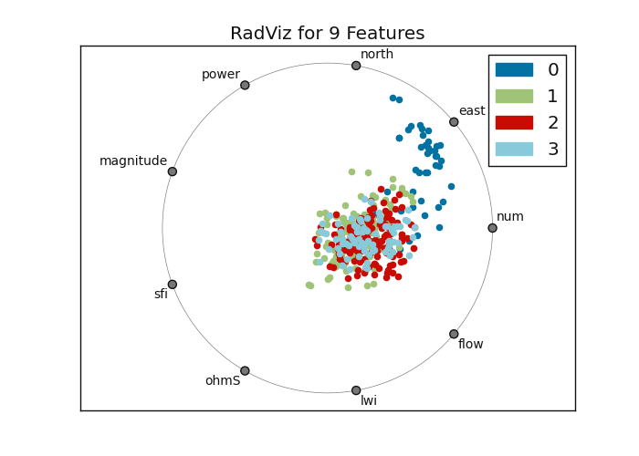
	
* **Radial Visualization: using pandas and yellow-brick plots** 

  ==================================== ====================================
  RadViz with Pandas 	              		RadViz with yellow-brick  
  ==================================== ====================================
  |pd_rv|                         		|yb_rd|
  ==================================== ====================================
  
Plot Pairwise comparison: :meth:`~watex.view.ExPlot.plotpairwisecomparison` 
^^^^^^^^^^^^^^^^^^^^^^^^^^^^^^^^^^^^^^^^^^^^^^^^^^^^^^^^^^^^^^^^^^^^^^^^^^^^^^^

:meth:`~watex.view.ExPlot.plotpairwisecomparison` creates a pairwise comparison between 
features. It shows a ['pearson'|'spearman'|'covariance'] correlation. Here is an example 
of a code snippet:

.. code-block:: python 

    >>> from watex.datasets import fetch_data 
	>>> from watex.view import ExPlot 
	>>> data = fetch_data ('bagoue original').get('data=dfy1') 
	>>> p= ExPlot(tname='flow', fig_size=(7, 5)).fit(data)
	>>> p.plotpairwisecomparison(fmt='.2f', corr='spearman', pkg ='yb',
								 annot=True, 
								 cmap='RdBu_r', 
								 vmin=-1, 
								 vmax=1 )
								 
The following output is given below:

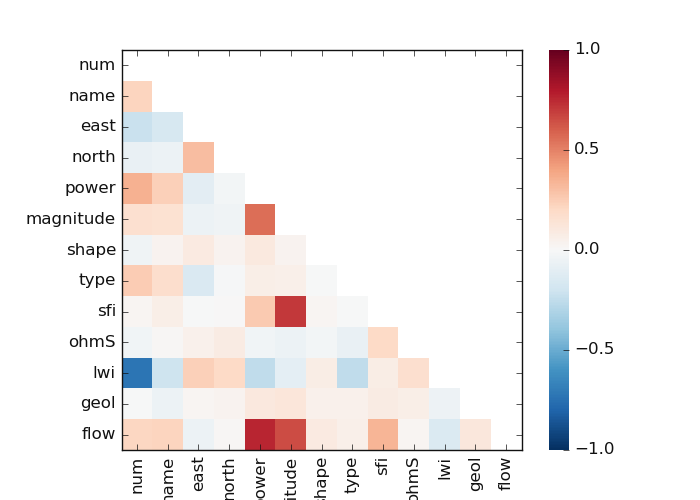
   
Plot Categorical Features Comparison :meth:`~watex.view.ExPlot.plotcutcomparison` 
^^^^^^^^^^^^^^^^^^^^^^^^^^^^^^^^^^^^^^^^^^^^^^^^^^^^^^^^^^^^^^^^^^^^^^^^^^^^^^^^^^^^^

:meth:`~watex.view.ExPlot.plotcutcomparison` compares the quantile values of ordinal categories. It stimulates 
the bining of `xname` into a `q` quantiles, and `yname` into `bins`. The plot is normalized so it fills all 
the vertical area which makes it easy to see that in the `4*q %` quantiles. Note that `xname` and `yname` are 
vectors or keys in data variables that specify positions on the `x` and `y` axes. Both are column names to consider. 
Should be items in the data frame columns. Raise an error if elements do not exist. Here is an example of `sfi` 
(:func:`~watex.utils.exmath.sfi`) and `ohmS` (:func:`~watex.utils.exmath.ohmicArea`):   

.. code-block:: python 

	>>> from watex.datasets import fetch_data 
	>>> from watex.view import ExPlot 
	>>> data = fetch_data ('bagoue original').get('data=dfy1') 
	>>> p= ExPlot(tname='flow', fig_size =(7, 5) ).fit(data)
	>>> p.plotcutcomparison(xname ='sfi', yname='ohmS') # compare 'sfi' and 'ohmS'
	<'ExPlot':xname='sfi', yname='ohmS' , tname='flow'>

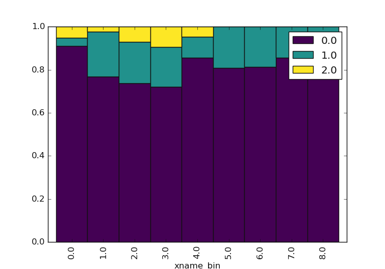
   
Plot Box: :meth:`~watex.view.ExPlot.plotbv` 
^^^^^^^^^^^^^^^^^^^^^^^^^^^^^^^^^^^^^^^^^^^^^ 

:meth:`~watex.view.ExPlot.plotbv` allows the visualization of the distribution using the box, boxen, or 
violin plots. The choice of the box is passed to the parameter `kind`. See :meth:`~watex.view.ExPlot.plotbv` 
documentation for further details. A basic example using the 'violin' plot is given below: 

.. code-block:: python 

	>>> from watex.datasets import fetch_data 
	>>> from watex.view import ExPlot 
	>>> data = fetch_data ('bagoue original').get('data=dfy1') 
	>>> p= ExPlot(tname='flow', fig_size =(7, 5)).fit(data)
	>>> p.plotbv(xname='flow', yname='ohmS', kind='violin')
	<'ExPlot':xname='flow', yname='ohmS' , tname='flow'>
  
Here is the given output: 

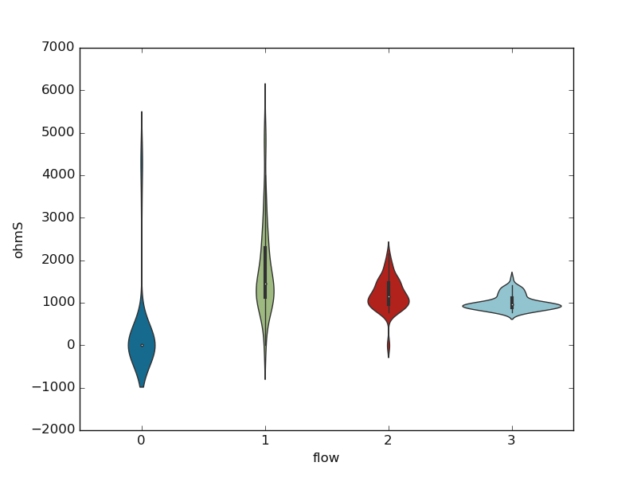
   
Plot Grid in Pair: :meth:`~watex.view.ExPlot.plotpairgrid`
^^^^^^^^^^^^^^^^^^^^^^^^^^^^^^^^^^^^^^^^^^^^^^^^^^^^^^^^^^^^^

:meth:`~watex.view.ExPlot.plotpairgrid` creates a pairing grid. The plot is a matrix of columns and kernel 
density estimations. To color by columns from a data frame, use the  `hue` parameter. Refer to 
:meth:`~watex.view.ExPlot.plotpairgrid` for more details. Here is a basic example: 

.. code-block:: python 

	>>> from watex.datasets import fetch_data 
	>>> from watex.view import ExPlot 
	>>> data = fetch_data ('bagoue original').get('data=dfy1') 
	>>> p= ExPlot(tname='flow', fig_size =(7, 5)).fit(data)
	>>> p.plotpairgrid (vars = ['magnitude', 'power'] )
	<'ExPlot':xname=None, yname=None , tname='flow'>

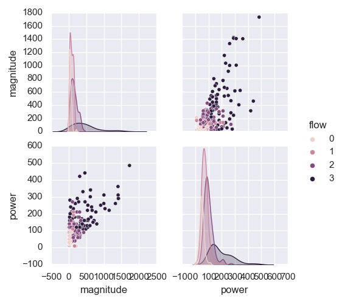
   
Plot Joint features: :meth:`~watex.view.ExPlot.plotjoint`
^^^^^^^^^^^^^^^^^^^^^^^^^^^^^^^^^^^^^^^^^^^^^^^^^^^^^^^^^^^^^^^^^

:meth:`~watex.view.ExPlot.plotjoint` is a fancier scatterplot that includes a histogram on the edge as well as a 
regression line called a `joinplot`. Here is an example: 

.. code-block:: python 

	>>> from watex.datasets import fetch_data 
	>>> from watex.view import ExPlot 
	>>> data = fetch_data ('bagoue original').get('data=dfy1') 
	>>> p= ExPlot(tname='flow', fig_size =(7, 5)).fit(data)
	>>> p.plotjoint(xname ='type', yname='shape', corr='spearman',  pkg ='yb')
	<'ExPlot':xname='power', yname='shape' , tname='flow'>

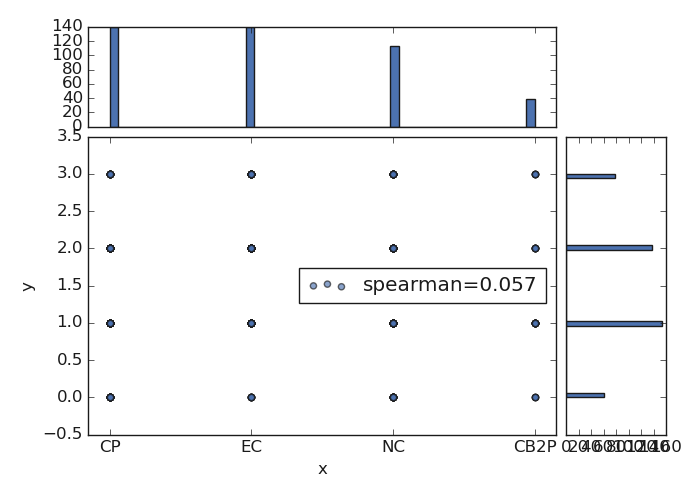
   
There are several options to customize joint plots passed to :meth:`~watex.view.ExPlot.plotjoint`.  
   
.. seealso:: 
	:meth:`~watex.view.plot.QuickPlot.joint2features` 
	
Plot Scatter: :meth:`~watex.view.ExPlot.plotscatter`
^^^^^^^^^^^^^^^^^^^^^^^^^^^^^^^^^^^^^^^^^^^^^^^^^^^^^^^^^

:meth:`~watex.view.ExPlot.plotscatter` plots numerical features and shows the relationship between 
two numeric columns. 

.. code-block:: python 

	>>> from watex.view import ExPlot 
	>>> ExPlot(tname='flow', fig_size =(7, 5)).fit(data).plotscatter (xname ='sfi', yname='ohmS' )
	<'ExPlot':xname='sfi', yname='ohmS' , tname='flow'>

The above code generates the following output: 

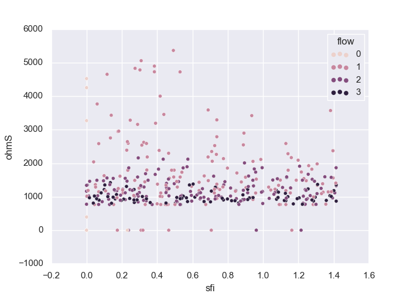

Plot Histogram - Features vs Target: :meth:`~watex.view.ExPlot.plothistvstarget`
^^^^^^^^^^^^^^^^^^^^^^^^^^^^^^^^^^^^^^^^^^^^^^^^^^^^^^^^^^^^^^^^^^^^^^^^^^^^^^^^^^

:meth:`~watex.view.ExPlot.plothistvstarget` plots a histogram of continuous values against the target of 
a binary plot. Here is a base implementation: 

.. code-block:: python 
	
	>>> from watex.utils import read_data 
	>>> from watex.view import ExPlot
	>>> data = read_data  ( 'data/geodata/main.bagciv.data.csv' ) 
	>>> p = ExPlot(tname ='flow').fit(data)
	>>> p.fig_size = (7, 5)
	>>> p.savefig ='bbox.png'
	>>> p.plothistvstarget (xname= 'sfi', c = 0, kind = 'binarize',  kde=True, 
					  posilabel='dried borehole (m3/h)',
					  neglabel = 'accept. boreholes'
					  )
	<'ExPlot':xname='sfi', yname=None , tname='flow'>

Here is the example output: 

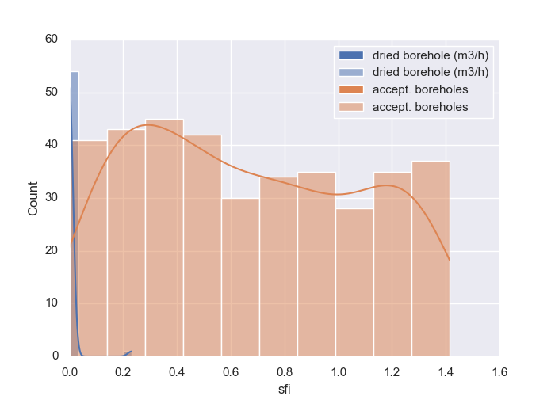

.. seealso:: 
	
	:meth:`~watex.view.ExPlot.plothist` for a pure histogram visualization 
	
Plot Missing: :meth:`~watex.view.ExPlot.plotmissing`
^^^^^^^^^^^^^^^^^^^^^^^^^^^^^^^^^^^^^^^^^^^^^^^^^^^^^^^

:meth:`~watex.view.ExPlot.plotmissing` helps visualizing patterns in the missing data. Here are some examples: 

.. code-block:: python 

	>>> from watex.utils import read_data
	>>> from watex.view import ExPlot
	>>> data = read_data ('data/geodata/main.bagciv.data.csv' ) 
	>>> p = ExPlot().fit(data)
	>>> p.fig_size = (7, 5)
	>>> p.plotmissing(kind ='dendrogram')
	<'ExPlot':xname=None, yname=None , tname=None>
	
The following outputs give three kinds of missing data visualization. The first outputs the base missing pattern:
 
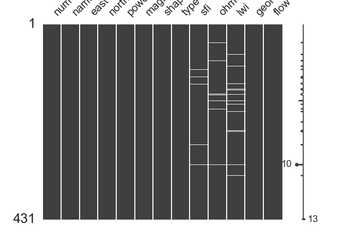

The remaining two give another representation of missing data. 

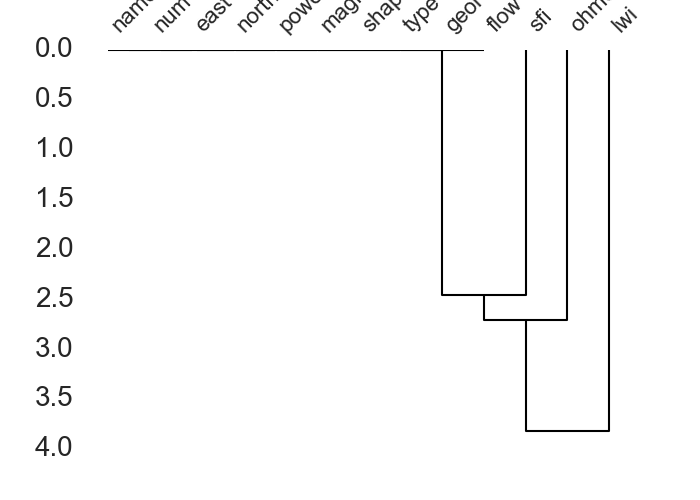
   
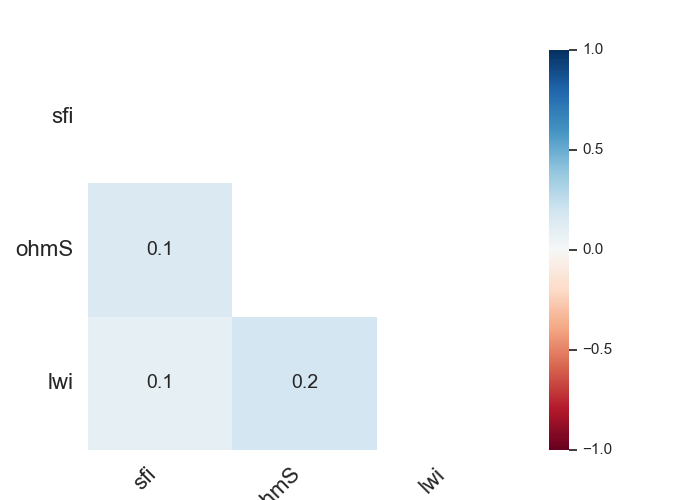
	
* **Three kinds of missing data visualization** 

  ==================================== ====================================
  Dendrogram missing patterns              Correlation missing patterns  
  ==================================== ====================================
  |dendro_mss|                                |corr_mss|
  ==================================== ====================================

.. seealso:: 

	:class:`~watex.base.Missing` for missing data manipulating

Analysis and Discussing plots: :class:`~watex.view.QuickPlot`
---------------------------------------------------------------

:class:`~watex.view.QuickPlot` is a special class that deals with analysis modules for quick diagrams, 
histograms, and bar visualization. Originally, it was designed for the flow rate (`FR`) prediction 
during the drinking water supply campaign (DWSC) [2]_. The parameters `mapflow` and `classes` work 
together and are useful when flow data is passed to :meth:`~watex.view.plot.QuickPlot.fit`. Once `mapflow` 
is set to ``True``, the flow target :math:`y` should be turned to categorical values encoded referring to 
the type or types of hydraulic system commonly recommended during the DWSC. Mostly the hydraulic system is 
tied to the number of living inhabitants in the survey area [3]_. For instance:

* FR = 0 is for dry boreholes (FR0)
* 0 < FR ≤ 3m3/h for village hydraulic (≤2000 inhabitants) (FR1)
* 3 < FR ≤ 6m3/h  for improved village hydraulic(>2000-20 000inhbts) (FR2)
* 6 <FR ≤ 10m3/h for urban hydraulic (>200 000 inhabitants)(FR3)
    
Note that this flow range passed by default when `mapflow=True` is not exhaustive and can be modified 
according to the type of hydraulic required on each project. Beyond the FR objective as the first 
motivation design of this class, however, it still perfectly works with any other dataset if the 
appropriate arguments are passed to different methods. In the following, some examples will be 
displayed to give a visual depiction of using the :class:`~watex.view.QuickPlot`  class. 

Plot Naive Target Inspection: :meth:`~watex.view.QuickPlot.naiveviz`
^^^^^^^^^^^^^^^^^^^^^^^^^^^^^^^^^^^^^^^^^^^^^^^^^^^^^^^^^^^^^^^^^^^^^
:meth:`~watex.view.QuickPlot.naiveviz` generates a plot to visualize the data using the existing 
coordinates `x` and `y` by considering a special data frame feature, mostly the target :math:`y`. 
The plot indicates the distribution of the data based on the coordinate positions. Here is a demonstration 
of naive visualization. 
        
.. code-block:: python
 
	>>> import matplotlib.pyplot as plt 
	>>> from watex.transformers import StratifiedWithCategoryAdder
	>>> from watex.view.plot import QuickPlot
	>>> from watex.datasets import load_bagoue 
	>>> df = load_bagoue ().frame
	>>> stratifiedNumObj= StratifiedWithCategoryAdder('flow')
	>>> strat_train_set , *_= \
	...    stratifiedNumObj.fit_transform(X=df) 
	>>> pd_kws ={'alpha': 0.4, 
	...         'label': 'flow m3/h', 
	...         'c':'flow', 
	...         'cmap':plt.get_cmap('jet'), 
	...         'colorbar':True}
	>>> qkObj=QuickPlot(fs=25., fig_size = (7, 5))
	>>> qkObj.fit(strat_train_set)
	>>> qkObj.naiveviz( x= 'east', y='north', **pd_kws)
	Out[103]: QuickPlot(savefig= None, fig_num= 1, fig_size= (7, 5), ... , classes= None, tname= None, mapflow= False)
	
Here is the following output: 

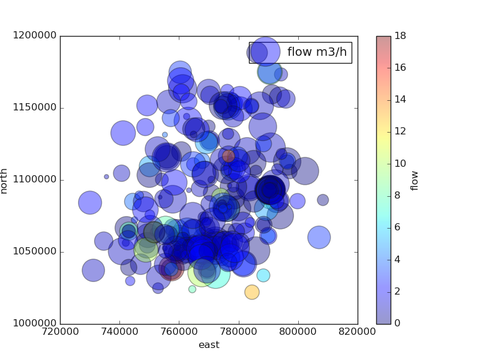
   
As a brief interpretation, at a glance, the survey area is dominated by the dried boreholes :math:`FR=0` and 
the unsustainable boreholes ( :math:`0 \leq FR < 2 \quad m^3/hr`). The most productive boreholes  
(:math:`FR \geq 4 \quad m^3/hr` ) are located in the southeastern part of the survey area. 

Plot Feature Discussing: :meth:`~watex.view.QuickPlot.discussingfeatures`
^^^^^^^^^^^^^^^^^^^^^^^^^^^^^^^^^^^^^^^^^^^^^^^^^^^^^^^^^^^^^^^^^^^^^^^^^^^

:meth:`~watex.view.QuickPlot.discussingfeatures` plots feature distributions along the target. For instance, 
ones can provide the features names at least 04 and discuss them with their distribution. Here is a basic 
example of the Bagoue dataset (:func:`watex.datasets.load_bagoue`) 

:meth:`~watex.view.QuickPlot.discussingfeatures` maps a dataset onto multiple axes arrayed in a grid of rows 
and columns that correspond to levels of features in the dataset. Here is a snippet code for a real-world example: 

.. code-block:: python 

	>>> from watex.view.plot import  QuickPlot 
	>>> from watex.datasets import load_bagoue 
	>>> data = load_bagoue ().frame 
	>>> qkObj = QuickPlot(  leg_kws={'loc':'upper right'},
	...          fig_title = '`sfi` vs`ohmS|`geol`',
	...            ) 
	>>> qkObj.tname='flow' # target the DC-flow rate prediction dataset
	>>> qkObj.mapflow=True  # to hold category FR0, FR1 etc..
	>>> qkObj.fit(data) 
	>>> sns_pkws={'aspect':2 , 
	...          "height": 2, 
	...                  }
	>>> map_kws={'edgecolor':"w"}   
	>>> qkObj.discussingfeatures(features =['ohmS', 'sfi','geol', 'flow'],
	...                           map_kws=map_kws,  **sns_pkws
	...                         )
	QuickPlot(savefig= None, fig_num= 1, fig_size= (12, 8), ... , classes= None, tname= flow, mapflow= True)
	
This is the following output: 

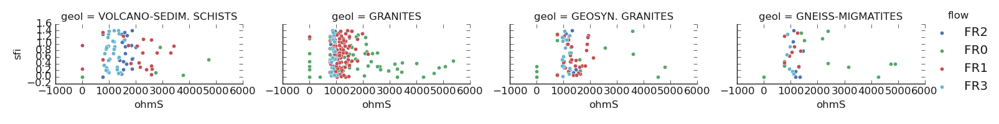
   
At a glance, the figure above shows that most of the drillings carried out on granites have an `FR` of 
around :math:`1 \quad m^3/hr` (:math:`FR1:0< FR \leq 1`). With these kinds of flows, it is obvious that 
the boreholes will be unproductive (unsustainable) within a few years.  However, the volcano-sedimentary 
schists seem the most suitable geological structure with an `FR` greater than :math:`3 \quad m^3/hr`. However, 
the wide fractures on these formations (explained by :math:`ohmS > 1500 \Omega.m^2`) do not mean that they should 
be more productive since all the drillings performed on the wide fracture do not always give a productive `FR` 
(:math:`FR>3 \quad m^3/hr`) contrary to the narrow fractures (around 1000 ohmS). As a result, it is reliable to 
consider this approach during a future DWSC such as the geology of the area and also the rock fracturing ratio 
computed thanks to the parameters `sfi` and `ohmS`.  

Plot Features Scattering: :meth:`~watex.view.QuickPlot.scatteringfeatures`
^^^^^^^^^^^^^^^^^^^^^^^^^^^^^^^^^^^^^^^^^^^^^^^^^^^^^^^^^^^^^^^^^^^^^^^^^^^^^

:meth:`~watex.view.QuickPlot.scatteringfeatures` draws a scatter plot with possibility of several semantic 
features grouping.Indeed `scatteringfeatures` analysis is a process of understanding how features in a dataset 
relate to each other and how those relationships depend on other features. Visualization can be a core component 
of this process because, when data are visualized properly, the human visual system can see trends and patterns 
that indicate a relationship. Below is an example of feature scattering plots: 

.. code-block:: python 

	>>> from watex.view.plot import  QuickPlot 
	>>> from watex.datasets import load_bagoue 
	>>> data = load_bagoue ().frame
	>>> qkObj = QuickPlot(lc='b', sns_style ='darkgrid', 
	...             fig_title='geol vs level of water inrush (m) ',
	...             xlabel='Level of water inrush (lwi) in meters', 
	...             ylabel='Flow rate in m3/h'
	...            ) 
	>>>
	>>> qkObj.tname='flow' # target the DC-flow rate prediction dataset
	>>> qkObj.mapflow=True  # to hold category FR0, FR1 etc..
	>>> qkObj.fig_size=(7, 5)
	>>> qkObj.fit(data) 
	>>> marker_list= ['o','s','P', 'H']
	>>> markers_dict = {key:mv for key, mv in zip( list (
	...                       dict(qkObj.data ['geol'].value_counts(
	...                           normalize=True)).keys()), 
	...                            marker_list)}
	>>> sns_pkws={'markers':markers_dict, 
	...          'sizes':(20, 200),
	...          "hue":'geol', 
	...          'style':'geol',
	...         "palette":'deep',
	...          'legend':'full',
	...          # "hue_norm":(0,7)
	...            }
	>>> regpl_kws = {'col':'flow', 
	...             'hue':'lwi', 
	...             'style':'geol',
	...             'kind':'scatter'
	...            }
	>>> qkObj.scatteringfeatures(features=['lwi', 'flow'],
	...                         relplot_kws=regpl_kws,
	...                         **sns_pkws, 
	...                    )
	QuickPlot(savefig= None, fig_num= 1, fig_size= (7, 5), ... , classes= None, tname= flow, mapflow= True)

This is the following output: 

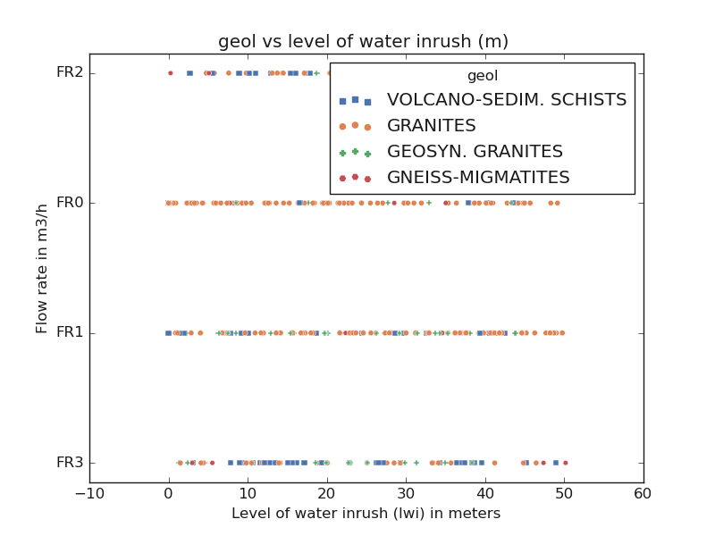
   
In the above figure, ones can notice that the productive `FR` is mostly found between 10 -20  and 40-45 m 
meters deep. Some borehole has two-level of water inrush and is mostly found in volcano-sedimentary schists. 

Plot Jointing Features: :meth:`~watex.view.QuickPlot.joint2features`
^^^^^^^^^^^^^^^^^^^^^^^^^^^^^^^^^^^^^^^^^^^^^^^^^^^^^^^^^^^^^^^^^^^^^^^^^^^^^

:meth:`~watex.view.QuickPlot.joint2features` allows visualizing the correlation of two features. It draws 
a plot of two features with bivariate and univariate graphs. Here is an example: 

.. code-block:: python 

	>>> from watex.view.plot import QuickPlot 
	>>> from watex.datasets import load_bagoue 
	>>> data = load_bagoue ().frame
	>>> qkObj = QuickPlot( lc='b', sns_style ='darkgrid', 
	...             fig_title='Quantitative features correlation'
	...             ).fit(data)  
	>>> qkObj.fig_size =(7, 5)
	>>> sns_pkws={
	...            'kind':'reg' , #'kde', 'hex'
	...            # "hue": 'flow', 
	...               }
	>>> joinpl_kws={"color": "r", 
					'zorder':0, 'levels':6}
	>>> plmarg_kws={'color':"r", 'height':-.15, 'clip_on':False}           
	>>> qkObj.joint2features(features=['ohmS', 'lwi'], 
	...            join_kws=joinpl_kws, marginals_kws=plmarg_kws, 
	...            **sns_pkws, 
	...            )
	QuickPlot(savefig= None, fig_num= 1, fig_size= (7, 5), ... , classes= None, tname= None, mapflow= False)
        
The above code snippet renders the following output: 

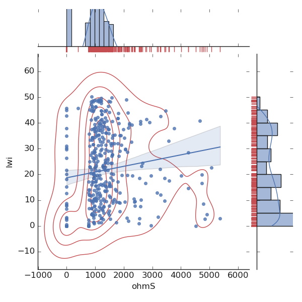
   
.. seealso:: 
	:meth:`~watex.view.ExPlot.plotjoint` uses an additional package like `yellowbrick` [1]_. 

Plot Qualitative Features: :meth:`~watex.view.QuickPlot.numfeatures`
^^^^^^^^^^^^^^^^^^^^^^^^^^^^^^^^^^^^^^^^^^^^^^^^^^^^^^^^^^^^^^^^^^^^^^^^^^

:meth:`~watex.view.QuickPlot.numfeatures` plots qualitative (numerical) features distribution using 
correlative aspect. It only works with sure numerical features.  Here is a tangible example for plotting 
the numerical distribution according to the target passed to `tname`. For this demonstration, we will change 
a little bit the target name to ohmic-area `ohmS` and only keep the features `['ohmS', 'power', 'lwi', 'flow']` 
in the data. Note, rather than mapping the flow with the parameter `mapflow`, we use the function 
:func:`~watex.utils.funcutils.smart_label_classifier` to categorize the numerical `ohmS` values into 
three classes called `oarea` such as :math:`oarea1 :ohmS \leq 1000 \Omega.m^2` encoded to `{0}`, 
:math:`oarea2 :1000 <ohmS \leq 2000 \Omega.m^2` encoded to `{1}` and :math:`oarea3 : ohmS > 2000 \Omega.m^2` 
encoded to `{2}`.  The code snippet is given below:

.. code-block:: python 

	>>> from watex.view.plot import QuickPlot 
	>>> from watex.datasets import load_bagoue 
	>>> from watex.utils import smart_label_classifier 
	>>> data = load_bagoue ().frame
	>>> demo_features =['ohmS', 'power', 'lwi', 'flow'] 
	>>> data_area=data [demo_features] 
	>>> # categorized the ohmS series into a class labels 'oarea1', 'oarea2' and 'oarea3'
	>>> data_area ['ohmS'] = smart_label_classifier (data_area.ohmS, values =[1000, 2000 ])
	>>> qkObj = QuickPlot(mapflow =False, tname="ohmS"
							  ).fit(data_area)
	>>> qkObj.sns_style ='darkgrid', 
	>>> qkObj.fig_title='Quantitative features correlation'
	>>> qkObj.fig_size =(7, 5)
	>>> sns_pkws={'aspect':2 , 
	...          "height": 2, 
	# ...          'markers':['o', 'x', 'D', 'H', 's',
	#                         '^', '+', 'S'],
	...          'diag_kind':'kde', 
	...          'corner':False,
	...          }
	>>> marklow = {'level':4, 
	...          'color':".2"}
	>>> qkObj.numfeatures(coerce=True, map_lower_kws=marklow, **sns_pkws)

Here is the following output: 

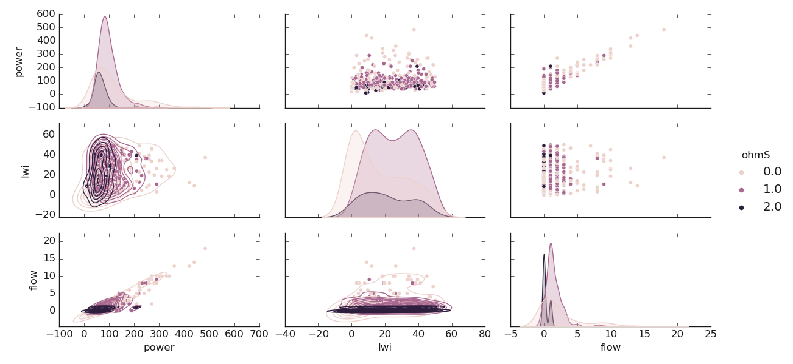
   
   
Plot Correlating Features: :meth:`~watex.view.QuickPlot.corrmatrix`  
^^^^^^^^^^^^^^^^^^^^^^^^^^^^^^^^^^^^^^^^^^^^^^^^^^^^^^^^^^^^^^^^^^^^^^^

:meth:`~watex.view.QuickPlot.corrmatrix`  method quickly plots the correlation between the numerical 
and categorical features by setting the parameter `cortype` to ``num`` or ``cat`` for numerical or 
categorical features. Here is an example using the `Bagoue dataset` with a mixture type of features:
        
.. code-block:: python 

	>>> from watex.view.plot import QuickPlot 
	>>> from watex.datasets import load_bagoue 
	>>> data = load_bagoue ().frame
	>>> qplotObj = QuickPlot(fig_size = (7, 5)).fit(data)
	>>> sns_kwargs ={'annot': False, 
	...            'linewidth': .5, 
	...            'center':0 , 
	...            # 'cmap':'jet_r', 
	...            'cbar':True}
	>>> qplotObj.corrmatrix(cortype='cat', **sns_kwargs)
	>>> qplotObj.corrmatrix( **sns_kwargs)
	QuickPlot(savefig= None, fig_num= 1, fig_size= (7, 5), ... , classes= None, tname= None, mapflow= False)
   
Here are examples of matrix correlation between categorical and numerical features:

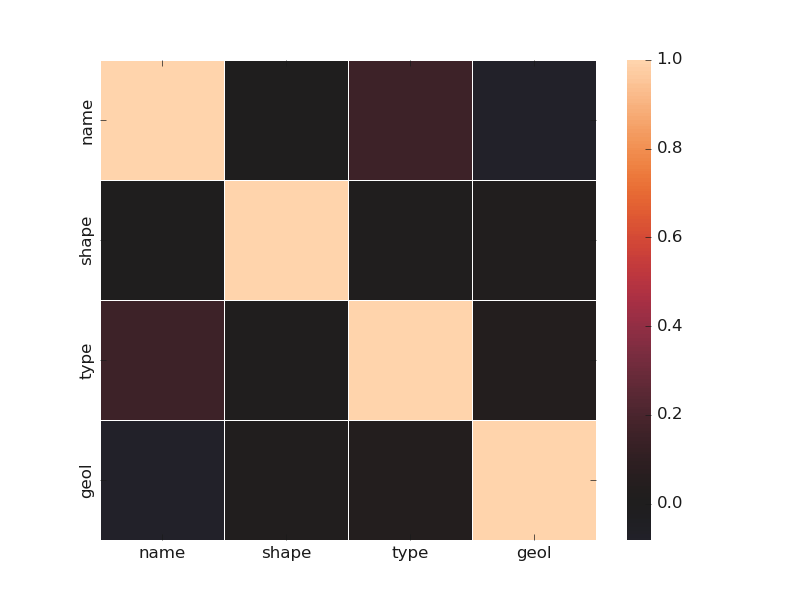

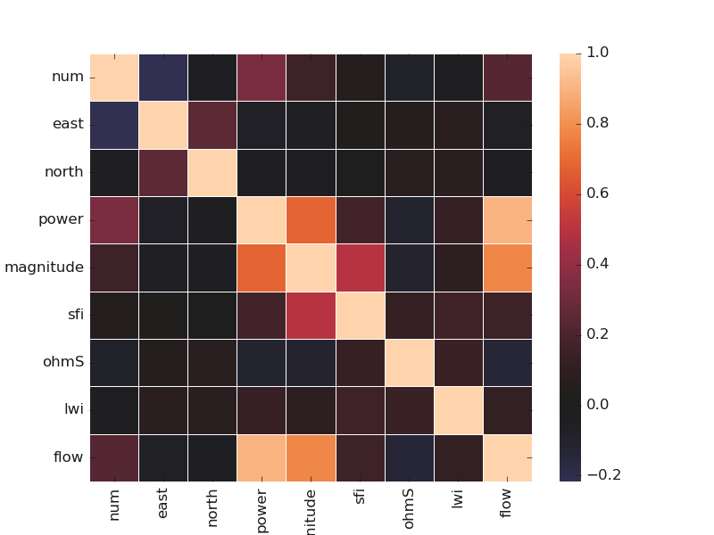
 
	
* **Categorical and numerical correlation** 

  =================================    ====================================
  Categorical features correlation	    Numerical features correlation
  =================================    ====================================
  |cat_corr|    					    |num_corr|
  =================================    ====================================

Plot Multiples categorical feature distribution :meth:`~watex.view.QuickPlot.multicatdist`  
^^^^^^^^^^^^^^^^^^^^^^^^^^^^^^^^^^^^^^^^^^^^^^^^^^^^^^^^^^^^^^^^^^^^^^^^^^^^^^^^^^^^^^^^^^^^^^

:meth:`~watex.view.QuickPlot.multicatdist` gives a figure-level interface for drawing multiple categorical 
distributions. It plots onto a FacetGrid. The following code snippet gives a basic illustration. 

.. code-block:: python 

	>>> from watex.view.plot import QuickPlot 
	>>> from watex.datasets import load_bagoue 
	>>> data = load_bagoue ().frame
	>>> qplotObj= QuickPlot(lc='b', tname='flow')
	>>> qplotObj.sns_style = 'darkgrid'
	>>> qplotObj.mapflow=True # to categorize the flow rate 
	>>> qplotObj.fit(data)
	>>> fdict={
	...            'x':['shape', 'type', 'type'], 
	...            'col':['type', 'geol', 'shape'], 
	...            'hue':['flow', 'flow', 'geol'],
	...            } 
	>>> qplotObj.multicatdist(**fdict)
        

Multiple categorical feature distributions can give useful insights into the figure distributions. Let’s 
check the following outputs and give a brief interpretation: 

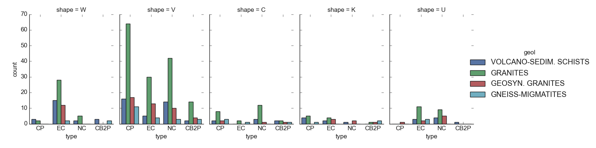

For instance, the figure above shows at a glance that the granites are the most geological structures 
encountered in the survey area. Furthermore, the conductive zones found in the volcano-sedimentary schists 
are mostly dominated by the type `CP` and `NC` whereas they are found everywhere in the granite formations, 
especially in the anomaly with shape `V` . The conductive zone with shapes `C` and `K` as well as the `U` is 
rarely found. This can be explained by the difficulty to find a wide fracture in that area. Refer to :func:`~watex.utils.exmath.type_`  
and :func:`~watex.utils.exmath.shape` for further details about the `type` and `shape` DC parameters` computation and [4]_ 
for a better explanation. The next figure will try to give insights into the probable relationship between the geological 
formations of the area and the other features. 

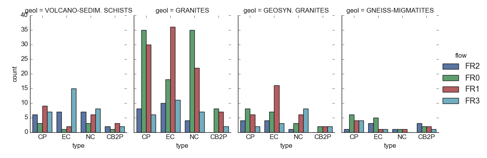
   
The figure validates the predominance of the granite formations in the area and indicated that at the same time, 
the granites are the most structures that yield dried boreholes successful (FR0: FR=0)) and unsustainable boreholes 
(FR1). At the site of the granites, the volcano-sedimentary shists are the most productive with productive FR 
values (FR2 and FR3) although there is a little bit of FR1. It seems very interesting to consider the geology 
of the area when looking at productive FR in the survey area. 

Plot Base Distributions using Histogram or Bar: :meth:`~watex.view.QuickPlot.histcatdist` | :meth:`~watex.view.QuickPlot.barcatdist`
^^^^^^^^^^^^^^^^^^^^^^^^^^^^^^^^^^^^^^^^^^^^^^^^^^^^^^^^^^^^^^^^^^^^^^^^^^^^^^^^^^^^^^^^^^^^^^^^^^^^^^^^^^^^^^^^^^^^^^^^^^^^^^^^^^^^^^^^^

Two basic distributions plots can be visualized using the :meth:`~watex.view.QuickPlot.histcatdist` 
or :meth:`~watex.view.QuickPlot.barcatdist` for histogram and bar distribution respectively. Here are 
two bases examples. For a better view, the target can be mapped into categorized labels. For instance the 
flow target straightforwardly checked from :mod:`~watex.datasets` can be mapped using the 
function :func:`~watex.utils.cattarget` as follow:: 

	>>> from watex.datasets import load_bagoue 
	>>> from watex.utils import cattarget 
	>>> data = load_bagoue ().frame 
	>>> data.flow.values [:7] 
	array([2., 0., 1., 1., 1., 2., 1.])
	>>> data.flow = cattarget (data.flow , labels = [0, 1, 2,3], rename_labels= ['FR0', 'FR1', 'FR2', 'FR3'])
	>>> data.flow.values  [:7] 
	array(['FR2', 'FR0', 'FR1', 'FR1', 'FR1', 'FR2', 'FR1'], dtype=object)
	
The snippet code above can be skipped by fetching the same data using the boilerplate 
function :func:`~watex.datasets.fetch_data` yields the stored second stored kind of flow target 
in the frame by passing  the `get` dictionary method to the `tag=original` like this::
	
	>>> from watex.datasets import fetch_data 
	>>> data= fetch_data ('Bagoue original').get('data=dfy2')
	>>> data.flow.values [:7]  # same like above even the data is shuffled.
	array(['FR2', 'FR1', 'FR1', 'FR2', 'FR2', 'FR2', 'FR1'], dtype=object)
	
The following codes give distributions histogram and bar plots: 

.. code-block:: python 

	>>> from watex.view.plot import QuickPlot
	>>> from watex.datasets import load_bagoue 
	>>> data = load_bagoue ().frame 
	>>> # data = fetch_data ('Bagoue original').get ('data=dfy2') # for FR categorization instead  
	>>> qplotObj= QuickPlot(xlabel = 'Anomaly type',
					ylabel='Number of  occurence (%)',
					lc='b', tname='flow')
	>>> qplotObj.fig_size = (7, 5) 
	>>> qplotObj.sns_style = 'darkgrid'
	>>> qplotObj.fit(data)
	>>> qplotObj. barcatdist(basic_plot =False, 
						  groupby=['shape' ])
	
The following outputs give target numerical and  categorization histogram plots: 

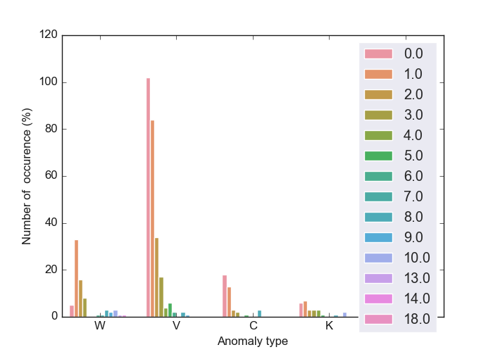

.. |cat_hplot| image:: ../examples/auto_examples/view_quickplot_bar_distributions.png
   :target: ../examples/auto_examples/view_quickplot_bar_distributions.html
   :scale: 40%
 
 
* **Numerical and categorization target histogram plot** 

  =================================    ========================================
  Histogram with numeric target 	        Histogram with categorical target
  =================================    ========================================
  |num_hplot|    					    	|cat_hplot|
  =================================    ========================================
 
		
For base bar distribution plots, refer to ::meth:`~watex.view.QuickPlot.barcatdist` examples below. 

Tensor recovery  plots: :class:`~watex.view.TPlot` 
----------------------------------------------------
:class:`~watex.view.TPlot`  gives base plots from short-period processing data.
Indeed, :class:`~watex.view.TPlot` plots Tensors (Impedances, resistivity, and phases ) plot class. 
:class:`~watex.view.TPlot` returns an instanced object that inherits from :class:`watex.property.Baseplots` 
ABC (Abstract Base Class) for visualization. 

.. note:: 
     :class:`~watex.view.TPlot` can straightforwardly be used without explicitly calling  
	 the :class:`~watex.methods.Processing` beforehand. When Edi data is passed to `fit` methods, 
	 it implicitly calls the :class:`~watex.methods.Processing` under the hood for attributes loading 
	 ready for visualization. The class does not output any restored or corrected EDI file. For this 
	 procedure, use :class:`~watex.methods.EM` instead.
	
Here, we will give some examples of base tensor recovery plots from EDI datasets loaded from 
using :func:`~watex.datasets.load_edis`. Note that, as well as all the :mod:`~watex.view` plotting classes, 
:class:`~watex.view.TPlot` inherits from global parameters of :class:`~watex.view.property.BasePlot`. 
Thus, each plot can be flexibly customized according to the user's desire. For instance, to visualize 
the corrected 2D tensors, one can  customize the plot by settling the plot keyword arguments as::

	>>> plot_kws = dict(
		ylabel = '$Log_{10}Frequency [Hz]$', 
		xlabel = '$Distance(m)$', 
		cb_label = '$Log_{10}Rhoa[\Omega.m]$', 
		fig_size =(7, 5), 
		font_size =7) 
	>>> TPlot(**plot_kws )

Single site signal recovery visualization: :meth:`~watex.view.TPlot.plot_recovery` 
^^^^^^^^^^^^^^^^^^^^^^^^^^^^^^^^^^^^^^^^^^^^^^^^^^^^^^^^^^^^^^^^^^^^^^^^^^^^^^^^^^^^

:meth:`~watex.view.TPlot.plot_recovery` allows visualizing the restored tensor at each site. For instance, 
the visualization of the first site `S00` is given as: 

.. code-block:: 

	>>> from watex.view import TPlot
	>>> from watex.datasets import load_edis 
	>>> edi_data = load_edis (return_data =True, samples =7) 
	>>> plot_kws = dict( ylabel = '$Log_{10}Frequency [Hz]$', 
				xlabel = '$Distance(m)$', 
				cb_label = '$Log_{10}Rhoa[\Omega.m$]', 
				fig_size =(7, 4), 
				font_size =7. 
				) 
	>>> t= TPlot(**plot_kws ).fit(edi_data)
	>>> # plot recovery of site 'S01'
	>>> t.plot_recovery ('S01')
	~~~~~~~~~~~~~~~~~~~~~~~~~~~~~~~~~~~~~~~~~~~~~~~~~~~~~~~~~~~~~~~~~~~~~~~~~~~~~
	|Data collected =  7      |EDI success. read=  7      |Rate     =  100.0  %|
	~~~~~~~~~~~~~~~~~~~~~~~~~~~~~~~~~~~~~~~~~~~~~~~~~~~~~~~~~~~~~~~~~~~~~~~~~~~~~
	<'TPlot':survey_area=None, distance=50.0, prefix='S', window_size=5, component='xy', mode='same', method='slinear', out='srho', how='py', c=2>

The result of the above  is given below: 

.. figure:: ../examples/auto_examples/view_tplot_recovery_tensor_site_s1.png
   :target: ../examples/auto_examples/view_tplot_recovery_tensor_site_s1.html
   :align: center
   :scale: 70% 
   
Indeed, the EDI data stored in :code:`watex` is already preprocessed. For a concrete example, 
refer to :ref:` methods <methods>` page.

Mutiple sites signal recovery visualization: :meth:`~watex.view.TPlot.plot_multi_recovery`   
^^^^^^^^^^^^^^^^^^^^^^^^^^^^^^^^^^^^^^^^^^^^^^^^^^^^^^^^^^^^^^^^^^^^^^^^^^^^^^^^^^^^^^^^^^^^^^^^^^

:meth:`~watex.view.TPlot.plot_multi_recovery` plots multiple sites/stations with signal recovery. Here is an example: 

.. code-block:: python 

	>>> from watex.view.plot import TPlot 
	>>> from watex.datasets import load_edis 
	>>> # takes the 03 samples of EDIs 
	>>> edi_data = load_edis (return_data= True, samples =21 ) 
	>>> TPlot(fig_size =(9, 7), font_size =7., show_grid =True, gwhich='both').fit(edi_data).plot_multi_recovery (
		sites =['S00', 'S07', 'S14',  'S20'], colors =['ok-',  'xr-.', '^b-', 'oc-.'])
   
The above code yields the following result. 

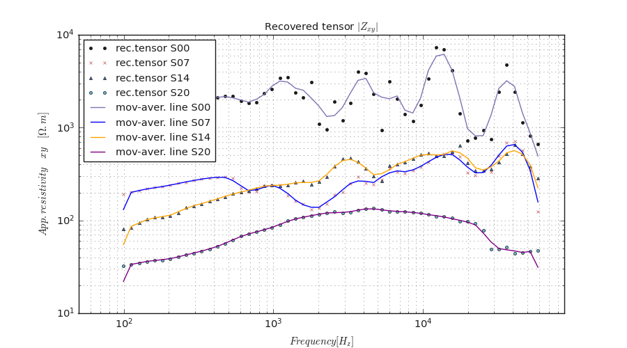
   
 
Two dimensional tensor plot: :meth:`~watex.view.TPlot.plot_tensor2d`   
^^^^^^^^^^^^^^^^^^^^^^^^^^^^^^^^^^^^^^^^^^^^^^^^^^^^^^^^^^^^^^^^^^^^^^^^^^^^^^^^^^^^^^^^^^^^^^^^^^
:meth:`~watex.view.TPlot.plot_tensor2d`  gives a quick visualization of tensors. In the following 
examples, the resistivity and phase tensors from `yx` are plotted using: 

.. code-block:: python 

	>>> from watex.view.plot import TPlot 
	>>> from watex.datasets import load_edis 
	>>> # get some 12 samples of EDI for demo 
	>>> edi_data = load_edis (return_data =True, samples =12)
	>>> # customize plot by adding plot_kws 
	>>> plot_kws = dict( ylabel = '$Log_{10}Frequency [Hz]$', 
						xlabel = '$Distance(m)$', 
						cb_label = '$Log_{10}Rhoa[\Omega.m$]', 
						fig_size =(6, 3), 
						font_size =7.,
						plt_style ='imshow',  
						) 
	>>> t= TPlot(component='yx', **plot_kws).fit(edi_data)
	>>> # plot recovery2d using the log10 resistivity 
	>>> t.plot_tensor2d (to_log10=True)
	
To run the phase tensor at the same component `yx`, we don't need to re-run the script above, 
just customize the color bar label and easily set the `tensor` params to ``phase`` like below: 

.. code-block:: python 

	>>> t.cb_label= '$Phase [\degree]$' 
	>>> t.plot_tensor2d ( tensor ='phase', to_log10=True) 
	<AxesSubplot:xlabel='$Distance(m)$', ylabel='$Log_{10}Frequency [Hz]$'>
	
The following outputs are given below : 

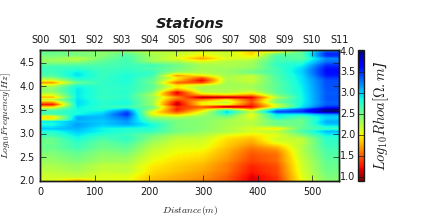

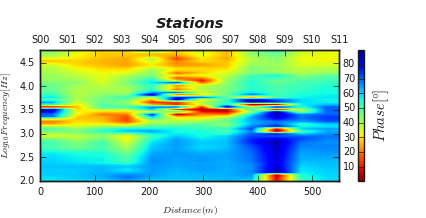
 
* **Resistivity and Phase tensors `xy` 2D plots** 

  =================================     ========================================
  Resistivity tensor yx 	            Phase tensor yx 
  =================================     ========================================
  |res_yx|    					    	|phase_yx|
  =================================     ========================================

  
Two dimensional filtered tensor plots: :meth:`~watex.view.TPlot.plot_ctensor2d`   
^^^^^^^^^^^^^^^^^^^^^^^^^^^^^^^^^^^^^^^^^^^^^^^^^^^^^^^^^^^^^^^^^^^^^^^^^^^^^^^^^^^^^^^^^^^^^^^^^^

:meth:`~watex.view.TPlot.plot_ctensor2d` plots the filtered tensor by applying the filtered function. 
Refer to :ref:`methods` to have an idea about the different available filters. As the example below, we 
collected 12 EDI data and applied the fixed-dipole-length moving-average filter (FLMA) passed to the parameter 
`ffilter`. The default filter is trimming moving average (TMA)as: 

.. code-block:: python 

	>>> from watex.view.plot import TPlot 
	>>> from watex.datasets import load_edis 
	>>> # get some 12 samples of EDI for demo 
	>>> edi_data = load_edis (return_data =True, samples =12 )
	>>> # customize plot by adding plot_kws 
	>>> plot_kws = dict( ylabel = '$Log_{10}Frequency [Hz]$', 
						xlabel = '$Distance(m)$', 
						cb_label = '$Log_{10}Rhoa[\Omega.m$]', 
						fig_size =(6, 3), 
						font_size =7.,
						plt_style='imshow'
						) 
	>>> t= TPlot(**plot_kws ).fit(edi_data)
	>>> # plot filtered tensor using the log10 resistivity 
	>>> t.plot_ctensor2d (to_log10=True, ffilter='flma')

Here is the following output which can be compared with the above figure. The FLMA shows a smooth filtered 
resistivity tensor `yx` as possible. 

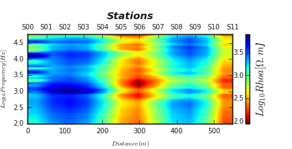
   

.. note:: 
	
	The params space plots give some basic plots for data exploration and analysis. However, the user can 
	provide its scripts for plotting.

The module :mod:`~watex.view.plot` can not give all the possible plots that can be yielded with the predicting datasets. 
	
.. seealso:: 
	
	`seaborn_` provides some wonderful statistical data visualization tools. 
	
.. _seaborn: https://seaborn.pydata.org/

Learning space plots: :mod:`~watex.view.mlplot`
================================================

The `Learning space` plots from :mod:`~watex.view.mlplot` is dedicated to modeling visualization through the :class:`~watex.view.EvalPlot`. Models 
are evaluated and estimated with either diagrams, curves, or dendrograms.  It also includes additional plot functions for inspecting the model on their learning curves, 
evaluating the number of clustering, scores analysis, etc. 

Model Evaluation plots
-----------------------------

The model evaluation plots are performed with the :class:`~watex.view.EvalPlot` class.
The :class:`~watex.view.EvalPlot` is mostly dedicated to metrics and dimensionality evaluation plots. The class inherits from 
:class:`BasePlot`.  

.. note:: 
   :class:`~watex.view.EvalPlot` works only with numerical features. If categorical features are included in the dataset, they should be discarded. However, for plot reasons, if the target is a categorial labels , provided that it 
   is specified by the parameter `tname`, the categorical labels can be renamed to non-numerical labels using :meth:`~watex.view.EvalPlot._cat_codes_y` method.

Furthermore, :class:`~watex.view.EvalPlot` applies the :meth:`~watex.view.EvalPlot.transform` and :meth:`~watex.view.EvalPlot.fit_transform` methods. The former imputes directly the missing 
data existing in the dataset whereas the latter does the `fit()` and `transform()`at once. The base `strategy` for data imputation 
is the ``most_frequent``, however, the impute strategy can be changed if specifying the parameter `strategy` to `median`,`mean`, or any other 
argument values from :class:`~watex.exlib.sklearn.SimpleImputer`. 

Plot Robust PCA: :meth:`~watex.view.EvalPlot.plotPCA`
^^^^^^^^^^^^^^^^^^^^^^^^^^^^^^^^^^^^^^^^^^^^^^^^^^^^^^^^^^^^^^^

The robust PCA identifies the axis that accounts for the largest amount of variance in the trainset :math:`X`. It also 
finds a second axis orthogonal to the first one, that accounts for the largest amount of remaining variance. Here we give an example of 
a code snippet elaborated using a real-world example of the Bagoue dataset (c.f. :mod:`~watex.datasets`)  for the flow rate prediction. 

.. code-block:: python 

	>>> from watex.datasets import load_bagoue 
	>>> from watex.view.mlplot import EvalPlot 
	>>> X , y = load_bagoue(as_frame =True )
	>>> b=EvalPlot(tname ='flow', encode_labels=True ,
					  scale = True )
	>>> b.fit_transform (X, y)
	>>> b.plotPCA (n_components= 2 )

.. note:: 
   The number of components and axes might be consistent. For instance, if two components are selected, 
   The maximum axis cannot be greater than 2. The example below gives a real-case example. 

.. code-block:: python 

	>>> # pc1 and pc2 labels > n_components -> raises user warnings
	>>> # throws a userwarning since the components is two and 
	>>> b.plotPCA (n_components= 2 , biplot=False, pc1_label='Axis 3',
				   pc2_label='axis 4') 
	... UserWarning: Number of components and axes might be consistent;
		'2'and '4 are given; default two components are used.
	>>> b.plotPCA (n_components= 8 , biplot=False, pc1_label='Axis3',
				   pc2_label='axis4')
		# works fine since n_components are greater to the number of axes
	... EvalPlot(tname= None, objective= None, scale= True, ... , 
				 sns_height= 4.0, sns_aspect= 0.7, verbose= 0)
				 
The above code gives the following output:

.. figure:: glr_examples/view/images/sphx_glr_plot_pca_001.png 
   :target: glr_examples/view/images/sphx_glr_plot_pca_001.html 
   :align: center
   :scale: 50% 
   
To rename the numerical labels to fit specific categorical classes from the target `y`, one can plot the robust PCA by setting the following 
attributes as::

.. code-block:: python 
	>>> b.encode_labels =True 
	>>> b.prefix ='FR' # set the prefix of the new labels 
	>>> b.label_values =[0,1, 2, 3] # labels values 
	>>> b.plotPCA (n_components= 2 )
	
The code above yields the following output where the classes have been fitted to match the `FR0`, `FR1`, `FR2`, and `FR3` classes. 

.. figure:: ../examples/auto_examples/view_evalplot_plot_pca_r.png 
   :target: ../examples/auto_examples/view_evalplot_plot_pca_r.html 
   :align: center
   :scale: 50% 
   
An other example can be found below: 

.. topic:: Examples:

   * :ref:`sphx_glr_glr_examples_view_plot_pca.py`

Plot Precision-Recall (PR): :meth:`~watex.view.EvalPlot.plotPR`
^^^^^^^^^^^^^^^^^^^^^^^^^^^^^^^^^^^^^^^^^^^^^^^^^^^^^^^^^^^^^^^^

:meth:`~watex.view.EvalPlot.plotPR` method plots the precision/recall (PR) and tradeoff plots. The PR computes a 
score based on the decision function and plots the result as a score vs threshold. Here is an example of a code 
snippet with the :class:`~watex.exlib.SGDClassifier` with binarizing target. 

.. code-block:: python 

	>>> from watex.exlib.sklearn import SGDClassifier
	>>> from watex.datasets.dload import load_bagoue 
	>>> from watex.utils.mlutils import cattarget 
	>>> from watex.view.mlplot import EvalPlot 
	>>> X , y = load_bagoue(as_frame =True )
	>>> sgd_clf = SGDClassifier(random_state= 42) # our estimator 
	>>> base_plot_kws = dict (fig_size = (7, 5) , sns_style ='ticks', font_size =7. , ls ='-', lw =3., lc ='b' )  
	>>> b= EvalPlot(scale = True , encode_labels=True, ** base_plot_kws)
	>>> b.fit_transform(X, y)
	>>> # binarize the label b.y 
	>>> ybin = cattarget(b.y, labels= 2 ) # can also use labels =[0, 1]
	>>> b.y = ybin 
	>>> # plot the Precision-recall tradeoff  
	>>> b.plotPR(sgd_clf , label =0) # class= 0 for negative label
	Out[16]: EvalPlot(tname= None, objective= None, scale= True, ... , sns_height= 4.0, sns_aspect= 0.7, verbose= 0)
	
The following graph plots the negative labels (class =0).  

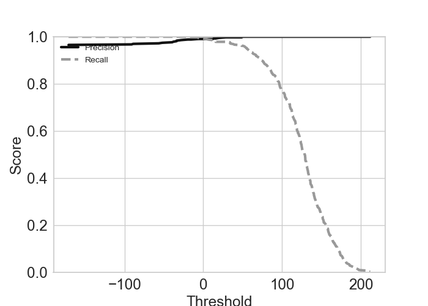

An example of positive class plot can be found in the example below: 

.. topic:: Example:

   * :ref:`sphx_glr_glr_examples_view_plot_pr.py`

Plot ROC: :meth:`~watex.view.EvalPlot.plotROC`
^^^^^^^^^^^^^^^^^^^^^^^^^^^^^^^^^^^^^^^^^^^^^^^^^^^^^^^^^^^^^^^^
ROC stands for Receiving operating characteristic and is another metric for classifier model evaluation. 
The :meth:`~watex.view.EvalPlot.plotROC` plots the model performance. It can also plot multiple classifiers at once. 
If multiple classifiers are given, each classifier must be a tuple of ``( <name>, classifier>, <method>)``. For instance, 
to plot the both :class:`watex.exlib.RandomForestClassifier` and :class:`watex.exlib.SGDClassifier` classifiers, they must be
ranged as follow::
            
	clfs =[
	 ('sgd', SGDClassifier(), "decision_function" ),
	 ('forest', RandomForestClassifier(), "predict_proba") 
	 ]
	 
It is important to know whether the method ``predict_proba`` or ``decision_function`` is valid for the scikit-learn classifier. The kind of 
The method is passed to the parameter `method`. The default is ``decision_function``. Here is an example 
of ROC figure for a single  :class:`watex.exlib.SGDClassifier` classifier model evaluation: 

.. figure:: glr_examples/view/images/sphx_glr_plot_roc_001.png 
   :target: glr_examples/view/images/sphx_glr_plot_roc_001.html 
   :align: center
   :scale: 50% 

Let's try to experiment with multiple-classifiers plots. The snippet code below gives an example of plotting four (04) classifiers on a single 
ROC graph: 

.. code-block:: python 

	>>> from watex.exlib.sklearn import SGDClassifier, RandomForestClassifier, LogisticRegression, SVC
	>>> from watex.datasets.dload import load_bagoue 
	>>> from watex.utils.mlutils import cattarget 
	>>> from watex.view.mlplot import EvalPlot 
	>>> X , y = load_bagoue(as_frame =True )
	>>> sgd_clf = SGDClassifier(random_state= 42) # our estimator 
	>>> b= EvalPlot(scale = True , encode_labels=True)
	>>> b.fit_transform(X, y)
	>>> # binarize the label b.y 
	>>> ybin = cattarget(b.y, labels= 2 ) # can also use labels =[0, 1]
	>>> b.y = ybin 
	>>> base_plot_kws = dict (lw =3., lc=(.9, 0, .8), font_size=7, fig_size = (7, 5)) 
	>>> b= EvalPlot(scale = True , encode_labels=True, 
					** base_plot_kws )
	>>> sgd_clf = SGDClassifier(random_state= 42)
	>>> forest_clf =RandomForestClassifier(random_state=42)
	>>> lr_clf = LogisticRegression (random_state =42) 
	>>> svc_clf = SVC (random_state = 42) 
	>>> b.fit_transform(X, y)
	>>> # binarize the label b.y 
	>>> ybin = cattarget(b.y, labels= 2 ) # can also use labels =[0, 1]
	>>> b.y = ybin 
	>>> clfs =[('sgd', sgd_clf, "decision_function" ), 
		   ('forest', forest_clf, "predict_proba"), 
		   ('logit', lr_clf , "predict_proba") , 
		   ('svc', svc_clf, "decision_function") 
		   ]
	>>> b.plotROC (clfs =clfs , label =1 )
	EvalPlot(tname= None, objective= None, scale= True, ... , sns_height= 4.0, sns_aspect= 0.7, verbose= 0)

The following output gives the result of the above code: 

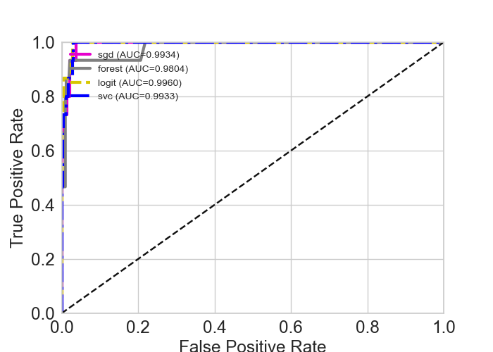

Other examples can be found in: 

.. topic:: Example:

   * :ref:`sphx_glr_glr_examples_view_plot_roc.py`
   

Plot Confusion Matrix: :meth:`~watex.view.EvalPlot.plotConfusionMatrix`
^^^^^^^^^^^^^^^^^^^^^^^^^^^^^^^^^^^^^^^^^^^^^^^^^^^^^^^^^^^^^^^^^^^^^^^^
:meth:`~watex.view.EvalPlot.plotConfusionMatrix` gives a representation of the confusion matrix for error visualization. If 
the parameter ``kind is set ``map``, the plot gives the number of confused instances/items. However, when `kind` is set to ``error``, 
the number of items confused is explained as a percentage. Let go ahead for a basic example. The kind of plot is set to ``err`` for 
error visualization using the :class:`~watex.exlib.sklearn.AdaBoostClassifier`.   

.. code-block:: python 

	>>> from watex.datasets import fetch_data
	>>> from watex.utils.mlutils import cattarget 
	>>> from watex.exlib.sklearn import AdaBoostClassifier 
	>>> from watex.view.mlplot import EvalPlot
	>>> X, y = fetch_data ('bagoue', return_X_y=True, as_frame =True)
	>>> # partition the target into 4 clusters-> just for demo 
	>>> b= EvalPlot(scale =True, label_values = 4 ) 
	>>> b.fit_transform (X, y) 
	>>> # prepare our estimator 
	>>> ada_clf = AdaBoostClassifier( random_state =42)
	>>> matshow_kwargs ={
			'aspect': 'auto', # 'auto'equal
			'interpolation': None, 
		   'cmap':'summer' }                   
	>>> plot_kws ={'lw':3, 
		   'lc':(.9, 0, .8), 
		   'font_size':15., 
			'cb_format':None,
			'xlabel': 'Predicted classes',
			'ylabel': 'Actual classes',
			'font_weight':None,
			'tp_labelbottom':False,
			'tp_labeltop':True,
			'tp_bottom': False, 
			'fig_size': (7, 7)
			}
	>>> b.litteral_classes = ['FR0', 'FR1', 'FR2', 'FR3']
	>>> b.plotConfusionMatrix(ada_clf, matshow_kws=matshow_kwargs, 
							  kind='error', **plot_kws) 
Here is the following output. 

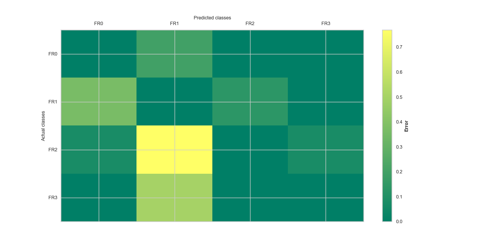
   
.. topic:: Example:

   * :ref:`sphx_glr_glr_examples_view_plot_confusion_matrix_metric.py`
   
Model functions plots
-----------------------------
The additional plot functions called model functions in :mod:`~watex.view.mlplot` are singleton functions that accept the :class:~watex.property.BasePlot` class 
parameters for the plot customizing. The :class:~watex.property.BasePlot` parameters can be passed as keyword arguments to the model functions. The are several utils 
for model scores evaluation, estimating, etc. Here are some useful plots in the list of model function plots. 

Projection plot: :func:`~watex.view.plotProjection`
^^^^^^^^^^^^^^^^^^^^^^^^^^^^^^^^^^^^^^^^^^^^^^^^^^^^^
:func:`~watex.view.plotProjection` allows visualizing the location of the training and test dataset based on geographical coordinates.  If the 
dataset includes geographical information such as latitude/longitude or easting/northing, the plot creates a scatterplot of 
all instances for train and test survey location. Let's go straight to an example: 

.. code-block:: python 

	>>> from watex.datasets import fetch_data 
	>>> from watex.view.mlplot import plotProjection 
	>>> import matplotlib.pyplot as plt 
	>>> plt.style.use ("classic") 
	>>> # Discard all the non-numeric data 
	>>> # then input numerical data 
	>>> from watex.utils.mlutils import to_numeric_dtypes, naive_imputer
	>>> X, Xt, *_ = fetch_data ('bagoue', split_X_y =True, as_frame =True) 
	>>> X =to_numeric_dtypes(X, pop_cat_features=True )
	>>> X= naive_imputer(X)
	>>> Xt = to_numeric_dtypes(Xt, pop_cat_features=True )
	>>> Xt= naive_imputer(Xt)
	>>> plot_kws = dict (fig_size=(8, 12),
					 lc='#CED9EF',
					 marker='o',
					 lw =3.,
					 font_size=15.,
					 xlabel= 'easting (m) ',
					 ylabel='northing (m)' , 
					 marker_facecolor ='#CED9EF', 
					 marker_edgecolor='#9EB3DD',
					 alpha =1., 
					 marker_edgewidth=2., 
					 show_grid =True,
					 galpha =0.2, 
					 glw=.5, 
					 rotate_xlabel =90.,
					 fs =7.,
					 s = 7)
	>>> plotProjection( X, Xt , columns= ['east', 'north'], trainlabel='train location', 
						testlabel='test location', test_kws = dict (color = "r", edgecolor="#0A4CEE") ,
						 **plot_kws
					   )
The code above outputs the following figure: 

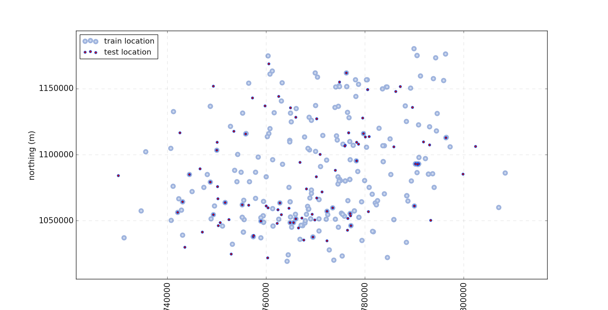

In the above plot, one can notice the location of the test data and the train data. 

.. topic:: Example:

   * :ref:`sphx_glr_glr_examples_view_plot_projection.py`

Model plot: :func:`~watex.view.plotModel`
^^^^^^^^^^^^^^^^^^^^^^^^^^^^^^^^^^^^^^^^^^^^^^^^^^^^^
:func:`~watex.view.plotModel` allows to visualization dataset with correct and wrong predictions. It plots 'y' (true labels) versus 
'ypred' (predicted) from test data. It allows knowing where the estimator/classifier fails to predict correctly the target. The plot creates a 
scatterplot of all instances for correct and wrong visualization. Here is an example: 

.. code-block:: python 

	>>> from watex.exlib.sklearn  import SVC 
	>>> from watex.datasets import fetch_data 
	>>> from watex.view import plotModel 
	>>> from watex.utils.mlutils import split_train_test_by_id
	>>> X, y = fetch_data('bagoue analysis' ) 
	>>> _, Xtest = split_train_test_by_id(X, test_ratio=.3 ,  keep_colindex= False)
	>>> _, ytest = split_train_test_by_id(y, .3 , keep_colindex =False) 
	>>> svc_clf = SVC(C=100, gamma=1e-2, kernel='rbf', random_state =42) 
	>>> base_plot_params ={
						'lw' :3.,                  # line width 
						'lc':'#0A4CEE', 
						'ms':7.,                
						'yp_marker' :'o', 
						'fig_size':(12, 8),
						'font_size':15.,
						'xlabel': 'Test examples',
						'ylabel':'Flow categories' ,
						'marker':'o', 
						'markeredgecolor':'k', 
						'markerfacecolor':'b', 
						'markeredgewidth':3, 
						'yp_markerfacecolor' :'k', 
						'yp_markeredgecolor':'r', 
						'alpha' :1., 
						'yp_markeredgewidth':2.,
						'show_grid' :True,          
						'galpha' :0.2,              
						'glw':.5,                   
						'rotate_xlabel' :90.,
						'fs' :3.,                   
						's' :20 ,                  
						'rotate_xlabel':90
				   }
	>>> plotModel(yt= ytest ,
				   Xt=Xtest , 
				   predict =True , # predict the result (estimator fit)
				   clf=svc_clf ,  
				   fill_between= False, 
				   prefix ='b', 
				   labels=['FR0', 'FR1', 'FR2', 'FR3'], # replace 'y' labels. 
				   **base_plot_params 
				   )
				   
The code above gives the following output: 

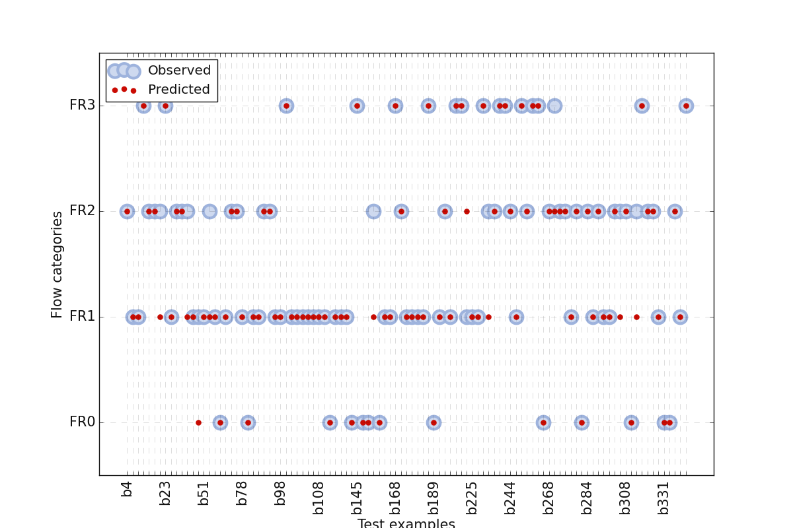
   
.. topic:: Example:

   * :ref:`sphx_glr_glr_examples_view_plot_model.py`

Regression score plot: :func:`~watex.view.plot_reg_scoring`
^^^^^^^^^^^^^^^^^^^^^^^^^^^^^^^^^^^^^^^^^^^^^^^^^^^^^^^^^^^^^^

:func:`~watex.view.plot_reg_scoring` focuses on the regression model. It plots regressor learning curves with (root)mean squared error
scorings. It uses the hold-out [5]_ cross-validation technique for score evaluation. A basic example using the :class:`~watex.exlib.sklearn.SVC` 
is given below: 

.. code-block:: python 

	>>> import matplotlib.pyplot as plt 
	>>> from watex.datasets import fetch_data 
	>>> from watex.view.mlplot import plot_reg_scoring
	>>> plt.style.use ('classic')  
	>>> # Note that for the demo, we import SVC rather than LinearSVR since the 
	>>> # problem of Bagoue dataset is a classification rather than regression.
	>>> # if use regression instead, a convergence problem will occurs. 
	>>> from watex.exlib.sklearn import SVC 
	>>> X, y = fetch_data('bagoue analysed')# got the preprocessed and imputed data
	>>> plot_kws = dict(fig_size =(7, 5 ), lc='blue', ls='-' , font_size =7.,lw=3) 
	>>> svm =SVC() 
	>>> _=plot_reg_scoring(svm, X, y, return_errors=True,**plot_kws )

The figure below is the result of the code snippet implemented above: 

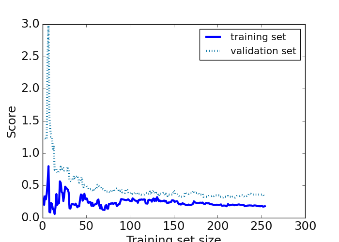
   
.. topic:: Example:

   * :ref:`sphx_glr_glr_examples_view_plot_reg_scoring.py`

Model score plot: :func:`~watex.view.plot_model_scores`
^^^^^^^^^^^^^^^^^^^^^^^^^^^^^^^^^^^^^^^^^^^^^^^^^^^^^^^^^^^^^^

:func:`~watex.view.plot_model_scores`  uses cross-validation to get an estimation of model performance generalization. 
It visualizes the fined tuned model scores vs the cross-validation to determine its performance. The function can 
read multiple classifiers and accepts the different way of estimators' arrangements. Here are two examples of the 
estimator arrangement before feeding to the function: 

* Append each score to the model 
  This is encouraged when we deal with a single model.
 

.. code-block:: python 

	>>> import matplotlib.pyplot as plt
	>>> plt.style.use ('classic')
	>>> from watex.exlib.sklearn import KNeighborsClassifier  
	>>> from watex.view.mlplot import plot_model_scores
	>>> import numpy as np 
	>>> knn_model = KNeighborsClassifier() 
	>>> y = 2 * np.linspace (0, 1e3, 400 ) + 12 * np.random.randn (400) # add randon noises 
	>>> y =  np.sqrt (np.abs (y)) 
	>>> fake_scores = (y- y.min()) / (y.max() -y.min() )  # normalize the scores
	>>> # customize the base plot with plot params 
	>>> plot_kws = dict(fig_size =(9, 6 ), 
		lc='r', ls='-' , 
		font_size =7., 
		lw=3,
		xlabel ='training samples', 
		ylabel ='scores')
	>>> plot_model_scores([(knn_model, fake_scores )], **plot_kws )
	>>> # same as
	>>> # plot_model_scores ([knn_model], scores = [fake_scores ] , **plot_kws) 
	
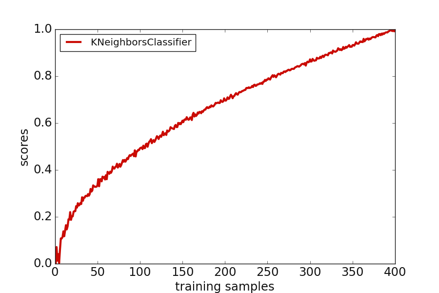

* Plot multiple cross-validation scores

.. code-block:: python

	>>> from watex.exlib.sklearn import LogisticRegression, DecisionTreeClassifier , KNeighborsClassifier 
	>>> from watex.view.mlplot import plot_model_scores
	>>> import numpy as np
	>>> log_model = LogisticRegression () 
	>>> dc_model = DecisionTreeClassifier ()
	>>> knn_model = KNeighborsClassifier() 
	>>> y = np.sqrt(np.abs (2 * np.linspace (0, 1e3, 400 ) + 12 * np.random.randn (400)) )
	>>> knn_scores = (y- y.min()) / (y.max() -y.min() )  # normalize the score 
	>>> log_scores = np.abs (2 * np.linspace (0, 100, 400 ) +  1.5* np.random.randn (400)) **2
	>>> log_scores = (log_scores- log_scores.min()) / (log_scores.max() -log_scores.min() )
	>>> dc_scores = ( np.abs (4* np.linspace (0, 50, 400 ) +  np.random.randn (400)) ) 
	>>> dc_scores = (dc_scores- dc_scores.min()) / (dc_scores.max() -dc_scores.min() )
	>>> plot_kws = dict(
		fig_size =(9, 6 ),
		lc='r', ls='-' , 
		font_size =7., 
		lw=3, 
		xlabel ='training samples', 
		ylabel ='scores'
		)
	>>> plot_model_scores([knn_model, log_model, dc_model], 
		scores = [knn_scores, log_scores, dc_scores ],   **plot_kws )
		
Here is the following output with the fake scores created for 400 samples. 

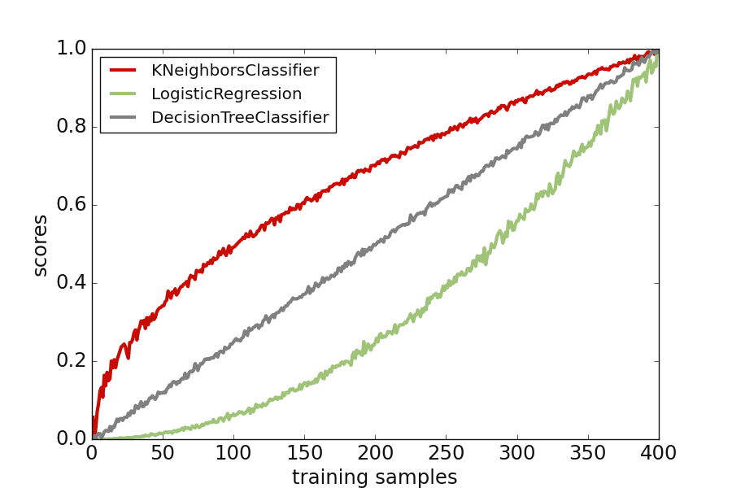

.. topic:: Example:

   * :ref:`sphx_glr_glr_examples_view_plot_model_scores.py`

Dendrogram plot: :func:`~watex.view.plotDendrogram`
^^^^^^^^^^^^^^^^^^^^^^^^^^^^^^^^^^^^^^^^^^^^^^^^^^^^^^^^^^^^^^^^^   
:func:`~watex.view.plotDendrogram` Visualizes the linkage matrix in the results of the dendrogram. 

.. note:: 
   :func:`~watex.view.plotDendrogram` does not work with categorical features. If data contain categorical features, they 
   should be discarded instead. Moreover, if NaN is included in the data, they must be imputed otherwise an error will raise. 

.. code-block:: python 

	>>> import matplotlib.pyplot as plt; plt.style.use ("classic")
	>>> from watex.datasets import load_hlogs 
	>>> from watex.utils import naive_imputer # for impute NAN
	>>> from watex.view import plotDendrogram
	>>> data = load_hlogs ().frame
	>>> data.drop (columns ='remark', inplace =True )
	>>> data = naive_imputer (data ,mode='bi-impute')
	>>> fig, axe = plt.subplots (1, 1, figsize =(14, 7) ) # dimension the axis 
	>>> plotDendrogram (data , columns =['gamma_gamma', 'sp', 'resistivity'] ,ax = axe  ) # for three features 

The output of the above code is below: 

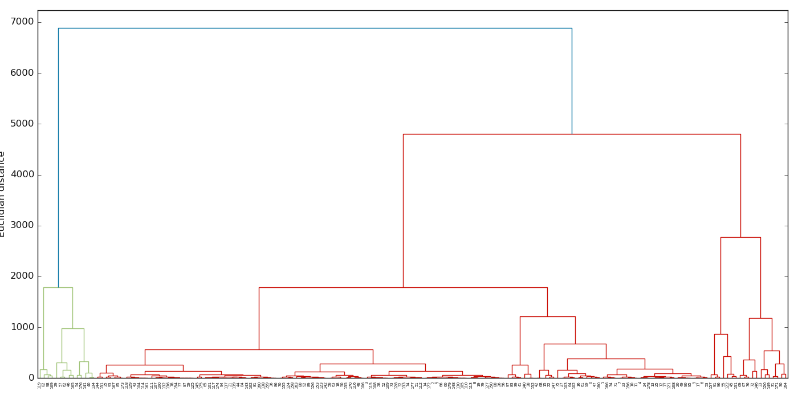
   
Other example using the IRIS dataset ( :func:`~watex.datasets.load_iris` ) is given below: 

.. topic:: Example:

   * :ref:`sphx_glr_glr_examples_view_plot_dendrogram.py`
   
   
Dendrogram-heatmap plot: :func:`~watex.view.plotDendroheat`
^^^^^^^^^^^^^^^^^^^^^^^^^^^^^^^^^^^^^^^^^^^^^^^^^^^^^^^^^^^^^^^^^

:func:`~watex.view.plotDendroheat` attaches the dendrogram to a heat map to ease of interpretation.  Sometimes, the hierarchical dendrogram is 
often used in combination with a heat map which allows us to represent the individual value in a data array or matrix containing the 
training examples with a color code. Here is a naive example using a random data 
 
.. code-block:: python 

	>>> import numpy as np; import pandas as pd 
	>>> from watex.view.mlplot import plotDendroheat
	>>> np.random.seed(123) 
	>>> variables =['shape', 'type', 'power', 'sfi','magnitude', 'ohmS'] 
	>>> labels =['FR0', 'FR1', 'FR2','FR3', 'FR4', 'FR5'] 
	>>> X= np.random.random_sample ([6,6]) *10 
	>>> df =pd.DataFrame (X, columns =variables, index =labels)
	>>> plotDendroheat (df, cmap ='jet_r')

Here is the following output. 

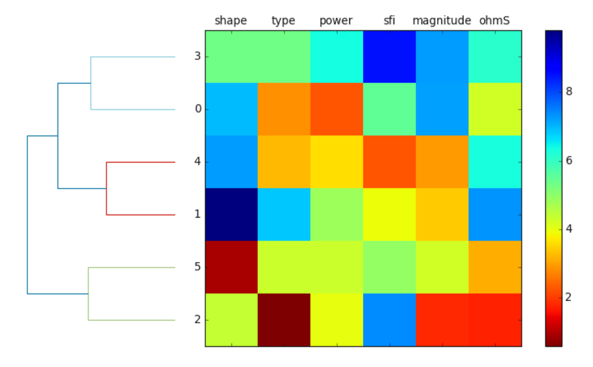

.. topic:: Example:

   * :ref:`sphx_glr_glr_examples_view_plot_dendroheat.py`
   

Silhouette plot: :func:`~watex.view.plotSilhouette`
^^^^^^^^^^^^^^^^^^^^^^^^^^^^^^^^^^^^^^^^^^^^^^^^^^^^^^^^^^^^^^^^^   
:func:`~watex.view.plotSilhouette` quantifies the quality of clustering samples. Commonly the silhouette is used as a graphical tool 
to plot a measure know how tightly is grouped the examples of the clusters. To calculate the silhouette coefficient, the three steps can be 
basic guidance: 
* calculate the **cluster cohesion**, :math:`a(i)`, as the average distance between examples, :math:`x^{(i)}`, and all the others points
* calculate the **cluster separation**, :math:`b^{(i)}` from the next average distance between the example , :math:`x^{(i)}` amd all the example of nearest cluster 
* calculate the silhouette, :math:`s^{(i)}`, as the difference between the cluster cohesion and separation divided by the greater of the two, as shown here: 
  
.. math:: 
	
	s^{(i)}=\frac{b^{(i)} - a^{(i)}}{max {{b^{(i)},a^{(i)} }}}

Here is a basic example using the :func:`~watex.datasets.load_hlogs` data: 

.. code-block:: python 

	>>> from watex.datasets import load_hlogs 
	>>> from watex.view.mlplot import plotSilhouette
	>>> from watex.utils import naive_imputer 
	>>> # use 'natural_gamma', 'short_distance_gamma', 'resistivity', 'sp' for  demonstration
	>>> data= load_hlogs().frame[['natural_gamma', 'short_distance_gamma', 'resistivity', 'sp']]  
	>>> # inpute the NanN using the naive_imputer 
	>>> data = naive_imputer (data, mode ='bi-impute')
	>>> plotSilhouette (data, prefit =False) # 	will trigger fit method of K-Means-clustering 
	
	
See the output below: 

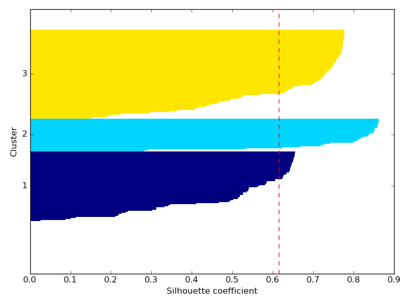
   

.. topic:: Example:

   * :ref:`sphx_glr_glr_examples_view_plot_silhouette.py`

Inspect single model: :func:`~watex.view.plotLearningInspection`
^^^^^^^^^^^^^^^^^^^^^^^^^^^^^^^^^^^^^^^^^^^^^^^^^^^^^^^^^^^^^^^^^^^^^^
:func:`~watex.view.plotLearningInspection` inspects the model through its learning curve. It generates 3 plots: the test and training 
learning curve, the training samples vs fit times curve, and the fit times vs score curve. Here is a concrete example using the 
pre-trained model of :class:`~watex.exlib.sklearn.AdaBoostClassifier` fetched from dumped pre-trained model :class:`~watex.models.premodels.p`. 

.. code-block:: python 

	>>> from watex.datasets import fetch_data
	>>> from watex.models.premodels import p 
	>>> from watex.view.mlplot import plotLearningInspection 
	>>> # import sparse  matrix from Bagoue datasets 
	>>> X, y = fetch_data ('bagoue prepared') 
	>>> # import the  AdabostClassifier from pretrained models 
	>>> plotLearningInspection (p.AdaBoost.best_estimator_  , X, y )

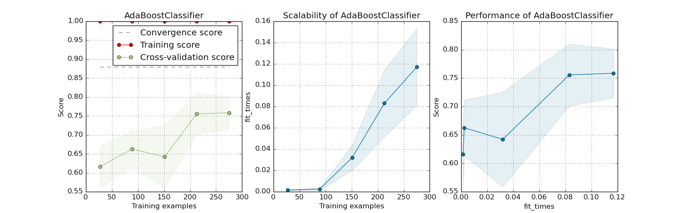
   
.. topic:: Example:

   * :ref:`sphx_glr_glr_examples_view_plot_model_inspection.py`

Inspect multiple models: :func:`~watex.view.plotLearningInspections`
^^^^^^^^^^^^^^^^^^^^^^^^^^^^^^^^^^^^^^^^^^^^^^^^^^^^^^^^^^^^^^^^^^^^^^
:func:`~watex.view.plotLearningInspections` inspects multiple models from their learning curves. It plots the model learning curves, 
the training samples vs fit times curve, and the fit times vs score curve for each model. Here is an example of 
two :class:`~watex.exlib.sklearn.ExtraTreeClassifier` and :class:`watex.exlib.sklearn.VotingClassifier` models fetched from 
dumped pre-trained object (:class:`~watex.models.premodels.p` of :mod:`~watex.models.premodels` module. 

.. code-block:: python 

	>>> from watex.datasets import fetch_data
	>>> from watex.models.premodels import p 
	>>> from watex.view.mlplot import plotLearningInspections 
	>>> # import sparse  matrix from Bagoue dataset 
	>>> X, y = fetch_data ('bagoue prepared') 
	>>> # import the two pretrained models from pre-trained modules  
	>>> models = [p.ExtraTrees.best_estimator_  , p.Voting.best_estimator_ ]
	>>> plotLearningInspections (models , X, y, ylim=(0.7, 1.01) )

Here is the following output: 

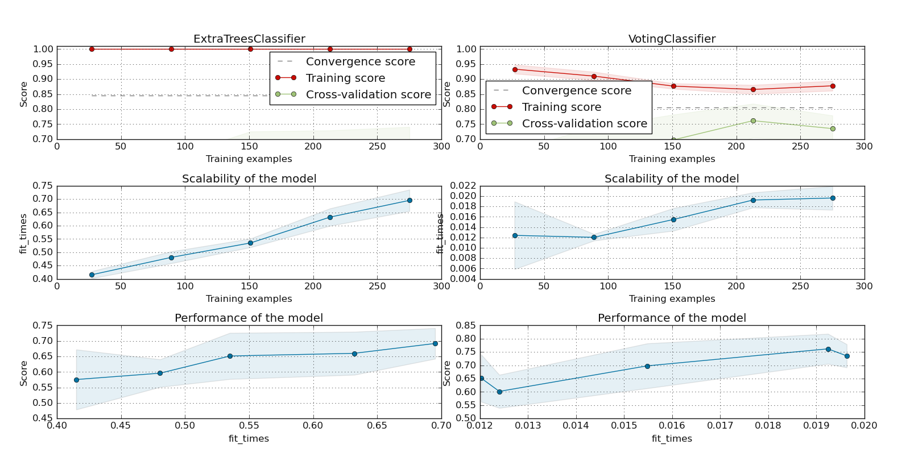
   
See other examples using the SVM below:

.. topic:: Examples:

   * :ref:`sphx_glr_glr_examples_view_plot_learning_inspections.py`

Matrix-show plot: :func:`~watex.view.plot_matshow`
^^^^^^^^^^^^^^^^^^^^^^^^^^^^^^^^^^^^^^^^^^^^^^^^^^^^^
:func:`~watex.view.plot_matshow` visualizes data in a matrix representation. Here is a basic geological example with 
a generated flow rate data.

.. code-block:: python 

	>>> import numpy as np
	>>> from watex.view.mlplot import plot_matshow 
	>>> matshow_kwargs ={
		'aspect': 'auto',
		'interpolation': None,
	   'cmap':'magma', 
			}
	>>> baseplot_kws ={'lw':3, 
			   'lc':(.9, 0, .8), 
			   'font_size':10., 
				'cb_format':None,
				#'cb_label':'Rate of prediction',
				'xlabel': 'Predicted flow classes',
				'ylabel': 'Geological rocks',
				#'rotate_xlabel':45, 
				'font_weight':None,
				'tp_labelbottom':False,
				'tp_labeltop':True,
				'tp_bottom': False, 
				'fig_size': (12, 12 ), 
				}
	>>> labelx =['FR0', 'FR1', 'FR2', 'FR3', 'Rates'] 
	>>> labely =['VOLCANO-SEDIM. SCHISTS', 'GEOSYN. GRANITES', 
				 'GRANITES', 'MIGMATITES-GNEISS', 'Rates']
	>>> array2d = np.array([(1. , .5, 1. ,1., .9286), 
						(.5,  .8, 1., .667, .7692),
						(.7, .81, .7, .5, .7442),
						(.667, .75, 1., .75, .82),
						(.9091, 0.8064, .7, .8667, .7931)])
	>>> plot_matshow(array2d, labelx, labely, matshow_kwargs, **baseplot_kws )
	
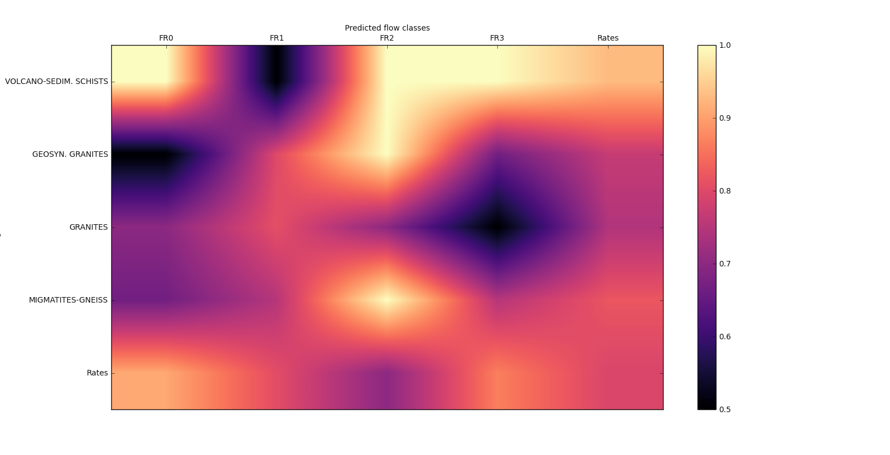
   
.. topic:: Examples:

   * :ref:`sphx_glr_glr_examples_view_plot_matshow.py`
   

Bivariate PCA plot: :func:`~watex.view.biPlot`
^^^^^^^^^^^^^^^^^^^^^^^^^^^^^^^^^^^^^^^^^^^^^^^^^^^^^
:func:`~watex.view.biPlot` visualizes all-in-one for PCA analysis. There is an implementation in R but there is no 
standard implementation in Python. Here is an example: 

.. note:: 
    :func:`~watex.view.biPlot`  accepts as the first parameter the :class:`~watex.view.mlplot.pobj` of :class:`~watex.property.BasePlot`. 
	You may first need to call the object and secondly feed the :math:`X` and remaining arguments.  Moreover the Default 
	:class:`~watex.property.BasePlot` cannot be instanced so, the user must call the shadow object :class:`~watex.view.mlplot.pobj` for 
	plotting as:: 
	
		>>> from watex.view import pobj 
		
The following example will illustrate how to implement the bivariate plot. 

.. code-block:: python 

	>>> from watex.analysis import nPCA
	>>> from watex.datasets import fetch_data
	>>> from watex.view import biPlot, pobj  # pobj is Baseplot instance 
	>>> X, y = fetch_data ('bagoue pca' )  # fetch pca data 
	>>> pca= nPCA (X, n_components= 2 , return_X= False ) # return PCA object 
	>>> components = pca.components_ [:2, :] # for two components 
	>>> # to change for instance line width (lw) or style (ls) use *pobj*. Here 
	>>> # we will change the fontsize and set the x and y labels 
	>>> pobj.font_size =7.
	>>> pobj.xlabel ='axis1: PC1'; pobj.ylabel='axis2: PC2'
	>>> biPlot (pobj, pca.X, components , y ) # pca.X is the reduced dim X 

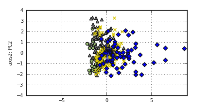
   
.. topic:: Example:

   * :ref:`sphx_glr_glr_examples_view_plot_biplot.py`

   
   
.. topic:: References 

   .. [1] Bengfort, B., & Bilbro, R., 2019. Yellowbrick: Visualizing the scikit-learn model. Journal of Open Source Software, 4( 35 ), 1075. https://doi.org/10.21105/joss.01075
   .. [2] Mel, E.A.C.T., Adou, D.L., Ouattara, S., 2017. Le programme presidentiel d’urgence (PPU) et son impact dans le departement de Daloa (Cote d’Ivoire). Rev. Géographie Trop. d’Environnement 2, 10.
   .. [3] Mobio, A.K., 2018. Exploitation des systèmes d’Hydraulique Villageoise Améliorée pour un accès durable à l’eau potable des populations rurales en Côte d’Ivoire : Quelle stratégie ? Institut International d’Ingenierie de l’Eau et de l’Environnement.
   .. [4] Kouadio, K.L., Loukou, N.K., Coulibaly, D., Mi, B., Kouamelan, S.K., Gnoleba, S.P.D., Zhang, H., XIA, J., 2022. Groundwater Flow Rate Prediction from Geo‐Electrical Features using Support Vector Machines. Water Resour. Res. 1–33. https://doi.org/10.1029/2021wr031623
   .. [5] Pedregosa, F., Varoquaux, G., Gramfort, A., Michel, V., Thirion, B., Grisel, O., Blondel, M., et al. (2011) Scikit-learn: Machine learning in Python. J. Mach. Learn. Res., 12, 2825–2830.